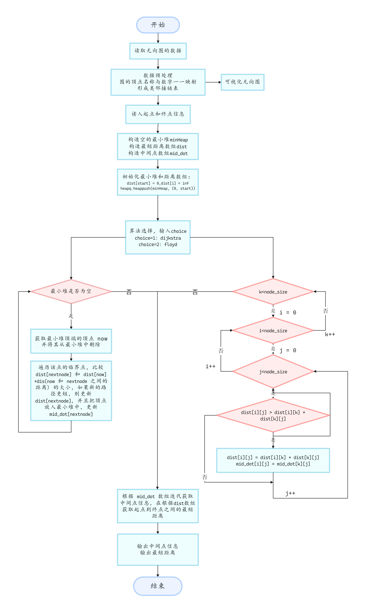
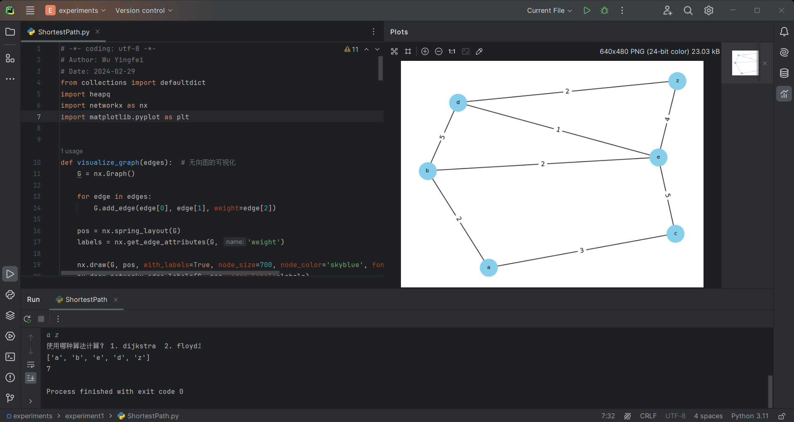
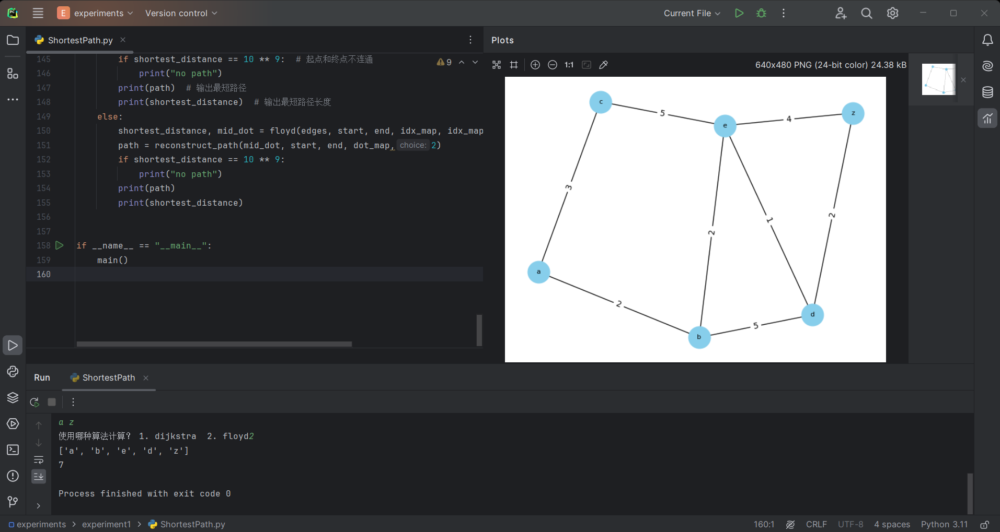

<header>                <p>人工智能实验</p>    </header>

# 中山大学计算机学院

# 人工智能

# 本科生实验报告

###### （2023学年春季学期）

**课程名称**：Artificial Intelligence

## 一、实验题目

给定无向图，及图上两个节点，求其最短路径及长度。要求使用 python 实现，至少实现 Dijkstra 算法。

## 二、实验内容

### 1.算法原理

我使用了两种算法计算最短路径：dijkstra算法和floyd算法。

**Dijkstra 算法原理**：

1. **初始化：** 初始化两个数组，`dist` 数组用于记录起点到各个节点的最短路径长度，`mid_dot` 数组用于记录中间节点信息。同时，使用一个最小堆（优先队列）存储节点和距离的元组，以便按照距离的顺序进行贪心选择。
2. **贪心选择：** 从起点开始，不断从最小堆中选择距离最短的节点，更新与其相邻节点的最短路径长度。如果发现新的路径比已知的路径更短，则更新路径长度和中间节点信息。
3. **循环迭代：** 重复上述贪心选择的过程，直到最小堆为空，即所有节点的最短路径都得到了更新。
4. **路径重构：** 使用 `reconstruct_path` 函数根据中间节点信息，从终点反向追溯到起点，构建出最短路径。

**Floyd 算法原理**：

1. **初始化：** 初始化两个二维数组，`dist` 用于记录任意两点之间的最短路径长度，`mid_dot` 用于记录中间节点信息。同时，将已知边的权值赋给 `dist` 数组。
2. **迭代更新：** 通过三层循环，不断尝试使用中间节点，更新每一对节点之间的最短路径。如果发现通过中间节点的路径更短，则更新路径长度和中间节点信息。
3. **循环迭代：** 通过外层循环，依次考察每一个中间节点。内层两个循环用于遍历图中的所有节点，检查是否通过当前中间节点可以获得更短的路径。
4. **路径重构：** 使用 `reconstruct_path` 函数根据中间节点信息，从起点到终点反向追溯，构建出最短路径。

### 2.流程图



### 3.关键代码展示

需要导入模块：

```python
from collections import defaultdict
import heapq
import networkx as nx 			 # 绘图
import matplotlib.pyplot as plt  # 绘图
```

图的构造：

```python
def build_graph(edges):  # 构造邻接链表
    idx_map = {}  # 顶点名称:顶点下标 键值对容器
    dot_map = []  # dot_map[i] 表示 下标i对应的顶点名称
    idx_map_size = 0
    graph = defaultdict(list)

    for x, y, w in edges:  # # 如果 dot_map 中没有 x 对应的点
        if x not in idx_map:
            idx_map[x] = idx_map_size
            dot_map.append(x)
            idx_map_size += 1
        if y not in idx_map:
            idx_map[y] = idx_map_size
            dot_map.append(y)
            idx_map_size += 1

        graph[idx_map[x]].append((idx_map[y], w))
        graph[idx_map[y]].append((idx_map[x], w))

    return idx_map, dot_map, idx_map_size, graph
```

dijkstra 算法的实现：

```python
def dijkstra(graph, start, end, idx_map_size):  # dijkstra 算法
    inf = 10 ** 9
    dist = [inf] * (idx_map_size + 1)  # 距离一维列表
    mid_dot = [-1] * (idx_map_size + 1)  # 记录中间点

    dist[start] = 0
    minHeap = []
    heapq.heappush(minHeap, (0, start))

    while minHeap:
        dis, now = heapq.heappop(minHeap)
        for nextNode, dis in graph[now]:  # 遍历和当前点相邻的顶点
            if dist[now] + dis < dist[nextNode]:   # 比较新旧路径的长度，如果旧路径更长，则更新最短路径长度和中间点信息
                dist[nextNode] = dist[now] + dis
                if now != start:  # 如果当前点不是起点，则更新中间点信息
                    mid_dot[nextNode] = now
                heapq.heappush(minHeap, (dist[nextNode], nextNode))

    return dist[end], mid_dot
```

floyd 算法实现：

```python
def floyd(edges, start, end, idx_map, idx_map_size):
    inf = 10 ** 9

    # 初始化二维数组 dist 和 mid_dot
    dist = [[inf] * idx_map_size for _ in range(idx_map_size)]
    mid_dot = [[-1] * idx_map_size for _ in range(idx_map_size)]

    # 初始化 dist，将已知边的权值赋给相应位置
    for x, y, w in edges:
        dist[idx_map[x]][idx_map[y]] = w
        dist[idx_map[y]][idx_map[x]] = w
	# 初始化距离和 mid_dot
    for i in range(idx_map_size):
        dist[i][i] = 0
        mid_dot[i][i] = i

    for i in range(idx_map_size):
        for j in range(idx_map_size):
            mid_dot[i][j] = i

    # Floyd 算法核心部分
    for k in range(idx_map_size):
        for i in range(idx_map_size):
            for j in range(idx_map_size):
                if dist[i][j] > dist[i][k] + dist[k][j]:
                    dist[i][j] = dist[i][k] + dist[k][j]
                    mid_dot[i][j] = mid_dot[k][j]

    return dist[start][end], mid_dot
```

重构路径：

```python
def reconstruct_path(mid_dot, start, end, dot_map, choice):  # 根据中间点数组来重构最短路径
    if choice == 1:  # 根据 dijkstra 得到的一维的 mid_dot 重构路径
        rpath = [dot_map[end]]  # 得到的是反向的路径
        nextNode = mid_dot[end]

        while nextNode != -1:  # 当还有中间点的时候
            rpath.append(dot_map[nextNode])
            nextNode = mid_dot[nextNode]

        rpath.append(dot_map[start])
        path = rpath[::-1]  # 路径反转
        return path
    
	# choice == 2 根据 floyd 算法得到的 二维的 mid_dot 重构路径
    rpath = [dot_map[end]]
    nextNode = mid_dot[start][end]

    while nextNode != start:  # 当中间点不等于起点的时候
        rpath.append(dot_map[nextNode])
        nextNode = mid_dot[start][nextNode]

    rpath.append(dot_map[start])
    path = rpath[::-1]
    return path
```

主函数：

```python
def main():  # 主函数
    m, n = map(int, input().split())  # 获取输入

    edges = [input().split() for _ in range(n)]
    edges = [(x, y, int(w)) for x, y, w in edges]  # 把路径长度信息修改成 int 类型
    idx_map, dot_map, idx_map_size, graph = build_graph(edges)  # 构造邻接链表
    visualize_graph(edges)  # 图的可视化

    start_str, end_str = input().split()  # 获取起点和终点的信息
    if start_str not in idx_map or end_str not in idx_map:  # 处理输入异常的情况
        print("no path")
    start = idx_map[start_str]  # 获取起点的下标信息
    end = idx_map[end_str]  # 获取终点的下标信息

    choice = int(input("使用哪种算法计算？ 1. dijkstra  2. floyd"))

    if choice == 1:
        # 实现 dijkstra 算法
        shortest_distance, mid_dot = dijkstra(graph, start, end, idx_map_size)
        # 根据中间点数组重构最短路径
        path = reconstruct_path(mid_dot, start, end, dot_map, 1)
        if shortest_distance == 10 ** 9:  # 起点和终点不连通
            print("no path")
        print(path)  # 输出最短路径
        print(shortest_distance)  # 输出最短路径长度
    else:
        shortest_distance, mid_dot = floyd(edges, start, end, idx_map, idx_map_size)
        path = reconstruct_path(mid_dot, start, end, dot_map,2)
        if shortest_distance == 10 ** 9:
            print("no path")
        print(path)
        print(shortest_distance)
```

运行的代码：

```python
if __name__ == "__main__":
    main()
```


## 三、实验结果及分析

1. 实验结果展示示例

使用 dijkstra 算法实现



使用 floyd 算法计算：




## 四、参考资料

[力扣743题解](https://leetcode.cn/problems/network-delay-time/solutions/1264969/cpython3java-1po-su-dijkstrasuan-fa-2zui-ks36/)

