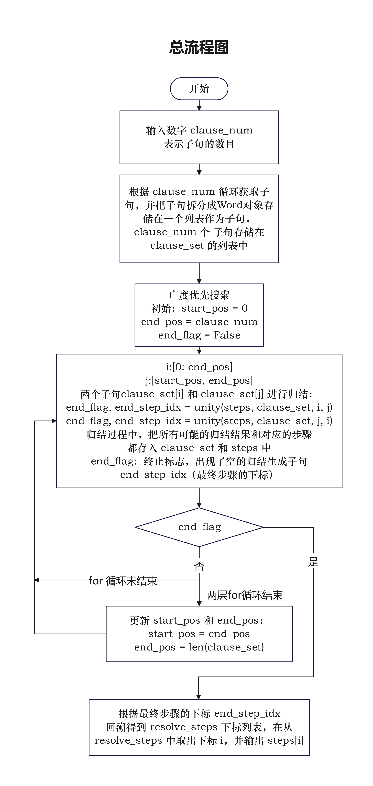
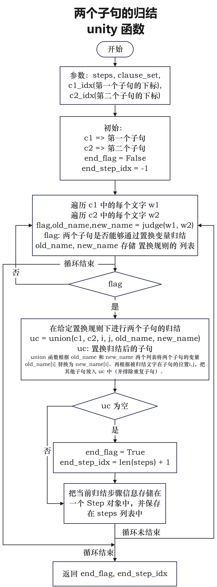
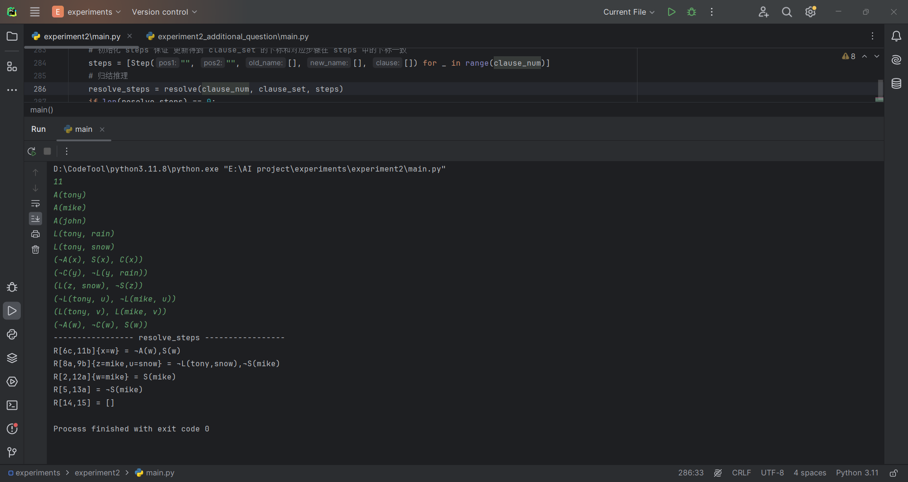
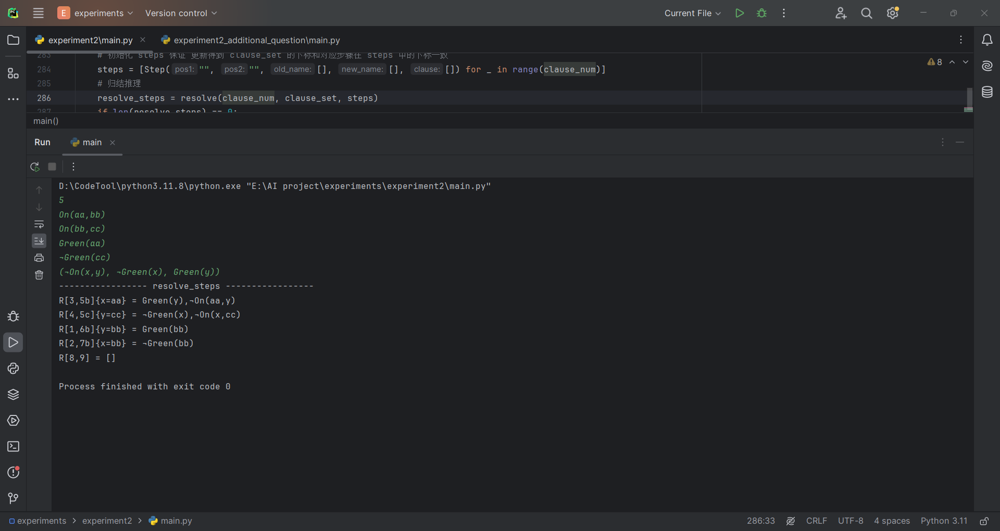
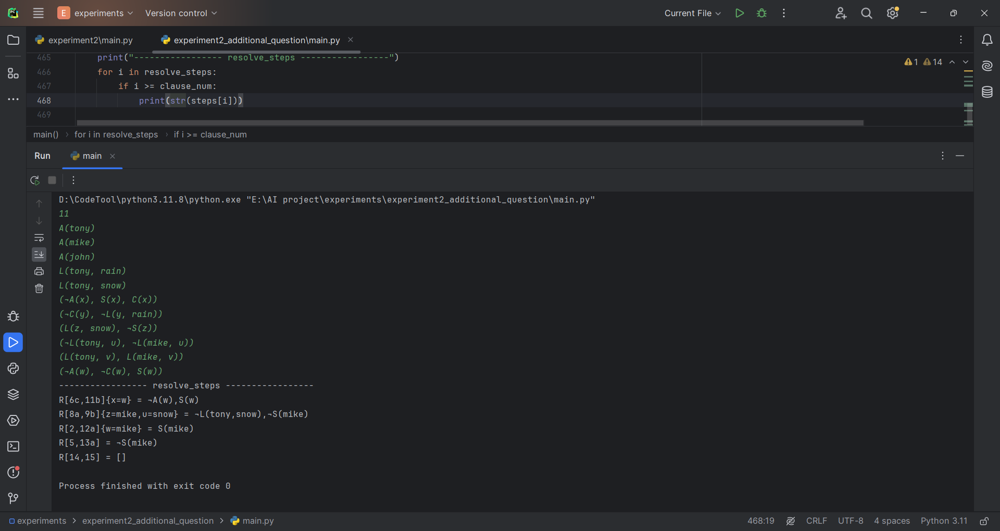
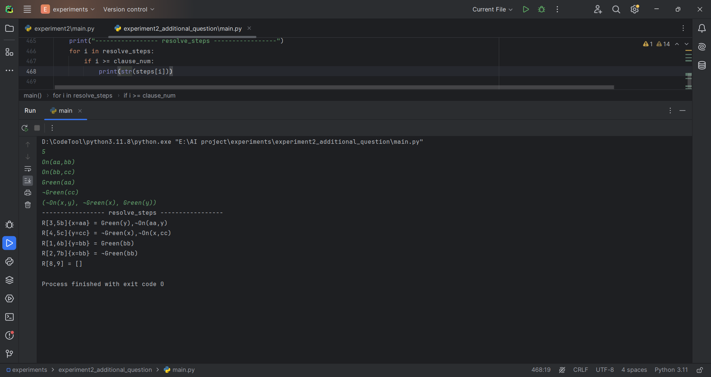
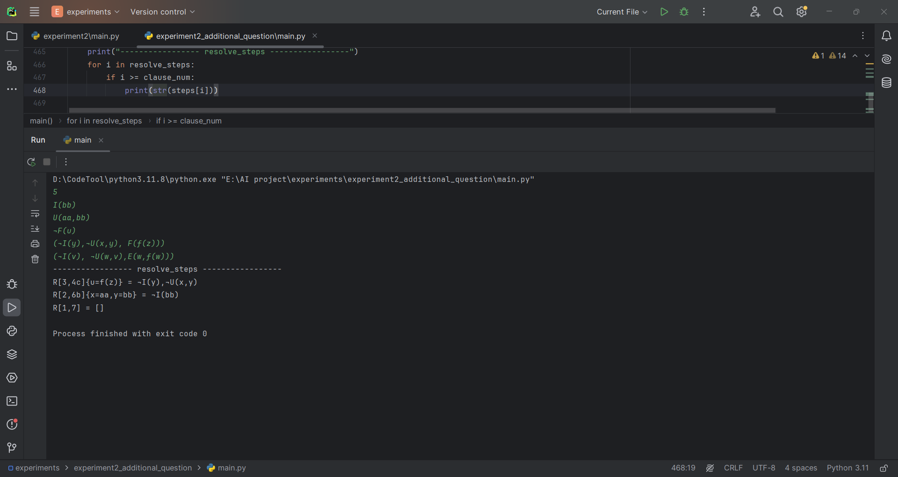
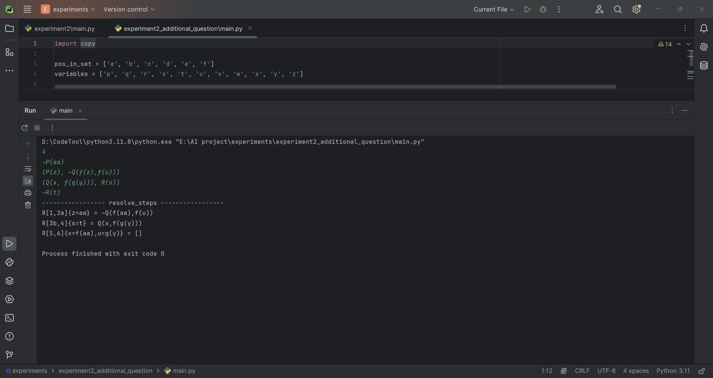

<header>                <p>人工智能实验</p>    </header>

# 中山大学计算机学院

# 人工智能

# 本科生实验报告

###### （2023学年春季学期）

**课程名称**：Artificial Intelligence

## 一、实验题目

编写一个程序，实现一阶逻辑归结算法，用于求解给出的逻辑推理问题。

## 二、实验内容

### 1.算法原理

一阶逻辑归结算法是一种基本的自动推理技术，用于判断逻辑命题的真假。它通过归结推理规则逐步推导出一个空子句，若成功，则原命题为真；若失败，则原命题为假。

步骤：

1. **归结：** 不断应用归结规则对子句集合进行归结，直到得到空子句或无法继续归结为止。

   a. **选择两个子句：** 从子句集合中选择两个不同的子句，每次归结选择的两个子句称为父子句。

   b. **选择归结配对文字：** 在两个父子句中选择一个文字，使得一个为该文字，而另一个是该文字的否定。

   c. **归结操作：** 使用归结规则对两个子句进行归结，生成一个新的子句。该新子句是两个父子句中除了归结配对文字外的所有文字的合取。

2. **检查：** 检查新生成的子句是否为空，如果为空则原命题为真；否则，将该新子句加入到子句集合中，继续归结。

   

3. **重复步骤1和步骤2，直到满足以下条件之一：**

   - 得到空子句，命题为真。

   - 无法继续归结，命题为假。

     

### 2.流程图

定义的类：

* 文字类 Word
* 步骤类 Step




### 3.关键代码展示（带注释）

#### 3.1 类的定义

文字类 Word:

```python
class Word:
    def __init__(self, word_str):
        self.arguments = []  # 字符串列表，每个字符串代表一个参数
        self.is_negative = False  # 谓词前面是否有 ¬
        self.predicate = ""  # 谓词
        pos = 0
        if word_str[0] == '¬':  # 如果谓词前面有 ¬
            self.is_negative = True
            pos = 1
        temp = ""
        # 获取谓词和参数
        while pos < len(word_str):
            if word_str[pos] == "(":  # 如果遇到(，说明前面的是谓词
                self.predicate = temp
                temp = ""
                pos += 1
                continue
            # 如果遇到 , 或 ) 说明前面的是 argument
            if word_str[pos] == "," or word_str[pos] == ')':
                self.arguments.append(temp)
                temp = ""
                pos += 1
                continue
            temp += word_str[pos]
            pos += 1

    def __str__(self):
        arguments_str = ",".join(self.arguments)
        negative_str = "¬" if self.is_negative else ""
        return f"{negative_str}{self.predicate}({arguments_str})"

    # 替换变量
    def replace_var(self, old_name: [str], new_name: [str]):
        for i in range(len(old_name)):
            self.arguments = [new_name[i] if arg == old_name[i] else arg for arg in self.arguments]

    def __lt__(self, other):  # sort 子句中的文字的时候会用到
        return self.predicate < other.predicate
```

步骤类Step：

```python
class Step:
    def __init__(self, pos1, pos2, old_name: [], new_name: [], clause: [Word]):
        self.pos1 = pos1  # 第一个文字的位置
        self.pos2 = pos2  # 第二个文字的位置
        self.old_name = copy.deepcopy(old_name)  # 被替换的变量
        self.new_name = copy.deepcopy(new_name)	 # 替换的新名称
        self.clause = clause  # 归结生成的子句

    def __str__(self):
        replace_str = ""
        if self.old_name:
            replace_str += "{" + ','.join(f"{old}={new}" for old, new in zip(self.old_name, self.new_name)) + "}"
        c_str = "[]" if not len(self.clause) else get_clause_str(self.clause)
        return f"R[{self.pos1},{self.pos2}]{replace_str} = {c_str}"
```


#### 3.2 针对无函数参数的文字归结

`change` 函数：（在谓词相同，互为否定，参数不同的前提下）通过判断当前位置的参数类型来判断两个文字是否能够归结，如果能同时返回当前位置（传入的参数 pos）的变量置换方案。

```python
# 前提: 两个文字谓词相同，互为否定，参数不同
def change(pos: int, w1: Word, w2: Word):
    # pos: 第一个不同的参数的位置
    # 如果当前位置的参数都是常量，则两个文字不能进行归结
    if not is_var(w1.arguments[pos]) and not is_var(w2.arguments[pos]):
        return False, "", ""

    if is_var(w1.arguments[pos]):  # 第一个文字的参数是变量
        old_name = w1.arguments[pos]
        new_name = w2.arguments[pos]
        w1.replace_var([old_name], [new_name])
        return True, old_name, new_name
    else:  # 第二个文字的参数是变量
        old_name = w2.arguments[pos]
        new_name = w1.arguments[pos]
        w2.replace_var([old_name], [new_name])
        return True, old_name, new_name
```


`is_same` （在只考虑参数的情况下）针对两个文字判断是否相同。如果不相同，则返回False和第一个不相同的位置。

```python
def is_same(w1: Word, w2: Word) -> bool and int:
    for i in range(len(w1.arguments)):
        if w1.arguments[i] != w2.arguments[i]:
            return False, i
    return True, 0
```


`judge` 函数：判断两个文字是否能够进行归结，在判断过程求解到 mgu（置换方案在 old_name 和 new_name 列表中，两个列表一一对应）

```python
def judge(w1: Word, w2: Word):
    word1 = copy.deepcopy(w1)  # 深拷贝，防止修改原来的文字
    word2 = copy.deepcopy(w2)
    old_name = []
    new_name = []
    # 不能归结的情况：谓词不同，参数数目不同，不是互为否定
    if word1.predicate != word2.predicate or len(word1.arguments) != len(word2.arguments) or (
            word1.is_negative and word2.is_negative) or (not word1.is_negative and not word2.is_negative):
        return False, old_name, new_name

    # flag: 是否能够归结, dif_pos 通过 is_same 函数返回第一个不同地方（根据前面排除的情况可以知道这个地方一定是第一个不同的参数的位置）
    flag, dif_pos = is_same(word1, word2)

    while not flag:  # 如果不相同
        is_changed, old, new = change(dif_pos, word1, word2)
        if not is_changed:  # 两个不同的参数都是常量，则无法归结
            return False, old_name, new_name
        old_name.append(old)  # 把变量替换方案放入总的替换方案中
        new_name.append(new)
        flag, dif_pos = is_same(word1, word2)  # 继续判断

    return True, old_name, new_name
```


`union` 函数：（给定被归结的文字的位置和 mgu 的前提下）归结两个子句。

```python
def union(clause1: [Word], clause2: [Word], pos1: [], pos2: [], old_name: [str], new_name: [str]) -> [Word]:
    c1 = copy.deepcopy(clause1)  # 深拷贝，防止修改原来的Word对象
    c2 = copy.deepcopy(clause2)
    # 变量替换
    for i in range(len(c1)):
        c1[i].replace_var(old_name, new_name)

    for i in range(len(c2)):
        c2[i].replace_var(old_name, new_name)

    uc = []  # 两个子句归结后的子句
    for i in range(len(c1)):
        if i != pos1:  # 不是被归结位置上的文字
            new_flag = True
            for word in uc:
                if str(c1[i]) == str(word):
                    new_flag = False
            if new_flag:  # 如果在子句中不存在
                uc.append(c1[i])

    for i in range(len(c2)):
        if i != pos2:
            new_flag = True
            for word in uc:
                if str(c2[i]) == str(word):
                    new_flag = False
            if new_flag:
                uc.append(c2[i])

    return uc
```


`unity` 函数：判断两个子句是否能够归结

```python
def unity(steps: [], clause_set: [[Word]], c1_idx, c2_idx):
    c1 = copy.deepcopy(clause_set[c1_idx])
    c2 = copy.deepcopy(clause_set[c2_idx])
    end_flag = False
    end_step_idx = -1

    for i, w1 in enumerate(c1):
        for j, w2 in enumerate(c2):
            flag, old_name, new_name = judge(w1, w2)
            if flag:
                uc = union(c1, c2, i, j, old_name, new_name)
                uc.sort()

                if not uc:  # 如果归结后的子句为空
                    end_flag = True
                    end_step_idx = len(steps) + 1

                if is_exist(uc, clause_set):  # 避免子句重复
                    continue
                # 如果没有重复，则把 归结后的子句存入 clause_set 中
                clause_set.append(uc)

                # 得到 当前步骤的信息 然后创建 Step对象，保存在 steps 列表中
                pos1_str = f"{c1_idx + 1}{pos_in_set[i]}" if len(c1) > 1 else f"{c1_idx + 1}"
                pos2_str = f"{c2_idx + 1}{pos_in_set[j]}" if len(c2) > 1 else f"{c2_idx + 1}"


                steps.append(Step(pos1_str, pos2_str, old_name, new_name, uc))

    return end_flag, end_step_idx
```


`resolve` 函数：根据 clause_set 进行广度优先遍历，先遍历给定的子句，再利用更新得到的子句和其他的子句进行归结。

```python
def resolve(clause_num: int, clause_set: [[Word]], steps: [Step]):
    end_flag: bool = False  # 是否到达 []
    end_step_idx: int = -1

    start_pos = 0  # 第二层遍历的起始位置
    end_pos = clause_num  # 第二层遍历的终止位置

    while not end_flag:  # 如果没有到达 []
        for i in range(end_pos):  # 第一层遍历：遍历所有的子句
            for j in range(start_pos, end_pos):  # 第二层遍历：遍历更新的子句
                if i < j:
                    end_flag, end_step_idx = unity(steps, clause_set, i, j)
                    if end_flag:
                        break
                    # 保证产生所有可能的归结情况
                    end_flag, end_step_idx = unity(steps, clause_set, j, i)
                    if end_flag:
                        break
            if end_flag:
                break
        # 更新第二层遍历的范围
        if len(clause_set) == end_pos:  # 如果子句没有增加，说明不能归结
            return []
        start_pos = end_pos
        end_pos = len(clause_set)
    # 回溯得到 归结推理的所有步骤
    return back_search(steps, end_step_idx)
```


`get_input` 函数：

```python
def get_input(clause_num, clause_set):
    for i in range(clause_num):
        line = input().strip().replace(' ', '')
        if line.startswith('('):  # 子句
            pos = 1
            temp = ""
            while pos < len(line)-1:
                temp += line[pos]
                if line[pos] == ")":  # 说明是一个文字的结尾
                    clause_set[i].append(Word(temp))
                    pos += 1  # 跳过一个","号
                    temp = ""
                pos += 1
        else:  # 单个文字
            clause_set[i].append(Word(line))
```


`main` 函数：

```python
def main():
    # 获取输入
    clause_num = int(input())
    clause_set = [[] for _ in range(clause_num)]
    get_input(clause_num, clause_set)
    # 初始化 steps 保证 更新得到 clause_set 的下标和对应步骤在 steps 中的下标一致
    steps = [Step("", "", [], [], []) for _ in range(clause_num)]
    # 归结推理
    resolve_steps = resolve(clause_num, clause_set, steps)
    if len(resolve_steps) == 0:
        print("无法归结")
        return
	# 序号重排
    idx_map = {}
    for i in range(clause_num):
        idx_map[i+1] = i+1

    cn = clause_num
    for i in resolve_steps:
        if i >= clause_num:
            cn += 1
            idx_map[i+1] = cn
            steps[i].pos1 = change_pos(steps[i].pos1, idx_map)
            steps[i].pos2 = change_pos(steps[i].pos2, idx_map)

    print("----------------- resolve_steps -----------------")
    # 输出归结推理的所有需要的步骤
    for i in resolve_steps:
        if i >= clause_num:
            print(str(steps[i]))
```


#### 3.3 针对更一般情况的子句归结（无函数+有函数）

主要需要修改的有 Word 类的 `__init__`函数和`replace_var`函数 、`is_var` 函数、`change` 函数、`get_input` 函数，并增加了 `is_function` 函数。

`is_function` 函数：

```python
def is_function(arg):
    if len(arg) < 4:  # 字符串长度小于 4 直接排除
        return False, -1
    temp = ""
    pos = 0
    stack = []
    while pos < len(arg):
        if arg[pos] == "(":
            stack.append("(")
            temp = ""
        elif arg[pos] == ")":  
            # 到达第一个 ),首先说明有函数，并且 ) 前面的字符串为变量或常量
            # temp 表示函数里面的 变量或常量
            # pos-len(temp) 表示 函数中的变量或常量所在的位置
            return True, pos-len(temp)
        else:
            temp += arg[pos]
        pos += 1
    return False, -1
```

Word 类：

```python
class Word:
    def __init__(self, word_str):
        self.arguments = []
        self.is_negative = False
        self.predicate = ""

        pos = 0
        if word_str[0] == '¬':
            self.is_negative = True
            pos = 1
        stack = []
        temp = ""

        while pos < len(word_str):
            if not len(stack):
                if word_str[pos] != "(":
                    temp += word_str[pos]
                else:  # 第一个"("，说明开始读入参数，前面的字符串为谓词
                    self.predicate = temp
                    temp = ""
                    stack.append("(")
            elif word_str[pos] == "(":  # 栈非空时的"("存入栈中，以区分函数
                stack.append("(")
                temp += word_str[pos]
            elif word_str[pos] == ")":
                stack.pop()
                if len(stack):  # 说明这是函数的 ")"
                    temp += word_str[pos]
                else:  # 说明到达了最后的 ")"
                    self.arguments.append(temp)
            elif word_str[pos] == ",":  # 说明前面的字符串为 argument
                self.arguments.append(temp)
                temp = ""
            else:
                temp += word_str[pos]
            pos += 1

    def __str__(self):
        arguments_str = ",".join(self.arguments)
        negative_str = "¬" if self.is_negative else ""
        return f"{negative_str}{self.predicate}({arguments_str})"

    def replace_var(self, old_name: [str], new_name: [str]):
        for i in range(len(old_name)):
            for j in range(len(self.arguments)):
                func_flag, var_pos = is_function(self.arguments[j])  # var_pos 返回的变量的地址
                if func_flag:  # 函数的情况
                    # 如果是变量，并且变量需要被替换
                    if is_var(self.arguments[j]) and self.arguments[j][var_pos] == old_name[i]:
                        # 替换变量
                        new_arg = ""
                        for k in range(0, var_pos):  # new_arg 先存入 原变量 前面的字符
                            new_arg += self.arguments[j][k]
                        new_arg += new_name[i]  # new_arg 加入 替换的新名字
                        for k in range(var_pos + 1, len(self.arguments[j])):  # 存入 原变量 后面的字符
                            new_arg += self.arguments[j][k]
                        self.arguments[j] = new_arg  # 改变 旧的参数
                elif self.arguments[j] == old_name[i]:  # 非函数情况，直接替换
                    self.arguments[j] = new_name[i]

    def __lt__(self, other):
        return self.predicate < other.predicate
```


`change` 函数：修改的最多的函数，分支判断最多的函数。

>  `change` 函数：（<u>在谓词相同，互为否定，参数不同</u>的前提下）通过判断当前位置的参数类型来判断两个子句是否能够归结，如果能同时返回当前位置（传入的参数 pos）的变量置换方案。

```python
def change(pos: int, w1: Word, w2: Word):
    var_flag1, var_name1 = is_var(w1.arguments[pos])
    var_flag2, var_name2 = is_var(w2.arguments[pos])
    # 如果都不是变量，说明一定不能归结
    if not var_flag1 and not var_flag2:
        return False, "", ""

    func_flag1, var_pos1 = is_function(w1.arguments[pos])
    func_flag2, var_pos2 = is_function(w2.arguments[pos])

    if (not func_flag1 and not func_flag2 and var_flag1) or (not func_flag1 and func_flag2 and var_flag1):
        old_name = w1.arguments[pos]
        new_name = w2.arguments[pos]
        if func_flag2 and var_flag2 and (old_name == w2.arguments[pos][var_pos2]):  # 说明被替换的变量出现在了替换变量的项中
            return False, "", ""
        w1.replace_var([old_name], [new_name])
        return True, old_name, new_name
    elif (not func_flag1 and not func_flag2) or (func_flag1 and not func_flag2 and var_flag2):
        old_name = w2.arguments[pos]
        new_name = w1.arguments[pos]
        if func_flag1 and var_flag1 and (old_name == w1.arguments[pos][var_pos1]):
            return False, "", ""
        w2.replace_var([old_name], [new_name])
        return True, old_name, new_name
    elif (func_flag1 and not func_flag2) or (not func_flag1 and func_flag2):
        return False, "", ""
    else:  # 两个都是函数
        if len(w1.arguments[pos]) > len(w2.arguments[pos]):
            # 第一个参数字符串更长
            if (var_flag1 and not var_flag2) or (w1.arguments[pos][var_pos1] == w2.arguments[pos][var_pos2]):
                # 如果第一个函数是变量，第二个函数不是变量
                # 说明再怎么改变都无法使第一个参数变成第二个参数
                # 如果第一个函数的变量和第二个函数的变量相同，则无法归结
                return False, "", ""

            # 说明 w2.arg[pos]是变量，可以改变 w2.arg[pos] 使参数一致
            i = 0
            while i < min(len(w1.arguments[pos]), len(w2.arguments[pos])):
                if w1.arguments[pos][i] != w2.arguments[pos][i]:
                    break
                i += 1
            # i 到达第一个不同的地方,如果w2.arg[pos]这个地方是变量
            # 说明，w2的变量可替换，否则说明w2变量前面就出现了不同
            # 则不可替换
            if i != var_pos2:
                return False, "", ""

            if w2.arguments[pos][i] in variables:
                old_name = w2.arguments[pos][i]
                new_name = ""
                stack = []
                # 利用栈类型，通过匹配括号，得到 w2.arg[pos]的变量可以替换的
                # w1.arg[pos] 中的对应字符串
                while i < len(w1.arguments[pos]):
                    new_name += w1.arguments[pos][i]
                    if w1.arguments[pos][i] == "(":
                        stack.append("(")
                    elif w1.arguments[pos][i] == ")":
                        stack.pop()
                        if not len(stack):
                            break
                    i += 1
                w2.replace_var([old_name], [new_name])
                return True, old_name, new_name

        elif len(w2.arguments[pos]) > len(w1.arguments[pos]):
            if (var_flag2 and not var_flag1) or (w1.arguments[pos][var_pos1] == w2.arguments[pos][var_pos2]):
                return False, "", ""
            i = 0
            while i < min(len(w2.arguments[pos]), len(w1.arguments[pos])):
                if w2.arguments[pos][i] != w1.arguments[pos][i]:
                    break
                i += 1
            if i != var_pos1:
                return False, "", ""

            if w1.arguments[pos][i] in variables:
                old_name = w1.arguments[pos][i]
                new_name = ""
                stack = []
                while i < len(w2.arguments[pos]):
                    new_name += w2.arguments[pos][i]
                    if w2.arguments[pos][i] == "(":
                        stack.append("(")
                    elif w2.arguments[pos][i] == ")":
                        stack.pop()
                        if not len(stack):
                            break
                    i += 1
                if old_name in new_name:
                    return False, "", ""
                w1.replace_var([old_name], [new_name])
                return True, old_name, new_name

        else:  # 两个参数的长度相等，说明函数的参数都是一个字符长度
            i = 0
            while i < len(w1.arguments[pos]):
                if w1.arguments[pos][i] != w2.arguments[pos][i]:
                    break
                i += 1
            if i != var_pos1:  # 如果不同的地方不是变量所在的地方，说明前面的函数就出现了不同
                return False, "", ""
            if var_flag1:
                old_name = w1.arguments[pos][var_pos1]
                new_name = w2.arguments[pos][var_pos2]
                w1.replace_var([old_name], [new_name])
                return True, old_name, new_name
            else:
                old_name = w2.arguments[pos][var_pos2]
                new_name = w1.arguments[pos][var_pos1]
                w2.replace_var([old_name], [new_name])
                return True, old_name, new_name

    return False, "", ""
```


`get_input` 函数：

```python
def get_input(clause_num, clause_set):
    for i in range(clause_num):
        line = input().strip().replace(' ', '')
        if line.startswith('('):   # 子句
            pos = 1  # pos : 1~len(line)-2, 排除了子句前后的括号
            temp = ""
            stack = []  # 利用栈区分 参数内部函数 和 谓词后面的括号
            clause = [] # 子句
            while pos < len(line)-1:
                if not len(stack):
                    if line[pos] == '(':
                        stack.append("(")
                    temp += line[pos]
                elif line[pos] == '(':
                    stack.append(")")
                    temp += line[pos]
                elif line[pos] == ')':
                    stack.pop()
                    temp += line[pos]
                    if not len(stack):
                        if temp[0] == ',':
                            temp = temp[1:]
                        clause.append(Word(temp))
                        temp = ""
                elif line[pos] == ',' and not len(stack):
                    continue
                else:
                    temp += line[pos]
                pos += 1
            clause_set[i] = clause
        else:  # 单个文字
            clause_set[i].append(Word(line))
```


## 三、实验结果及分析

### 实验结果展示

1. 针对无函数参数的子句归结的程序：

   输入：

   ```python
   11
   A(tony)
   A(mike)
   A(john)
   L(tony, rain)
   L(tony, snow)
   (¬A(x), S(x), C(x))
   (¬C(y), ¬L(y, rain))
   (L(z, snow), ¬S(z))
   (¬L(tony, u), ¬L(mike, u))
   (L(tony, v), L(mike, v))
   (¬A(w), ¬C(w), S(w))
   ```

   输出：

   

   ```python
   ----------------- resolve_steps -----------------
   R[6c,11b]{x=w} = ¬A(w),S(w)
   R[8a,9b]{z=mike,u=snow} = ¬L(tony,snow),¬S(mike)
   R[2,12a]{w=mike} = S(mike)
   R[5,13a] = ¬S(mike)
   R[14,15] = []
   
   Process finished with exit code 0
   ```

   解释：

   ```python
   R[6c,11b]{x=w} = ¬A(w),S(w)
   => 6c (¬A(x), S(x), C(x)) and 11b (¬A(w), ¬C(w), S(w)) => x=w => ¬A(w),S(w)
   
   R[8a,9b]{z=mike,u=snow} = ¬L(tony,snow),¬S(mike)
   => 8a (L(z, snow), ¬S(z)) and 9b (¬L(tony, u), ¬L(mike, u)) => z = mike, u = snow => ¬L(tony,snow),¬S(mike)
   
   R[2,12a]{w=mike} = S(mike)
   => 2 A(mike) and 12a ¬A(w),S(w) => w = mike => S(mike)
   
   R[5,13a] = ¬S(mike)
   => 5 L(tony, snow) and 13a ¬L(tony,snow),¬S(mike) => ¬S(mike)
   
   R[14,15] = []
   => 14 S(mike) and 15 ¬S(mike) => []
   ```

   推理过程正确

   

   输入：

   ```python
   5
   On(aa,bb)
   On(bb,cc)
   Green(aa)
   ¬Green(cc)
   (¬On(x,y), ¬Green(x), Green(y))
   ```

   输出：

   

   ```python
   ----------------- resolve_steps -----------------
   R[3,5b]{x=aa} = Green(y),¬On(aa,y)
   R[4,5c]{y=cc} = ¬Green(x),¬On(x,cc)
   R[1,6b]{y=bb} = Green(bb)
   R[2,7b]{x=bb} = ¬Green(bb)
   R[8,9] = []
   
   Process finished with exit code 0
   ```

   解释：

   ```python
   R[3,5b]{x=aa} = Green(y),¬On(aa,y)
   => 3 Green(aa) and 5b (¬On(x,y), ¬Green(x), Green(y)) => x=aa => Green(y),¬On(aa,y)
   
   R[4,5c]{y=cc} = ¬Green(x),¬On(x,cc)
   => 4 ¬Green(cc) and 5c (¬On(x,y), ¬Green(x), Green(y)) => y=cc => ¬Green(x),¬On(x,cc)
   
   R[1,6b]{y=bb} = Green(bb)
   => 1 On(aa,bb) and 6b Green(y),¬On(aa,y) => y=bb => Green(bb)
   
   R[2,7b]{x=bb} = ¬Green(bb)
   => 2 On(bb,cc) and 7b ¬Green(x),¬On(x,cc) => x=bb => ¬Green(bb)
   
   R[8,9] = []
   => 8 Green(bb) and 9 ¬Green(bb) => []
   ```

   根据一阶逻辑归结规则可知输出正确

   

2. 针对一般情况的子句归结（无函数+有函数）的程序：

   输入：

   ```
   11
   A(tony)
   A(mike)
   A(john)
   L(tony, rain)
   L(tony, snow)
   (¬A(x), S(x), C(x))
   (¬C(y), ¬L(y, rain))
   (L(z, snow), ¬S(z))
   (¬L(tony, u), ¬L(mike, u))
   (L(tony, v), L(mike, v))
   (¬A(w), ¬C(w), S(w))
   ```

   输出：

   

   ```python
   ----------------- resolve_steps -----------------
   R[6c,11b]{x=w} = ¬A(w),S(w)
   R[8a,9b]{z=mike,u=snow} = ¬L(tony,snow),¬S(mike)
   R[2,12a]{w=mike} = S(mike)
   R[5,13a] = ¬S(mike)
   R[14,15] = []
   
   Process finished with exit code 0
   ```

   结果和针对无函数参数的程序一样

   输入：

   ```
   5
   On(aa,bb)
   On(bb,cc)
   Green(aa)
   ¬Green(cc)
   (¬On(x,y), ¬Green(x), Green(y))
   ```

   输出：

   

   ```python
   ----------------- resolve_steps -----------------
   R[3,5b]{x=aa} = Green(y),¬On(aa,y)
   R[4,5c]{y=cc} = ¬Green(x),¬On(x,cc)
   R[1,6b]{y=bb} = Green(bb)
   R[2,7b]{x=bb} = ¬Green(bb)
   R[8,9] = []
   
   Process finished with exit code 0
   ```

   结果和针对无函数参数的程序一样

   

   输入：

   ```
   5
   I(bb)
   U(aa,bb)
   ¬F(u)
   (¬I(y),¬U(x,y), F(f(z)))
   (¬I(v), ¬U(w,v),E(w,f(w))) 
   ```

   输出：

   

   ```python
   ----------------- resolve_steps -----------------
   R[3,4c]{u=f(z)} = ¬I(y),¬U(x,y)
   R[2,6b]{x=aa,y=bb} = ¬I(bb)
   R[1,7] = []
   
   Process finished with exit code 0
   ```

   解释：

   ```python
   R[3,4c]{u=f(z)} = ¬I(y),¬U(x,y)
   => 3 ¬F(u) and 4c (¬I(y),¬U(x,y), F(f(z))) => u=f(z) => ¬I(y),¬U(x,y)
   
   R[2,6b]{x=aa,y=bb} = ¬I(bb)
   => 2 U(aa,bb) and 6b ¬I(y),¬U(x,y) => ¬I(bb)
   
   R[1,7] = []
   => 1 I(bb) and 7 ¬I(bb) => []
   ```

   推理过程正确

   

   输入：

   ```
   4
   ¬P(aa)
   (P(z), ¬Q(f(z),f(u)))
   (Q(x, f(g(y))), R(s))
   ¬R(t)
   ```

   输出：

   

   ```python
   ----------------- resolve_steps -----------------
   R[1,2a]{z=aa} = ¬Q(f(aa),f(u))
   R[3b,4]{s=t} = Q(x,f(g(y)))
   R[5,6]{x=f(aa),u=g(y)} = []
   
   Process finished with exit code 0
   ```

   解释：

   ```python
   R[1,2a]{z=aa} = ¬Q(f(aa),f(u))
   => 1 ¬P(aa) and 2a (P(z), ¬Q(f(z),f(u))) => z=aa => ¬Q(f(aa),f(u))
   
   R[3b,4]{s=t} = Q(x,f(g(y)))
   => 3b (Q(x, f(g(y))), R(s)) and 4 ¬R(t) =>  s=t => Q(x,f(g(y)))
   
   R[5,6]{x=f(aa),u=g(y)} = []
   => 5 ¬Q(f(aa),f(u)) and 6 Q(x,f(g(y))) => x=f(aa),u=g(y) => []
   ```

   推理过程正确

综合上面的测试结果，本程序能正确解决四个一阶逻辑的归结问题。

### 运行时间分析

针对更一般情况的子句归结程序的运行时间分析，分析顺序跟上面的输入一致：

* 输入1：1.7176270484924316
* 输入2：0.07525849342346191
* 输入3：0.007993221282958984
* 输入4：0.005511045455932617

可知，归结子句越多，运行时间越多，这是因为搜索的深度越深，所以消耗的时间更多。


## 四、参考资料

week3-4 归结原理.pdf