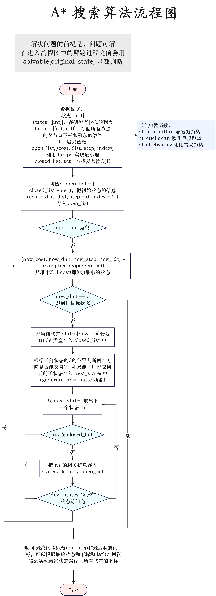
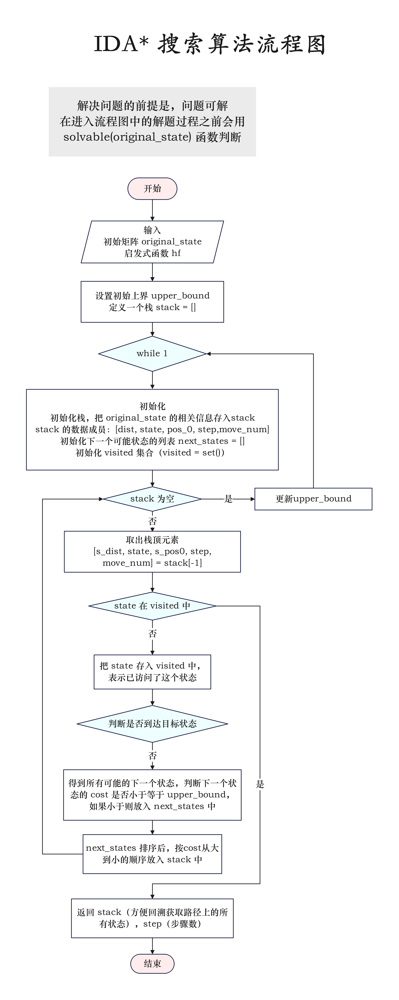
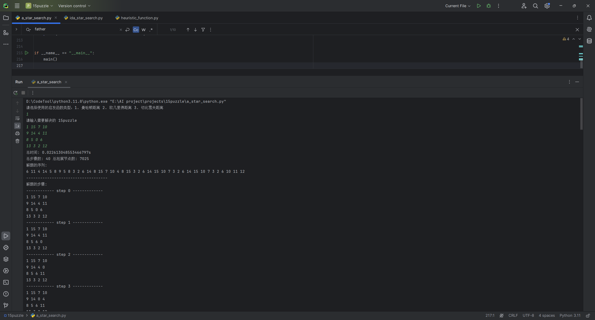
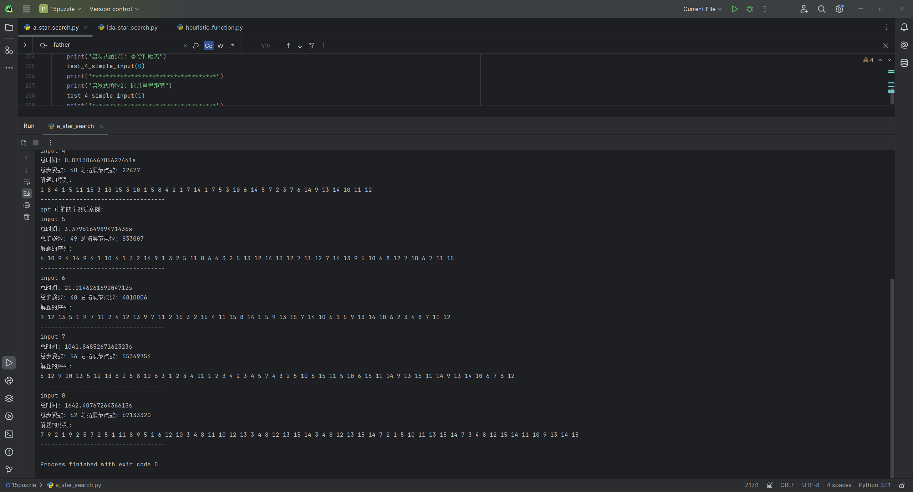
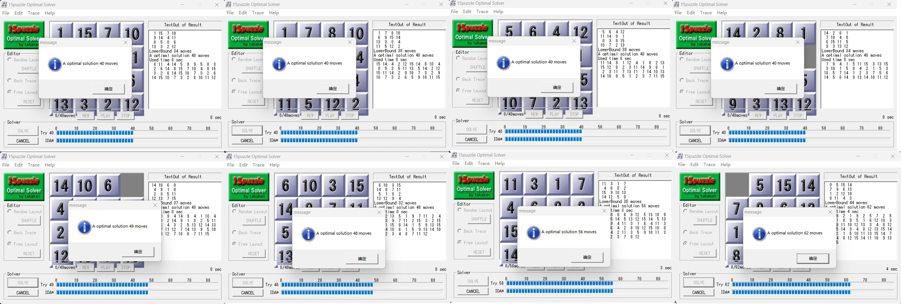
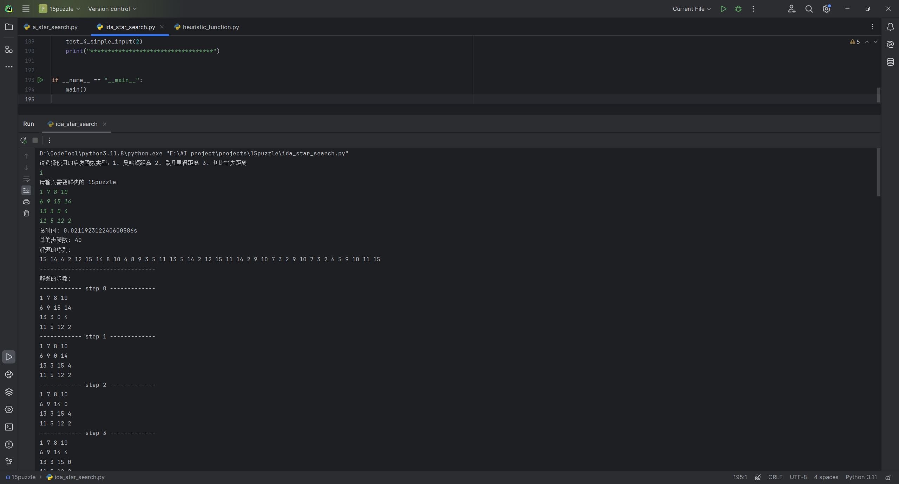
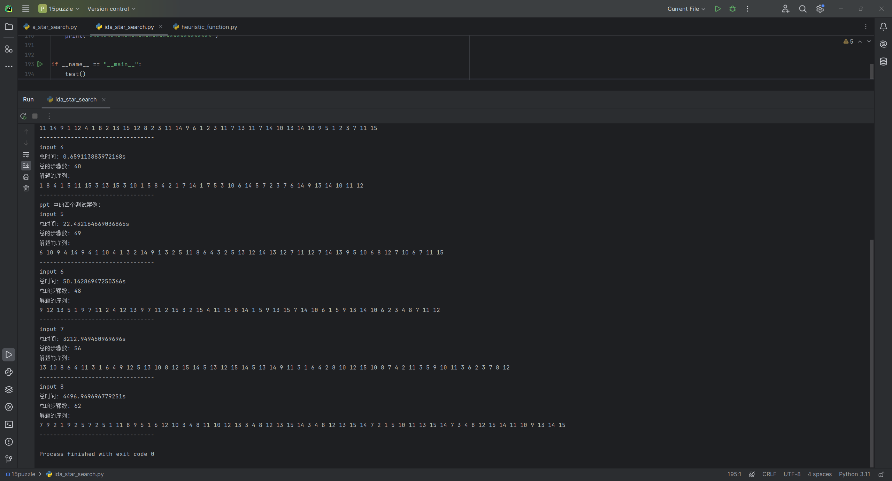
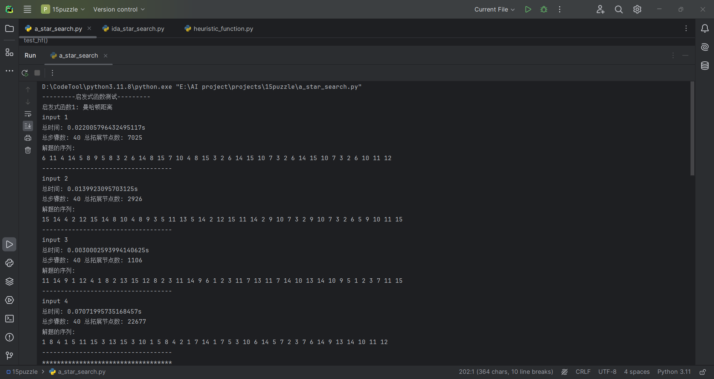
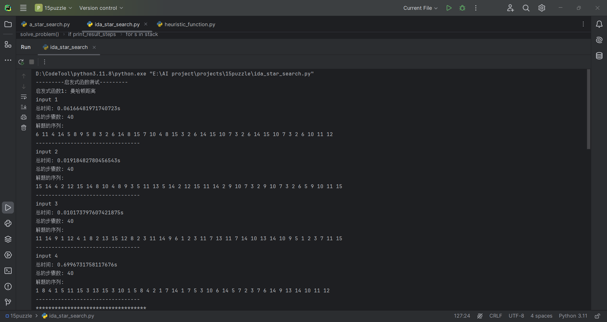

<header>                <p>人工智能实验</p>    </header>

# 中山大学计算机学院

# 人工智能

# 本科生实验报告

###### （2023学年春季学期）


**课程名称**：Artificial Intelligence


## 一、实验题目

使用A*与IDA\*算法求15-Puzzle问题的最优解，启发式函数可以自己选取，可以多尝试几种不同的启发式函数，完成压缩包的4个测例及ppt上的4个测例（最后两个难度较高）

* 结果分析要求 
  * 对比分析A\*和IDA\*的性能和结果（Memory Out请附上内存限制）
  * 如果使用了多种启发式函数也可以进行对比和分析
* 加分项（供参考）
  * 算法实现优化分析（使用数据结构、利用性质的剪枝等）
  * 未提及的启发式函数实现、对比和分析
* 启发式函数参考 
  * 曼哈顿距离 $|x_1 - x_2| + |y_1 - y_2|$ 
  * 切比雪夫距离 $\max(|x_1-x_2|, |y_1-y_2|)$  

* g(x)：表示已经走过的路程

## 二、实验内容

### 1.算法原理

#### 1.1 A* 算法

A*算法是一种启发式搜索算法，它在问题空间中寻找最优解。通过结合实际路径长度和启发式估计，它能够更快地找到目标状态。

* **估价函数**（Heuristic Function）:
  - 估价函数是A*算法的关键部分。它结合了两个因素：
    - **实际路径长度**（g(x)）：从起始状态到当前状态的实际路径长度。
    - **最佳路径估计距离**（h(x)）：从当前状态到目标状态的最佳路径的估计距离。
  - A*算法的估价函数形式为：f(x)=g(x)+h(x)

* **算法描述**:
  - 从起始状态开始，每次选择未进行拓展的状态中估价函数最小的状态进行拓展。
  - 搜索新的可达状态并计算它们的估价函数值，或更新待进行拓展的状态的g(x)。
  - 对已进行拓展的状态进行剪枝，直到找到目标状态。
* **步骤**:
  1. 从起始状态开始，将其作为待拓展状态存入一个“**开启列表**”。
  2. 从“开启列表”中找到估价函数最小的状态C，并将其从开启列表中删除，添加到“**关闭列表**”中（关闭列表保存所有不需要再次搜索的状态）。
  3. 检查C的所有相邻状态：
     - 如果状态在关闭列表中，则剪枝。
     - 否则，计算h, g, f，并将C作为“父状态”加入开启列表。
  4. 重复步骤2和3，直到找到目标状态（步骤2抽取的是目标状态）或开启列表为空。

A*算法的优点在于它综合了实际路径长度和启发式估计，从而在搜索过程中更快地找到最优解。这种算法的优点是它相比于其他简单的搜索算法，如深度优先搜索或广度优先搜索，它更加高效。然而，算法的效率也依赖于启发式函数 h(x) 的设计，如果 h(x) 能够很好地估计实际代价，算法将运行得更快。

####  1.2 IDA* 算法

IDA* 算法是一种有效的图搜索算法，它结合了深度优先搜索的空间效率和A*算法的优化搜索方向的特点。它通过不断增加估价函数值的阈值来限制搜索深度，从而在有限的内存中解决大规模问题。

* 估价函数

  $f(x) = h(x)+g(x)$

* 算法描述

  对估价函数值的阈值进行迭代，在迭代的每一步都进行深度优先搜索，选择相邻状态中的一个状态进行递归，若当前状态的估价函数值大于当前的阈值，则进行剪枝，直到到达目标状态或无解，否则更新阈值继续迭代。

* 步骤

  1. 对估价函数值的阈值进行迭代增加，对于给定的一个阈值，定义递归过程
     1. 从起始状态开始，计算所有相邻状态的估价函数值，选取其中一个状态进行递归
     2. 如果当前状态的估价函数值大于阈值，则记录当前状态的估价函数值（以确定阈值的下一个迭代值），回溯
     3. 如果当前状态是目标状态，则记录答案，结束递归
  2. 如果递归找到目标状态，则算法结束
  3. 如果递归过程中所有到达状态的估价函数值均小于等于阈值，则目标状态无法到达，算法结束；
  4. 根据递归过程中记录的超出阈值的估价函数值更新阈值（如最小值），再次进行步骤1的递归过程，直到找到目标状态，或无解

这个算法的一个关键特点是它的估价函数 f(x)=h(x)+g(x)，其中 h(x) 是启发式函数，用于估计从当前状态到目标状态的最小成本，而 g(x) 是从起始状态到当前状态的实际成本。这种结合确保了算法在寻找最短路径的同时，能够避免不必要的搜索。

IDA* 算法的优势在于它能够处理那些对于传统A\*算法来说内存消耗过大的问题。通过迭代增加阈值，它可以在每次迭代中只存储一条路径，而不是整个开放列表。这使得IDA*在空间复杂度上具有明显的优势。

然而，IDA* 算法也有其局限性。例如，它依赖于启发式函数的质量。如果启发式函数估计不准确，算法可能会进行很多无效的搜索，从而降低效率。此外，IDA* 在找到最优解之前可能需要多次重复搜索同一路径，这在某些情况下可能导致时间效率的损失。


### 2.流程图






### 3.关键代码展示（带注释）

#### 3.1 数据结构和全局变量

有尝试过用 python 的类来存储当前状态，但是发现封装实现的状态类，在运行时候速度太慢，在网上查python优化方法的时候，看到说最好不要用抽象数据结构，额外的处理层会让代码变慢。后面放弃 使用抽象数据结构 的想法，之后运行的时候快了很多。

最终使用的数据结构类型：

* 保存当前状态：`state  # type: [int]`，数据成员为 `int` 类型的列表
* 保存所有状态：`states  # type: [[int]]` 
* A* 算法中的：
  * `open_list` ：最小堆
  * `closed_list`：`set` 

全局变量：

```python
GOAL_STATE = [1, 2, 3, 4, 5, 6, 7, 8, 9, 10, 11, 12, 13, 14, 15, 0]
HEURISTIC_FUNCTIONS = [manhattan_dist, euclidean_dist, chebyshev_dist, different_dist]  # 存放启发式函数
```


#### 3.2 启发函数的实现

保存在 `heuristic_function.py` 文件中

实现启发式函数的代码：

```python
from math import sqrt


# 启发式函数
# 曼哈顿距离
def hf_manhattan(index: int, num: int):
    if num == 0:
        return 0
    r, c = divmod(index, 4)
    nr, nc = divmod(num-1, 4)
    return abs(r-nr) + abs(c - nc)


# 欧几里得距离
def hf_euclidean(index: int, num: int):
    if num == 0:
        return 0
    r, c = divmod(index, 4)
    nr, nc = divmod(num-1, 4)
    return int(sqrt((r-nr)**2 + (c-nc)**2))


# 切比雪夫距离
def hf_chebyshev(index: int, num: int):
    if num == 0:
        return 0
    r, c = divmod(index, 4)
    nr, nc = divmod(num-1, 4)
    return max(abs(r-nr), abs(c-nc))
```

为了加快代码运行速度，提前计算所有数字-下标对应的 启发式函数 的值：行 对应 某一位置上的数字，列 对应 该位置在列表中的下标。

举个例子，`dist[num][i]` ，`num` 就是 `state[i]` ，就是计算 `i` 位置对应的距离。

```python
# 数字-下标 对应的启发式函数计算得到的距离
# 曼哈顿距离
manhattan_dist = [
    [0, 0, 0, 0, 0, 0, 0, 0, 0, 0, 0, 0, 0, 0, 0, 0],
    [0, 1, 2, 3, 1, 2, 3, 4, 2, 3, 4, 5, 3, 4, 5, 6],
    [1, 0, 1, 2, 2, 1, 2, 3, 3, 2, 3, 4, 4, 3, 4, 5],
    [2, 1, 0, 1, 3, 2, 1, 2, 4, 3, 2, 3, 5, 4, 3, 4],
    [3, 2, 1, 0, 4, 3, 2, 1, 5, 4, 3, 2, 6, 5, 4, 3],
    [1, 2, 3, 4, 0, 1, 2, 3, 1, 2, 3, 4, 2, 3, 4, 5],
    [2, 1, 2, 3, 1, 0, 1, 2, 2, 1, 2, 3, 3, 2, 3, 4],
    [3, 2, 1, 2, 2, 1, 0, 1, 3, 2, 1, 2, 4, 3, 2, 3],
    [4, 3, 2, 1, 3, 2, 1, 0, 4, 3, 2, 1, 5, 4, 3, 2],
    [2, 3, 4, 5, 1, 2, 3, 4, 0, 1, 2, 3, 1, 2, 3, 4],
    [3, 2, 3, 4, 2, 1, 2, 3, 1, 0, 1, 2, 2, 1, 2, 3],
    [4, 3, 2, 3, 3, 2, 1, 2, 2, 1, 0, 1, 3, 2, 1, 2],
    [5, 4, 3, 2, 4, 3, 2, 1, 3, 2, 1, 0, 4, 3, 2, 1],
    [3, 4, 5, 6, 2, 3, 4, 5, 1, 2, 3, 4, 0, 1, 2, 3],
    [4, 3, 4, 5, 3, 2, 3, 4, 2, 1, 2, 3, 1, 0, 1, 2],
    [5, 4, 3, 4, 4, 3, 2, 3, 3, 2, 1, 2, 2, 1, 0, 1]
]  # row: num   col: index

# 欧几里得距离
euclidean_dist = [
    [0, 0, 0, 0, 0, 0, 0, 0, 0, 0, 0, 0, 0, 0, 0, 0],
    [0, 1, 2, 3, 1, 1, 2, 3, 2, 2, 2, 3, 3, 3, 3, 4],
    [1, 0, 1, 2, 1, 1, 1, 2, 2, 2, 2, 2, 3, 3, 3, 3],
    [2, 1, 0, 1, 2, 1, 1, 1, 2, 2, 2, 2, 3, 3, 3, 3],
    [3, 2, 1, 0, 3, 2, 1, 1, 3, 2, 2, 2, 4, 3, 3, 3],
    [1, 1, 2, 3, 0, 1, 2, 3, 1, 1, 2, 3, 2, 2, 2, 3],
    [1, 1, 1, 2, 1, 0, 1, 2, 1, 1, 1, 2, 2, 2, 2, 2],
    [2, 1, 1, 1, 2, 1, 0, 1, 2, 1, 1, 1, 2, 2, 2, 2],
    [3, 2, 1, 1, 3, 2, 1, 0, 3, 2, 1, 1, 3, 2, 2, 2],
    [2, 2, 2, 3, 1, 1, 2, 3, 0, 1, 2, 3, 1, 1, 2, 3],
    [2, 2, 2, 2, 1, 1, 1, 2, 1, 0, 1, 2, 1, 1, 1, 2],
    [2, 2, 2, 2, 2, 1, 1, 1, 2, 1, 0, 1, 2, 1, 1, 1],
    [3, 2, 2, 2, 3, 2, 1, 1, 3, 2, 1, 0, 3, 2, 1, 1],
    [3, 3, 3, 4, 2, 2, 2, 3, 1, 1, 2, 3, 0, 1, 2, 3],
    [3, 3, 3, 3, 2, 2, 2, 2, 1, 1, 1, 2, 1, 0, 1, 2],
    [3, 3, 3, 3, 2, 2, 2, 2, 2, 1, 1, 1, 2, 1, 0, 1]
]

# 切比雪夫距离
chebyshev_dist = [
    [0, 0, 0, 0, 0, 0, 0, 0, 0, 0, 0, 0, 0, 0, 0, 0],
    [0, 1, 2, 3, 1, 1, 2, 3, 2, 2, 2, 3, 3, 3, 3, 3],
    [1, 0, 1, 2, 1, 1, 1, 2, 2, 2, 2, 2, 3, 3, 3, 3],
    [2, 1, 0, 1, 2, 1, 1, 1, 2, 2, 2, 2, 3, 3, 3, 3],
    [3, 2, 1, 0, 3, 2, 1, 1, 3, 2, 2, 2, 3, 3, 3, 3],
    [1, 1, 2, 3, 0, 1, 2, 3, 1, 1, 2, 3, 2, 2, 2, 3],
    [1, 1, 1, 2, 1, 0, 1, 2, 1, 1, 1, 2, 2, 2, 2, 2],
    [2, 1, 1, 1, 2, 1, 0, 1, 2, 1, 1, 1, 2, 2, 2, 2],
    [3, 2, 1, 1, 3, 2, 1, 0, 3, 2, 1, 1, 3, 2, 2, 2],
    [2, 2, 2, 3, 1, 1, 2, 3, 0, 1, 2, 3, 1, 1, 2, 3],
    [2, 2, 2, 2, 1, 1, 1, 2, 1, 0, 1, 2, 1, 1, 1, 2],
    [2, 2, 2, 2, 2, 1, 1, 1, 2, 1, 0, 1, 2, 1, 1, 1],
    [3, 2, 2, 2, 3, 2, 1, 1, 3, 2, 1, 0, 3, 2, 1, 1],
    [3, 3, 3, 3, 2, 2, 2, 3, 1, 1, 2, 3, 0, 1, 2, 3],
    [3, 3, 3, 3, 2, 2, 2, 2, 1, 1, 1, 2, 1, 0, 1, 2],
    [3, 3, 3, 3, 2, 2, 2, 2, 2, 1, 1, 1, 2, 1, 0, 1]
]
```


一个状态对应的的启发式函数值计算：

```python
# 根据启发式函数，计算当前状态和目标状态的距离
def state_dist(state: [int], hf):
    return sum(hf[state[i]][i] for i in range(16))  # 16 个位置上的距离之和
```


三种启发式函数的“保证最优”的说明：

1. 曼哈顿距离：理论课上老师已经证明。

2. 欧几里得距离：

   * 可采纳的：假设$h(n)$ 为欧几里得距离之和 ，$h*(n)$ 是能计算出任意节点到目标节点的最优代价函数，显然有$h(n) \leqslant h*(n)$​ ，对于每个错位的数码，我们至少需要p个动作来将其移动到目标位置，其中p为初始位置和目标位置之间的欧几里得距离，对于任何两个不同的错位数码，动作的集合是不可相交的。

   * 单调的：任何动作至多能使 $h(n)$ 减少 1

   * 因此是保证最优的

3. 切比雪夫距离：

   * 可采纳的：假设$h(n)$ 为欧几里得距离之和 ，$h*(n)$ 是能计算出任意节点到目标节点的最优代价函数，显然有$h(n) \leqslant h*(n)$ ，对于每个错位的数码，我们至少需要c个动作来将其移动到目标位置，其中c为初始位置和目标位置之间的切比雪夫距离，对于任何两个不同的错位数码，动作的集合是不可相交的。

   * 单调的：任何动作至多能使 $h(n)$ 减少 1

   * 因此是保证最优的


#### 3.3 A* 算法的实现

这里的 A* 搜索算法，主要利用最小堆的数据结构实现 open_list，使得每次从 open_list 中取出的都是 代价最小的节点。

* open_list 的数据成员为 `(cost, distance, step, index)`，即`(总代价,距离,当前状态的步数,当前状态的下标)` 。
* 利用 `while` 循环实现不断从 open_list 中取出最小代价节点，同时把访问过的节点存入 closed_list 中，直到遇到目标状态。

在 close_list 处有一个优化的地方就是，使用 `set()` 的数据结构，使得在判断 下一个状态是否在 close_list 中的时候，查找时间复杂度为 $O(1)$，相较于使用 list，判断速度极大地提高。

```python
# A* 算法实现的主体
def a_star_search(states: [[int]], father: [(int, int)], hf: [[int]]):
    """
    A* 搜索算法
    :param states: 存储所有状态的数组
    :param father: 存储所有状态的父节点的下标
    :param hf: 启发式函数
    :return: 达到目标使用的步骤数 end_step 和 最后一个状态在 states 中的下标
    """
    open_list = []  # 使用列表作为堆
    original_dist = state_dist(states[0], hf)  # 初始状态的启发式距离
    heapq.heappush(open_list, (original_dist, original_dist, 0, 0))  # 将初始状态放入堆中
    closed_list = set()  # 使用集合来存储关闭列表中的状态
    while open_list:
        (now_cost, now_dist, now_step, now_idx) = heapq.heappop(open_list)  # 从堆中取出优先级最高的状态
        if now_dist == 0:
            return now_step, now_idx    # 如果当前状态已达到目标状态，则返回步数和状态在 states 中的下标

        closed_list.add(tuple(states[now_idx]))  # 将当前状态加入已处理集合中

        next_states = generate_next_state(states[now_idx])  # 生成当前状态的所有可能后继状态
        for (ns, move_num) in next_states:
            # if (tuple(ns) not in closed_list) and (solvable(ns)):  # 如果后继状态不在已处理集合中
            if tuple(ns) not in closed_list:  # 如果后继状态不在已处理集合中
                next_idx = len(states)  # 计算后继状态在 states 中的下标
                next_step = now_step + 1  # 更新后继状态的步数
                states.append(ns)  # 将后继状态加入 states 数组中
                father.append((now_idx, move_num))  # 更新后继状态的父节点下标
                next_dist = state_dist(ns, hf)  # 计算后继状态的启发式距离
                heapq.heappush(open_list, (next_dist + next_step, next_dist, next_step, next_idx))
                # 将后继状态加入堆中，元组格式为(总代价，启发式距离，步数，状态在 states 中的下标)
```


其他函数：

**输出路径上的所有状态**：

```python
def get_path_and_move_nums(father: [(int, int)], end_idx):
    """
    输出解决问题路径上所有的状态
    :param father: 存储父节点下标的列表
    :param end_idx: 最后一个状态的下标
    :return: path, move_nums
    """
    state_idx_path = []  # 存储路径上所有状态的下标
    move_nums = []  # type: [int]
    while end_idx != -1:  # 第0个状态的父节点的下标设置为 -1, 当达到 -1 时候说明到了 原状态的节点
        state_idx_path.append(end_idx)
        (end_idx, move_step) = father[end_idx]  # 得到当前状态的父节点的下标
        if end_idx != -1:
            move_nums.append(move_step)

    state_idx_path.reverse()
    move_nums.reverse()
    return state_idx_path, move_nums
```


**得到下一个状态**：

```python
def generate_next_state(state: [int]):
    """
    产生下一个状态
    :param state: 当前状态
    :return: 所有可能的下一个状态
    """
    pos = state.index(0)  # 找到 0 在 state 中的下标
    new_states = []  # 存放新状态
    i, j = divmod(pos, 4)  # 得到 0 映射在 4*4 矩阵中的横纵坐标
    for ni, nj in ((i - 1, j), (i + 1, j), (i, j - 1), (i, j + 1)):
        if 0 <= ni < 4 and 0 <= nj < 4:
            new_state = state.copy()
            new_state[pos], new_state[ni * 4 + nj] = new_state[ni * 4 + nj], new_state[pos]
            new_states.append(new_state)
    return new_states
```


**解决 15puzzle 的总函数**

```python
# 解决 15puzzle 的总函数
def solve_problem(original_state: [int], hf_kind, print_result_steps=False):
    """
    解决问题的总函数
    :param original_state: 初始状态
    :param hf_kind: 启发式函数的类型
    :param print_result_steps: 是否输出结果
    :return: None
    """
    if not solvable(original_state):
        print("无解")
        return

    father = []  # type: [(int, int)]      # 存储父节点的下标，用于回溯输出
    states = []  # type: [[int]]    # 存储所有状态

    # 初始化所有状态的列表和状态的父节点下标列表
    states.append(original_state)
    father.append((-1, -1))  # 初始状态的父节点设置为-1, 作为回溯得到路径上所有状态的时候的终止条件
    # 开始主体计算部分
    start_time = time()
    end_step, end_idx = a_star_search(states, father, HEURISTIC_FUNCTIONS[hf_kind])
    end_time = time()

    # 输出问题的解
    print("总时间: " + str(end_time - start_time) + "s")
    print("总步骤数:", end_step, "总拓展节点数:", len(states))
    path, move_nums = get_path_and_move_nums(father, end_idx)
    print("解题的序列:")
    move_str = ""
    for num in move_nums:
        move_str += str(num)+" "
    print(move_str)
    print("-----------------------------------")
    if print_result_steps:
        print("------------解题的步骤------------")
        print_solve_states(states, path, end_step)  # 输出解决问题的所有步骤
```


我在网上了解到 15puzzle 的有解性的特征（https://blog.csdn.net/mobius_strip/article/details/70283767）之后，编写了判断当前状态的是否有解的函数：

```python
def solvable(state: [int]) -> bool:
    pos_0 = state.index(0)
    count = 0  # 逆序对数
    temp = state.copy()
    temp.remove(0)
    for i in range(15):
        for j in range(i+1, 15):
            if temp[i] > temp[j]:
                count += 1
    if (count + int(pos_0/4)) % 2:
        return True
    return False
```

但是加入到 状态判断，实现剪枝的功能之后，发现程序运行速度更慢了（本来二十秒左右能运行完的花了六十多秒），所以我放弃了这个能实现剪枝的函数。所以，我感觉这个剪枝函数在 python 中并不能带来很大的优化，它的双层循环还可能减缓程序的运行。

最后这段代码，只是用于提前判断输入的状态是否有解，并没用放在真正的解题代码里面。


#### 3.4 IDA* 算法的实现

IDA* 算法，我一开始采用的是递归算法，了解到python 的递归实现比非递归实现更加消耗时间，所以我之后重写 IDA* 的代码，使用非递归实现，即使用栈来实现 IDA* 算法。

主体函数：

```python
# IDA* 搜索
def ida_star_search(original_state: [int], hf):
    """
    IDA* 搜索
    :param original_state: 初始状态
    :param hf: 启发式函数
    :return: stack, 终止的步数step, end_move_num
    """
    upper_bound = state_dist(original_state, hf)  # 初始化上界为原始状态到目标状态的估计距离
    stack = []  # 初始化栈

    while 1:  # 无限循环直到找到解
        # 将原始状态和相关信息压入栈 dist, state, pos_0, step, move_num
        stack.append([state_dist(original_state, hf), original_state, original_state.index(0), 0, -1])
        next_states = []  # 初始化下一个可能状态的列表
        visited = set()  # 初始化已访问状态的集合

        while stack:  # 当栈不为空时
            [s_dist, state, s_pos0, step, mn] = stack[-1]  # 获取栈顶元素

            if tuple(state) in visited:  # 如果状态已访问
                stack.pop()  # 弹出栈顶元素
                visited.remove(tuple(state))  # 从已访问集合中移除该状态
                continue
            visited.add(tuple(state))  # 将新状态添加到已访问集合

            if s_dist == 0:  # 如果当前状态到目标状态的距离为0
                return stack, step, mn  # 返回路径和步数

            i, j = divmod(s_pos0, 4)  # 计算0的位置
            # 遍历0的上下左右的位置
            for ni, nj in ((i - 1, j), (i + 1, j), (i, j - 1), (i, j + 1)):
                if 0 <= ni < 4 and 0 <= nj < 4:  # 如果新位置在边界内
                    new_state = state.copy()  # 复制当前状态
                    # 交换0和新位置的值
                    new_state[s_pos0], new_state[ni * 4 + nj] = new_state[ni * 4 + nj], new_state[s_pos0]
                    if tuple(new_state) not in visited:  # 如果新状态未访问
                        next_dist = state_dist(new_state, hf)  # 计算新状态到目标状态的距离
                        # 如果新状态的距离加上步数小于等于上界
                        if next_dist + step + 1 <= upper_bound:
                            next_states.append([next_dist, new_state, ni*4+nj, step+1, new_state[s_pos0]])  # 添加到下一个可能状态列表

            next_states.sort()  # 对可能的下一个状态进行排序
            while next_states:  # 当有可能的下一个状态时
                stack.append(next_states[-1])  # 将最小距离的状态压入栈
                next_states.pop()  # 移除已经压入栈的状态
        upper_bound += 2  # 增加上界

```


解决问题的总函数：

```python
def solve_problem(original_state: [int], hf_kind, print_result_steps=False):
    """
    解决问题的总函数
    :param original_state: 初始状态
    :param hf_kind: 启发式函数的类型
    :param print_result_steps: 是否输出结果
    :return: None
    """
    if not solvable(original_state):
        print("无解")
        return

    hf = HEURISTIC_FUNCTIONS[hf_kind]
    # 开始主体计算部分
    start_time = time()
    stack, end_step, end_move = ida_star_search(original_state, hf)
    end_time = time()
    # 输出结果
    print("总时间:", str(end_time - start_time) + "s")
    print("总的步骤数:", end_step)
    now_output = 0
    last = stack[0]
    print("解题的序列:")
    move_str = ""
    for s in stack:
        steps = s[3]
        if steps > now_output:
            if last[4] != -1:
                move_str += str(last[4])+" "
            now_output += 1
        last = s
    move_str += str(end_move)
    print(move_str)
    print("-----------------------------------")
    now_output = 0
    last = stack[0]
    if print_result_steps:
        for s in stack:
            steps = s[3]
            if steps > now_output:
                x = last[1]
                print("------------ step", now_output, "-------------")
                now_output += 1
                print(state_str(x))
            last = s
        print("------------ step", end_step, "-------------")  # stack 中没有保存目标状态，所以需要单独输出
        print(state_str(GOAL_STATE))
```


### 4.创新点&优化

* 不同启发函数的计算结果，提前计算好存入列表中，避免因为计算而带来的时间消耗（尤其是欧几里得距离的 `sqrt()` 函数，带来的时间消耗是很大的），提高总的程序的运行效率。
* A* 算法中，`closed_list` 采用的是 `set` 数据结构，极大提高了查找的速度（查找时间复杂度为 $O(1)$​）。
* A* 算法中，最小堆存储的不是状态本身，而是状态对应的总消耗 cost 和 状态在总的状态中的下标，能避免状态复制和存储带来的时间空间消耗。
* IDA* 算法采用栈的数据结构来实现，避免递归算法带来的不断调用函数的时间资源消耗。
* IDA* 的 cost  的上界更新时候，设置为自增 2，比自增 1 更快。

## 三、实验结果及分析

### 1 A*算法

#### 1.1 输入测试

`main` 函数：

```python
def main():
    # 获取输入
    print("请选择使用的启发函数类型：1. 曼哈顿距离 2. 欧几里得距离 3. 切比雪夫距离")
    hf_kind = int(input())
    if hf_kind <= 0 or hf_kind >= 5:
        print("输入错误")
        return
    hf_kind -= 1
    print("请输入需要解决的 15puzzle")
    original_state = []
    for i in range(4):
        nums = [int(c) for c in input().strip().split(' ')]
        original_state += nums
    # 解决问题
    solve_problem(original_state, hf_kind, True)
```

输入：

```
请选择使用的启发函数类型：1. 曼哈顿距离 2. 欧几里得距离 3. 切比雪夫距离
1
请输入需要解决的 15puzzle
1 15 7 10
9 14 4 11
8 5 0 6
13 3 2 12
```

输出：



```
总时间: 0.02399587631225586s
总步骤数: 40 总拓展节点数: 7025
解题的序列:
6 11 4 14 5 8 9 5 8 3 2 6 14 8 15 7 10 4 8 15 3 2 6 14 15 10 7 3 2 6 14 15 10 7 3 2 6 10 11 12 
-----------------------------------
解题的步骤:
------------ step 0 -------------
1 15 7 10
9 14 4 11
8 5 0 6
13 3 2 12
...(以下省略40个步骤状态)
```


#### 1.2 8个测试案例集中测试

8 个输入一起输入

测试代码：

```python
INPUT_STATES = [
    [1, 15, 7, 10, 9, 14, 4, 11, 8, 5, 0, 6, 13, 3, 2, 12],
    [1, 7, 8, 10, 6, 9, 15, 14, 13, 3, 0, 4, 11, 5, 12, 2],
    [5, 6, 4, 12, 11, 14, 9, 1, 0, 3, 8, 15, 10, 7, 2, 13],
    [14, 2, 8, 1, 7, 10, 4, 0, 6, 15, 11, 5, 9, 3, 13, 12],
    [14, 10, 6, 0, 4, 9, 1, 8, 2, 3, 5, 11, 12, 13, 7, 15],
    [6, 10, 3, 15, 14, 8, 7, 11, 5, 1, 0, 2, 13, 12, 9, 4],
    [11, 3, 1, 7, 4, 6, 8, 2, 15, 9, 10, 13, 14, 12, 5, 0],
    [0, 5, 15, 14, 7, 9, 6, 13, 1, 2, 12, 10, 8, 11, 4, 3]
]  # 8 个测试案例


# -----------------------------------------测试代码---------------------------------------------
def get_15puzzle_result(original_state, hf_kind, test_input_index):
    print("input", test_input_index)
    solve_problem(original_state, hf_kind)


def test_4_hard_input(hf_kind=0):
    for i in range(4):
        get_15puzzle_result(INPUT_STATES[i+4], hf_kind, i+5)


def test_4_simple_input(hf_kind=0):
    for i in range(4):
        get_15puzzle_result(INPUT_STATES[i], hf_kind, i + 1)


def test(hf_kind=0):
    print("-------------进行 8 个输入的测试-------------")
    print("examples 文件夹下的测试案例:")
    test_4_simple_input(hf_kind)
    print("ppt 中的四个测试案例:")
    test_4_hard_input(hf_kind)
```

测试案例：

```
input 1
1 15 7 10
9 14 4 11
8 5 0 6
13 3 2 12

input 2
1 7 8 10
6 9 15 14
13 3 0 4
11 5 12 2

input 3
5 6 4 12
11 14 9 1
0 3 8 15
10 7 2 13

input 4
14 2 8 1
7 10 4 0
6 15 11 5
9 3 13 12

input 5
14 10 6 0
4 9 1 8
2 3 5 11
12 13 7 15

input 6
6 10 3 15
14 8 7 11
5 1 0 2
13 12 9 4

input 7
11 3 1 7
4 6 8 2
15 9 10 13
14 12 5 0

input 8
0 5 15 14
7 9 6 13
1 2 12 10
8 11 4 3
```

输出：



```
-------------进行 8 个输入的测试-------------
examples 文件夹下的测试案例:
input 1
总时间: 0.030523300170898438s
总步骤数: 40 总拓展节点数: 7025
解题的序列:
6 11 4 14 5 8 9 5 8 3 2 6 14 8 15 7 10 4 8 15 3 2 6 14 15 10 7 3 2 6 14 15 10 7 3 2 6 10 11 12 
-----------------------------------
input 2
总时间: 0.020313024520874023s
总步骤数: 40 总拓展节点数: 2926
解题的序列:
15 14 4 2 12 15 14 8 10 4 8 9 3 5 11 13 5 14 2 12 15 11 14 2 9 10 7 3 2 9 10 7 3 2 6 5 9 10 11 15 
-----------------------------------
input 3
总时间: 0.001999378204345703s
总步骤数: 40 总拓展节点数: 1106
解题的序列:
11 14 9 1 12 4 1 8 2 13 15 12 8 2 3 11 14 9 6 1 2 3 11 7 13 11 7 14 10 13 14 10 9 5 1 2 3 7 11 15 
-----------------------------------
input 4
总时间: 0.07130646705627441s
总步骤数: 40 总拓展节点数: 22677
解题的序列:
1 8 4 1 5 11 15 3 13 15 3 10 1 5 8 4 2 1 7 14 1 7 5 3 10 6 14 5 7 2 3 7 6 14 9 13 14 10 11 12 
-----------------------------------
ppt 中的四个测试案例:
input 5
总时间: 3.3796164989471436s
总步骤数: 49 总拓展节点数: 833007
解题的序列:
6 10 9 4 14 9 4 1 10 4 1 3 2 14 9 1 3 2 5 11 8 6 4 3 2 5 13 12 14 13 12 7 11 12 7 14 13 9 5 10 6 8 12 7 10 6 7 11 15 
-----------------------------------
input 6
总时间: 21.114626169204712s
总步骤数: 48 总拓展节点数: 4810006
解题的序列:
9 12 13 5 1 9 7 11 2 4 12 13 9 7 11 2 15 3 2 15 4 11 15 8 14 1 5 9 13 15 7 14 10 6 1 5 9 13 14 10 6 2 3 4 8 7 11 12 
-----------------------------------
input 7
总时间: 1041.8485267162323s
总步骤数: 56 总拓展节点数: 55349754
解题的序列:
5 12 9 10 13 5 12 13 8 2 5 8 10 6 3 1 2 3 4 11 1 2 3 4 2 3 4 5 7 4 3 2 5 10 6 15 11 5 10 6 15 11 14 9 13 15 11 14 9 13 14 10 6 7 8 12 
-----------------------------------
input 8
总时间: 1642.4076726436615s
总步骤数: 62 总拓展节点数: 67133320
解题的序列:
7 9 2 1 9 2 5 7 2 5 1 11 8 9 5 1 6 12 10 3 4 8 11 10 12 13 3 4 8 12 13 15 14 3 4 8 12 13 15 14 7 2 1 5 10 11 13 15 14 7 3 4 8 12 15 14 11 10 9 13 14 15 
-----------------------------------

Process finished with exit code 0
```

（几个测试案例放在一起，运行时间会比单个测试案例进行测试要长一些）

15puzzle.exe 程序的执行结果（按照 input1=> input8 的顺序测试）



最终的步骤数和`15puzzle.exe` 程序的执行结果一致


### 2 IDA* 算法

#### 2.1 输入测试

`main` 函数：

```python
# 主函数，可获取输入
def main():
    # 获取输入
    print("请选择使用的启发函数类型：1. 曼哈顿距离 2. 欧几里得距离 3. 切比雪夫距离")
    hf_kind = int(input())
    if hf_kind <= 0 or hf_kind >= 5:
        print("输入错误")
        return
    hf_kind -= 1
    print("请输入需要解决的 15puzzle")
    original_state = []
    for i in range(4):
        nums = [int(c) for c in input().strip().split(' ')]
        original_state += nums
    # 解决问题
    solve_problem(original_state, hf_kind, True)
```

输入：

```
请选择使用的启发函数类型：1. 曼哈顿距离 2. 欧几里得距离 3. 切比雪夫距离
1
请输入需要解决的 15puzzle
1 7 8 10
6 9 15 14
13 3 0 4
11 5 12 2
```

输出：



```
总时间: 0.021192312240600586s
总的步骤数: 40
解题的序列:
15 14 4 2 12 15 14 8 10 4 8 9 3 5 11 13 5 14 2 12 15 11 14 2 9 10 7 3 2 9 10 7 3 2 6 5 9 10 11 15
---------------------------------
解题的步骤:
------------ step 0 -------------
1 7 8 10
6 9 15 14
13 3 0 4
11 5 12 2
...(以下省略40个步骤状态)
```


#### 2.2 8个测试案例集中测试

测试代码：

```python
# -----------------------------测试代码-------------------------------
def get_15puzzle_result(original_state, hf_kind, test_input_index):
    print("input", test_input_index)
    solve_problem(original_state, hf_kind)


def test_4_hard_input(hf_kind=0):
    for i in range(4):
        get_15puzzle_result(INPUT_STATES[i+4], hf_kind, i+5)


def test_4_simple_input(hf_kind=0):
    for i in range(4):
        get_15puzzle_result(INPUT_STATES[i], hf_kind, i + 1)


def test(hf_kind=0):
    print("examples 文件夹下的测试案例:")
    test_4_simple_input(hf_kind)
    print("ppt 中的四个测试案例:")
    test_4_hard_input(hf_kind)
```

测试的输入同 A* 算法的8个输入。

得到的输出：



```
examples 文件夹下的测试案例:
input 1
总时间: 0.05659604072570801s
总的步骤数: 40
解题的序列:
6 11 4 14 5 8 9 5 8 3 2 6 14 8 15 7 10 4 8 15 3 2 6 14 15 10 7 3 2 6 14 15 10 7 3 2 6 10 11 12
---------------------------------
input 2
总时间: 0.01800537109375s
总的步骤数: 40
解题的序列:
15 14 4 2 12 15 14 8 10 4 8 9 3 5 11 13 5 14 2 12 15 11 14 2 9 10 7 3 2 9 10 7 3 2 6 5 9 10 11 15
---------------------------------
input 3
总时间: 0.011008501052856445s
总的步骤数: 40
解题的序列:
11 14 9 1 12 4 1 8 2 13 15 12 8 2 3 11 14 9 6 1 2 3 11 7 13 11 7 14 10 13 14 10 9 5 1 2 3 7 11 15
---------------------------------
input 4
总时间: 0.659113883972168s
总的步骤数: 40
解题的序列:
1 8 4 1 5 11 15 3 13 15 3 10 1 5 8 4 2 1 7 14 1 7 5 3 10 6 14 5 7 2 3 7 6 14 9 13 14 10 11 12
---------------------------------
ppt 中的四个测试案例:
input 5
总时间: 22.432164669036865s
总的步骤数: 49
解题的序列:
6 10 9 4 14 9 4 1 10 4 1 3 2 14 9 1 3 2 5 11 8 6 4 3 2 5 13 12 14 13 12 7 11 12 7 14 13 9 5 10 6 8 12 7 10 6 7 11 15
---------------------------------
input 6
总时间: 50.14286947250366s
总的步骤数: 48
解题的序列:
9 12 13 5 1 9 7 11 2 4 12 13 9 7 11 2 15 3 2 15 4 11 15 8 14 1 5 9 13 15 7 14 10 6 1 5 9 13 14 10 6 2 3 4 8 7 11 12
---------------------------------
input 7
总时间: 3212.949450969696s
总的步骤数: 56
解题的序列:
13 10 8 6 4 11 3 1 6 4 9 12 5 13 10 8 12 15 14 5 13 12 15 14 5 13 14 9 11 3 1 6 4 2 8 10 12 15 10 8 7 4 2 11 3 5 9 10 11 3 6 2 3 7 8 12
---------------------------------
input 8
总时间: 4496.949696779251s
总的步骤数: 62
解题的序列:
7 9 2 1 9 2 5 7 2 5 1 11 8 9 5 1 6 12 10 3 4 8 11 10 12 13 3 4 8 12 13 15 14 3 4 8 12 13 15 14 7 2 1 5 10 11 13 15 14 7 3 4 8 12 15 14 11 10 9 13 14 15
---------------------------------

Process finished with exit code 0
```

最终的步骤数和`15puzzle.exe` 程序的执行结果一致

对比 A* 算法和 IDA* 算法可知，我的A* 算法的程序执行速度更快，但是我通过对比两个程序运行时候的任务管理器的内存占用情况发现，IDA*算法的内存占比要比 A\* 算法小很多，这是因为 stack 的保存的步骤的深度有限，不断入栈和出栈，使得 stack 的存储元素个数不会特别大。


### 3 分析不同启发函数的效率

我使用examples 文件夹下的测试案例进行测试，因为ppt上的测试案例运行时间太长，不方便ce'shi。

本来我想把 “不在原位置上的数字的数目”设置为启发式函数，但是运行的结果实在是太慢了，于是我就放弃了这个启发式函数。最终进行测试的启发式函数有三种：曼哈顿距离，欧几里得距离，切比雪夫距离。

#### 3.1 A* 算法中不同启发函数测试

测试代码：

```python
def test_4_simple_input(hf_kind=0):  # examples 文件夹下的测试案例
    for i in range(4):
        get_15puzzle_result(INPUT_STATES[i], hf_kind, i + 1)
        

def test_hf():
    print("---------启发式函数测试---------")
    print("启发式函数1: 曼哈顿距离")
    test_4_simple_input(0)
    print("***********************************")
    print("启发式函数2: 欧几里得距离")
    test_4_simple_input(1)
    print("***********************************")
    print("启发式函数3: 切比雪夫距离")
    test_4_simple_input(2)
    print("***********************************")
```

输出：



```
---------启发式函数测试---------
启发式函数1: 曼哈顿距离
input 1
总时间: 0.022005796432495117s
总步骤数: 40 总拓展节点数: 7025
解题的序列:
6 11 4 14 5 8 9 5 8 3 2 6 14 8 15 7 10 4 8 15 3 2 6 14 15 10 7 3 2 6 14 15 10 7 3 2 6 10 11 12 
-----------------------------------
input 2
总时间: 0.0139923095703125s
总步骤数: 40 总拓展节点数: 2926
解题的序列:
15 14 4 2 12 15 14 8 10 4 8 9 3 5 11 13 5 14 2 12 15 11 14 2 9 10 7 3 2 9 10 7 3 2 6 5 9 10 11 15 
-----------------------------------
input 3
总时间: 0.0030002593994140625s
总步骤数: 40 总拓展节点数: 1106
解题的序列:
11 14 9 1 12 4 1 8 2 13 15 12 8 2 3 11 14 9 6 1 2 3 11 7 13 11 7 14 10 13 14 10 9 5 1 2 3 7 11 15 
-----------------------------------
input 4
总时间: 0.07071995735168457s
总步骤数: 40 总拓展节点数: 22677
解题的序列:
1 8 4 1 5 11 15 3 13 15 3 10 1 5 8 4 2 1 7 14 1 7 5 3 10 6 14 5 7 2 3 7 6 14 9 13 14 10 11 12 
-----------------------------------
***********************************
启发式函数2: 欧几里得距离
input 1
总时间: 5.728215456008911s
总步骤数: 40 总拓展节点数: 1322203
解题的序列:
6 11 4 14 5 8 9 5 8 3 2 6 14 8 15 7 10 4 8 15 3 2 6 14 15 10 7 3 2 6 14 15 10 7 3 2 6 10 11 12 
-----------------------------------
input 2
总时间: 10.08297610282898s
总步骤数: 40 总拓展节点数: 2285874
解题的序列:
15 14 4 2 12 15 14 8 10 4 8 9 3 5 11 13 5 14 2 12 15 11 14 2 9 10 7 3 2 9 10 7 3 2 6 5 9 10 11 15 
-----------------------------------
input 3
总时间: 1.48746919631958s
总步骤数: 40 总拓展节点数: 407932
解题的序列:
11 14 9 1 12 4 1 8 2 13 15 12 8 2 3 11 14 9 6 1 2 3 11 7 13 11 7 14 10 13 14 10 9 5 1 2 3 7 11 15 
-----------------------------------
input 4
总时间: 4.377159118652344s
总步骤数: 40 总拓展节点数: 1019500
解题的序列:
1 8 4 1 5 11 15 3 13 15 3 10 1 5 8 4 2 1 5 3 10 5 7 14 1 2 3 7 5 6 14 5 6 14 9 13 14 10 11 12 
-----------------------------------
***********************************
启发式函数3: 切比雪夫距离
input 1
总时间: 5.655526638031006s
总步骤数: 40 总拓展节点数: 1322512
解题的序列:
6 11 4 14 5 8 9 5 8 3 2 6 14 8 15 7 10 4 8 15 3 2 6 14 15 10 7 3 2 6 14 15 10 7 3 2 6 10 11 12 
-----------------------------------
input 2
总时间: 10.168821096420288s
总步骤数: 40 总拓展节点数: 2286862
解题的序列:
15 14 4 2 12 15 14 8 10 4 8 9 3 5 11 13 5 14 2 12 15 11 14 2 9 10 7 3 2 9 10 7 3 2 6 5 9 10 11 15 
-----------------------------------
input 3
总时间: 1.5826387405395508s
总步骤数: 40 总拓展节点数: 417875
解题的序列:
11 14 9 1 12 4 1 8 2 13 15 12 8 2 3 11 14 9 6 1 2 3 11 7 13 11 7 14 10 13 14 10 9 5 1 2 3 7 11 15 
-----------------------------------
input 4
总时间: 4.39946436882019s
总步骤数: 40 总拓展节点数: 1021703
解题的序列:
1 8 4 1 5 11 15 3 13 15 3 10 1 5 8 4 2 1 5 3 10 5 7 14 1 2 3 7 5 6 14 5 6 14 9 13 14 10 11 12 
-----------------------------------
***********************************

Process finished with exit code 0
```


#### 3.2 IDA* 算法中不同启发函数测试

测试代码：同上

输出：



```
---------启发式函数测试---------
启发式函数1: 曼哈顿距离
input 1
总时间: 0.06166481971740723s
总的步骤数: 40
解题的序列:
6 11 4 14 5 8 9 5 8 3 2 6 14 8 15 7 10 4 8 15 3 2 6 14 15 10 7 3 2 6 14 15 10 7 3 2 6 10 11 12
---------------------------------
input 2
总时间: 0.01918482780456543s
总的步骤数: 40
解题的序列:
15 14 4 2 12 15 14 8 10 4 8 9 3 5 11 13 5 14 2 12 15 11 14 2 9 10 7 3 2 9 10 7 3 2 6 5 9 10 11 15
---------------------------------
input 3
总时间: 0.010173797607421875s
总的步骤数: 40
解题的序列:
11 14 9 1 12 4 1 8 2 13 15 12 8 2 3 11 14 9 6 1 2 3 11 7 13 11 7 14 10 13 14 10 9 5 1 2 3 7 11 15
---------------------------------
input 4
总时间: 0.6996731758117676s
总的步骤数: 40
解题的序列:
1 8 4 1 5 11 15 3 13 15 3 10 1 5 8 4 2 1 7 14 1 7 5 3 10 6 14 5 7 2 3 7 6 14 9 13 14 10 11 12
---------------------------------
***********************************
启发式函数2: 欧几里得距离
input 1
总时间: 10.87013053894043s
总的步骤数: 40
解题的序列:
6 11 4 14 5 8 9 5 8 3 2 6 14 8 15 7 10 4 8 15 3 2 6 14 15 10 7 3 2 6 14 15 10 7 3 2 6 10 11 12
---------------------------------
input 2
总时间: 25.146354913711548s
总的步骤数: 40
解题的序列:
15 14 4 2 12 15 14 8 10 4 8 9 3 5 11 13 5 14 2 12 15 11 14 2 9 10 7 3 2 9 10 7 3 2 6 5 9 10 11 15
---------------------------------
input 3
总时间: 3.9812209606170654s
总的步骤数: 40
解题的序列:
11 14 9 1 12 4 1 8 2 13 15 12 8 2 3 11 14 9 6 1 2 3 11 7 13 11 7 14 10 13 14 10 9 5 1 2 3 7 11 15
---------------------------------
input 4
总时间: 10.78963851928711s
总的步骤数: 40
解题的序列:
1 8 4 1 5 11 15 3 13 15 3 10 1 5 8 4 2 1 7 14 1 7 5 3 10 6 14 5 7 2 3 7 6 14 9 13 14 10 11 12
---------------------------------
***********************************
启发式函数3: 切比雪夫距离
input 1
总时间: 11.908648252487183s
总的步骤数: 40
解题的序列:
6 11 4 14 5 8 9 5 8 3 2 6 14 8 15 7 10 4 8 15 3 2 6 14 15 10 7 3 2 6 14 15 10 7 3 2 6 10 11 12
---------------------------------
input 2
总时间: 25.184382677078247s
总的步骤数: 40
解题的序列:
15 14 4 2 12 15 14 8 10 4 8 9 3 5 11 13 5 14 2 12 15 11 14 2 9 10 7 3 2 9 10 7 3 2 6 5 9 10 11 15
---------------------------------
input 3
总时间: 4.060204029083252s
总的步骤数: 40
解题的序列:
11 14 9 1 12 4 1 8 2 13 15 12 8 2 3 11 14 9 6 1 2 3 11 7 13 11 7 14 10 13 14 10 9 5 1 2 3 7 11 15
---------------------------------
input 4
总时间: 10.13596796989441s
总的步骤数: 40
解题的序列:
1 8 4 1 5 11 15 3 13 15 3 10 1 5 8 4 2 1 7 14 1 7 5 3 10 6 14 5 7 2 3 7 6 14 9 13 14 10 11 12
---------------------------------
***********************************

Process finished with exit code 0
```

可以看出，这三种启发式函数搜索效率最高的是 曼哈顿距离，欧几里得距离和切比雪夫距离结果相似，从它们的距离矩阵可以看出，两者的计算结果相似，所以在搜索时候的效率接近。


## 四、参考资料

1. https://www.icourse163.org/learn/DUT-1463110162?tid=1472088486#/learn/content?type=detail&id=1258301954&cid=1292834657&contentid=1219256638
2. week5&6 Astar & IDAstar.pdf


 