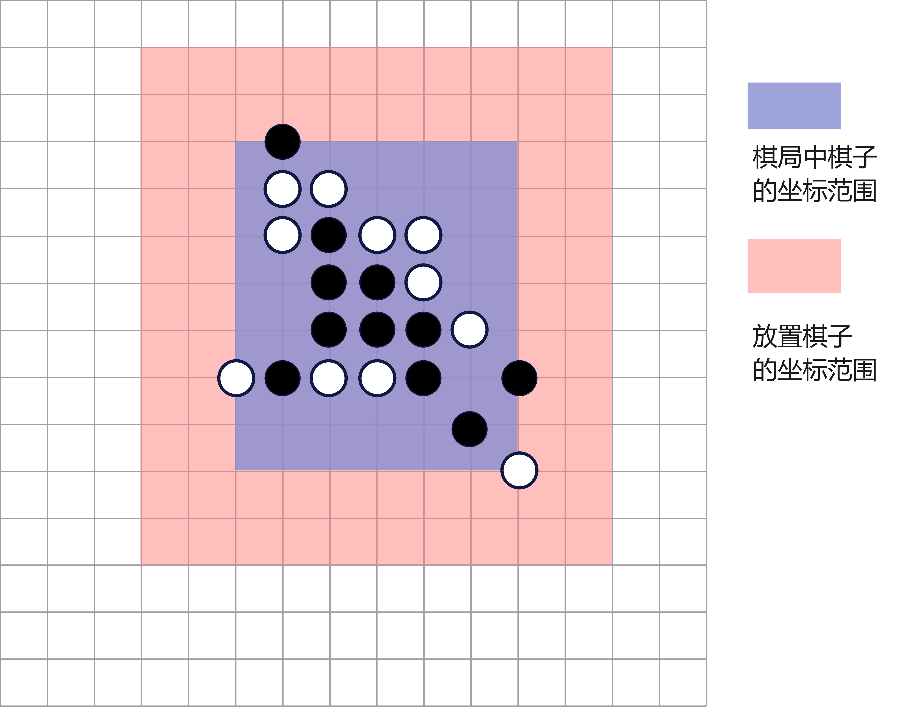
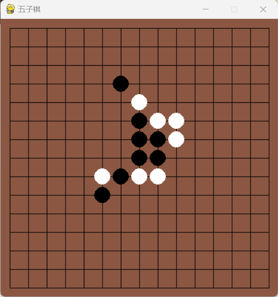
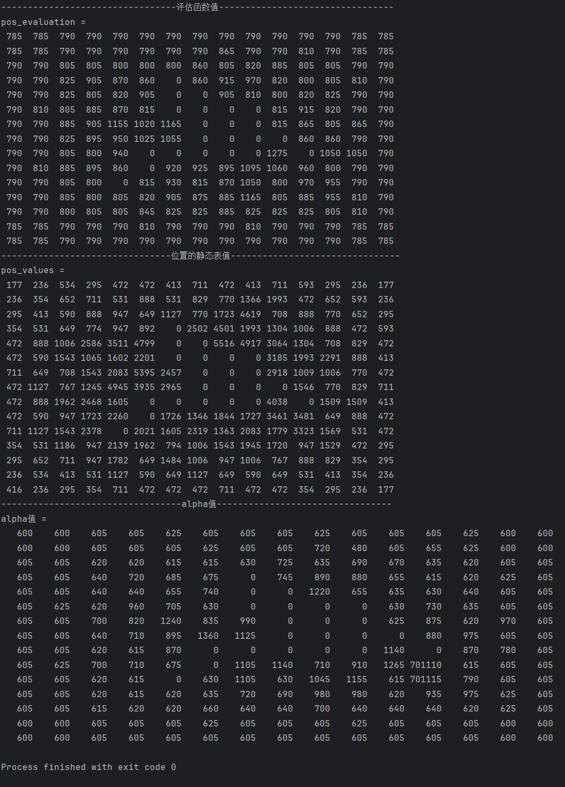

<header>                <p>人工智能实验</p>    </header>

# 中山大学计算机学院

# 人工智能

# 本科生实验报告

###### （2023学年春季学期）


**课程名称**：Artificial Intelligence


## 一、实验题目

* 编写一个五子棋博弈程序，要求用Alpha-beta剪枝算法，实现人机对弈。 
* 结果分析 
  * 微信小程序“欢乐五子棋”中的残局闯关的前20关，选择其中至少1关进行分析。AI能否 胜利，分析原因；将每一步的所有分支对应的评估函数值输出，分析是否合理；分析 评估函数的剪枝效果，如剪掉节点数的占比
  * 第14关较难，作为附加题
* 加分项示例 
  * 算法实现优化分析，分析优化后时间和空间的变化
  * 不同评价函数对比，分析不同评价函数的剪枝效果

## 二、实验内容

### 1.算法原理

#### 1.1 Alpha-beta 剪枝

**人工智能**是一个广泛的主题，其中涉及许多算法。其中之一就是**极小极大算法**。这是一种著名的回溯算法，用于决策。**Alpha-beta剪枝**是对极小极大算法的一种优化技术。剪枝字面上意味着剪掉死亡或过度生长的树枝或茎。在人工智能中，剪枝是指剪掉决策树和随机森林中无用的分支。

**MINMAX 算法**：

* **极小极大算法**是一种用于博弈论和决策的回溯算法。它用于寻找玩家的最佳移动，假设对手也在最优策略下行动。这种算法通常用于基于回合的双人游戏，例如国际象棋、跳棋、井字游戏等。
* 在极小极大算法中，有两个角色：**极小者**和**极大者**。极小者试图获得尽可能低的分数，而极大者则试图获得尽可能高的分数。极小极大方法确定了根节点玩家MAX的最佳移动。搜索树通过递归地从根节点开始向下扩展所有节点，直到游戏结束或达到最大搜索深度。

**Alpha-beta 剪枝**：

- **Alpha-beta剪枝**是**极小极大算法**的一种改进版本。在极小极大搜索算法中，它必须检查的游戏状态数量随着树的深度呈指数级增长。虽然我们无法消除这个指数，但我们可以将其减半。因此，有一种技术可以在不检查游戏树的每个节点的情况下计算正确的极小极大选择，这就是**剪枝**。这种技术涉及两个阈值参数：**Alpha**和**Beta**，因此被称为**Alpha-beta剪枝**。它也被称为**Alpha-Beta算法**。
- **Alpha**：在Maximizer路径上找到的迄今为止的最佳（最高值）选择。初始值为负无穷。
- **Beta**：在Minimizer路径上找到的迄今为止的最佳（最低值）选择。初始值为正无穷。

**alpha-beta 剪枝的关键点**：

* Alpha-beta剪枝的条件是**α >= β**。
* Alpha只在MAX的回合更新，而Beta只在MIN的回合更新。
* MAX玩家只会更新Alpha值，而MIN玩家只会更新Beta值。
* 在树的反转过程中，节点值将传递给上层节点，而不是Alpha和Beta值。
* 只有子节点会获得Alpha和Beta值。

#### 1.2 可能放棋的位置的排序

在Alpha-Beta剪枝中，节点的检查顺序决定了剪枝的效率。在人工智能中，移动顺序对Alpha-Beta剪枝至关重要。

在Alpha-Beta剪枝中，有两种类型的移动顺序：

1. **最差排序（Worst Ordering）**：在某些情况下，算法不会剪枝任何节点，表现得像传统的极小极大算法。由于Alpha和Beta变量，这需要很长时间，并且没有产生有价值的结果。在剪枝中，这被称为最差排序。在这种情况下，最佳移动位于树的右侧。
2. **理想排序（Ideal Ordering）**：在某些情况下，Alpha-Beta剪枝算法会剪枝大量节点。在剪枝中，这被称为理想排序。在这种情况下，最佳移动位于树的左侧。我们选择深度优先搜索（DFS）算法，因为它首先搜索树的左侧，然后比极小极大方法快两倍地深入搜索。

这些移动顺序的选择对于Alpha-Beta剪枝的性能至关重要。

**寻找良好排序的规则**：

1. 在树中，对节点进行排序，使得较好的节点首先被检查。
2. 从最浅的节点开始进行最佳移动。
3. 我们可以跟踪状态，因为它们有可能再次出现。
4. 在做出正确的步骤决策时，利用你的专业知识。

我的程序选择在遍历所有可能位置之前，先对所有位置进行评估，然后根据评估节点，把评估值大的放在列表的前面，把评估值小的放在列表的后面，这样能极大地提高剪枝的效率。

**位置评估的原理**：

参考文献：

> Cheng Y, Lei X F. Research and Improvement of Alpha-Beta Search Algorithm in Gobang[J]. Jisuanji Gongcheng/ Computer Engineering, 2012, 38(17).

我利用静态表启发式搜索对可能放置棋子的位置进行评估。

相同颜色的五个棋子在水平、垂直、左斜或右斜方向上相连，形成了一种称为“获胜组合”的棋形。双方玩家的目标是首先获得这个获胜组合。对于一个大小为15\*15的棋盘，共有572种获胜组合，包括15\*11的水平或垂直组合，以及11*11的左斜或右斜组合。如图2所示，列出了七种不同的获胜组合及其对应的编号：


棋盘上每个获胜组合占据的五个网格点是水平、垂直、左斜或右斜对角线四个方向上相邻的网格点，被称为“五连通网格点”（5cgp）。棋盘上的每个5cgp对应一个获胜组合，并被赋予相同的编号。每个5cgp上双方棋子的数量对应一定的分数，称为静态表参数，用于生成静态表。

下面是文献中给出的静态表参数。

| hape | Value | Shap | Value |
| ---- | ----- | ---- | ----- |
| OWN0 | 20    | OPP0 | 59    |
| OWN1 | 178   | OPP1 | 298   |
| OWN2 | 1151  | OPP2 | 1164  |
| OWN3 | 1240  | OPP3 | 1200  |
| OWN4 | 20000 | OPP4 | 10000 |

玩家在一个5cgp中拥有的棋子越多，威胁就越大，因此分数越高。此外，OWN0-OWN4或OPP0-OPP4表示在5cgp中分别有0-4个己方棋子或对手棋子。

计算单个空位置的单个方向的得分的示例图：


对于黑子而言，位置 A 的水平方向上的得分为 $20+178+1151+1240=2589$ 

在Alpha-Beta剪枝搜索中，我们希望对任何节点的子节点进行排序。因此，我们对棋盘上的所有空点进行评分，所有空点与其分数之间的对应关系被称为静态表。

得分方法对于某个空网格点的计算如下：首先，遍历包含该空网格点的四个方向中的所有5连通网格点（5cgp），然后每个5cgp对应双方棋子的数量（使用类似滑动窗口的思想实现）。其次，分别根据双方棋子的数量累加静态表参数。最后，得到双方的静态表值（也称为静态表启发式值）。该空网格点的最终静态表值为对于两方的棋子放置后的静态表值的最大值。
$$
score(posA) = \max(own(posA), opp(posA))
$$


#### 1.3 状态的启发式函数

参考文献：

> Cheng Y, Lei X F. Research and Improvement of Alpha-Beta Search Algorithm in Gobang[J]. Jisuanji Gongcheng/ Computer Engineering, 2012, 38(17).

参考的基础上，棋型分数的设定依据了自己的下棋经验。

| 棋型                         | 得分    |
| ---------------------------- | ------- |
| 成5                          | 5000000 |
| 活4                          | 4000000 |
| 连冲4                        | 500     |
| 跳冲4                        | 400     |
| 连活3                        | 600     |
| 跳活3                        | 550     |
| 连眠3                        | 300     |
| 眠3_1(目标棋之间间隔最多为1) | 200     |
| 眠3_2(目标棋之间间隔最大为2) | 150     |
| 连活2                        | 70      |
| 跳活2                        | 80      |
| 眠2                          | 20      |
| 活1                          | 5       |
| 双冲4                        | 800000  |
| 单冲4+单冲3                  | 700000  |
| 双冲3                        | 600000  |

状态的得分：
$$
score(board) = score(black)-score(white)
$$


### 2.流程图和伪代码

AlphaBetaSearch 函数的流程图：


alpha-beta 剪枝主体函数alpha_beta_search实现的伪代码：

```python
输入: alpha值, beta值, 当前的搜索的深度depth, 当前需要放置的棋子类型color,is_max是否是max层, 当前棋局的状态board
输出: 最优评估值
function alpha_beta_search(alpha, beta, depth, color, is_max, board):
    if 到达叶子节点 or 当前节点为必胜状态:
        return 当前状态的启发函数值
    
   	next_move_locations = get_next_move_locations(board)
   	x, y = CHONG_4_check(board, not color)
   	if x, y 存在
   		设置next_move_locations为[(x, y)]
   	
   	sort(next_move_locations)
   	
    if is_max then
        for x, y in next_move_locations:
            修改 board[x][y] 为 color
            next_score = alpha_beta_search(alpha, beta, depth + 1, not color, False, board)
            恢复 board[x][y] 为 EMPTY
            更新 alpha 为 max(alpha, next_score)
            if beta 小于 alpha:
                终止循环
        return alpha
    else
        for x, y in next_move_locations:
            修改 board[x][y] 为 color
            next_score = alpha_beta_search(alpha, beta, depth + 1, not color, True, board)
            恢复 board[x][y] 为 EMPTY
            更新 beta 为 min(beta, next_score)
            if beta 小于 alpha:
                终止循环
        return beta
   	end
```


### 3.关键代码展示

#### 3.1 AlphaBetaSearch

```python
def AlphaBetaSearch(board, color):
    # 得到下一个可能下的位置
    next_move_locations = get_next_move_locations(board)
    # get_next_move_locations 有位置限定优化
    # 把可能的位置限定在一定范围内，不会把所有空位都放在 next_move_locations 里面

    # 预处理 1
    # 对于 冲四 的情况，直接处理
    x, y = CHONG_4_check(board, color)  # 检查我方棋子是否存在冲4
    if x != -1:
        return x, y, 0
    x, y = CHONG_4_check(board, not color)  # 检查敌方棋子是否存在冲4
    if x != -1:
        return x, y, 0

    # 预处理 2
    # 对于可以成为 活4 的情况，选择最优位置进行返回
    best_x, best_y, best_score = -1, -1, 0
    for x, y in next_move_locations:
        board[x][y] = color
        if get_pattern_count(board, HUO_4_PATTERN[color][0], color):  # 检查是否存在活4
            score = evaluation(board, color == BLACK)
            if score > best_score:
                best_x, best_y = x, y
        board[x][y] = EMPTY
    if best_x != -1:
        return best_x, best_y, best_score

    # alpha-beta 剪枝
    # 初始化 alpha, beta, end_x, end_y
    alpha = -1000000000000
    beta = 100000000000
    end_x, end_y = 0, 0
    # 根据 point_value 对 next_move_locations 进行排序
    next_move_locations.sort(key=lambda point: (point_value(point[0], point[1], board, color)), reverse=True)

    # 遍历可能的位置
    for x, y in next_move_locations:
        board[x][y] = color  # 修改当前位置的状态
        next_score = alpha_beta_search(alpha, beta, 1, not color, False, board)
        board[x][y] = EMPTY  # 恢复当前位置的状态
        if next_score > alpha:  # 更新 alpha, end_x, end_y
            end_x, end_y = x, y
            alpha = next_score

    return end_x, end_y, alpha
```


#### 3.2 alpha_beta_search

```python
def alpha_beta_search(alpha, beta, depth, color, is_max, board):
    # 判断是否到达叶子节点或者到达必胜状态
    if depth == MAX_DEPTH-1 or (get_pattern_count(board, CHENG_5_PATTERN[color][0], color) + get_pattern_count(board, HUO_4_PATTERN[color][0], color)>0):
        return evaluation(board, color == BLACK)

    # 得到棋子可能放置的位置
    next_move_locations = get_next_move_locations(board)
    # 如果遇到对方的冲四，直接作为下一步的下棋位置
    x, y = CHONG_4_check(board, not color)
    if x != -1:
        next_move_locations = [(x, y)]

    # 对 next_move_locations 进行排序
    next_move_locations.sort(key=lambda point: (point_value(point[0], point[1], board, color)), reverse=True)
    if is_max:  # max 层
        for x, y in next_move_locations:
            board[x][y] = color     # 修改 board[x][y] 的状态
            # 得到当前状态的启发函数值
            next_score = alpha_beta_search(alpha, beta, depth + 1, not color, False, board)
            board[x][y] = EMPTY     # 恢复 board[x][y] 的状态
            alpha = max(alpha, next_score)  # 更新 alpha 值
            if beta <= alpha:       # 剪枝
                break
        return alpha
    else:  # min 层
        for x, y in next_move_locations:
            board[x][y] = color
            next_score = alpha_beta_search(alpha, beta, depth + 1, not color, True, board)
            board[x][y] = EMPTY
            beta = min(beta, next_score)
            if beta <= alpha:
                break
        return beta
```


#### 3.3 evaluation

```python
def evaluation(now_board):
    """
    判断当前棋局的分数
    """
    def evaluate(color, board):
        """
        判断棋局的分数
        :param color: 针对 color棋型计算棋局分数
        :param board: 当前棋局
        return: score 当前棋局的分数
        """
        score = 0  # 总的分数
        pattern_counts = []  # 不同棋型的统计数量
        
        # 遍历所有的棋型
        for i in range(PATTERN_TYPE_COUNT):
            cnt = 0
            if i == 4:  # 连活三, 需要特殊判断
                for pt in PATTERNS[color][i]:
                    cnt += get_pattern_count(board, pt, color, is_HUO_3=True)
            elif i == 9:  # 连活二, 也需要特殊判断
                for pt in PATTERNS[color][i]:
                    cnt += get_pattern_count(board, pt, color, is_HUO_2=True)
            else:
                for pt in PATTERNS[color][i]:
                    cnt += get_pattern_count(board, pt, color)
            pattern_counts.append(cnt)

        # 计算总分
        for i in range(PATTERN_TYPE_COUNT):
            score += PATTERN_SCORES[i] * pattern_counts[i]

        # 特殊棋型
        if pattern_counts[2] + pattern_counts[3] >= 2:  # 双冲四
            score += 800000
        elif pattern_counts[2] + pattern_counts[3] >= 1 and pattern_counts[4] + pattern_counts[5] >= 1:  # 冲四+冲三
            score += 700000
        elif pattern_counts[4] + pattern_counts[5] >= 2:  # 双冲三
            score += 600000
        return score
    # 返回总的评估值
    return evaluate(BLACK, now_board)-evaluate(WHITE, now_board)
```


#### 3.4 point_value

```python
def point_value(pos_x, pos_y, now_board, now_color):
    def static_table_value(point_x, point_y, dire, board, color, is_black):
        """
        计算单个方向的静态表值
        """
        own = 1 if color == is_black else 0  # 是否是 我方
        opp_color = not color

        start_x, start_y = point_x - 4 * dire[0], point_y - 4 * dire[1]  # 通过当前位置的五连通网格点的起点

        while not is_in_board(start_x, start_y):
            start_x, start_y = start_x + dire[0], start_y + dire[1]

        valid_pos = []  # 提前存好有效位置
        while is_in_board(start_x, start_y) and (start_x != point_x + 5 * dire[0] or start_y != point_y + 5 * dire[1]):
            valid_pos.append([start_x, start_y])
            start_x, start_y = start_x + dire[0], start_y + dire[1]
        # 如果有效位置长度小于5
        if len(valid_pos) < 5:
            return 0

        size, color_cnt, opp_cnt, value = 0, 0, 0, 0  # color_cnt我方棋子数量, opp_cnt 敌方棋子数量
        last_end_x, last_end_y = valid_pos[0][0], valid_pos[0][1]  # 五连通棋子的前面的一个棋子位置
        # 计算每个经过目标位置的五连通棋子的分数，并累加
        for x, y in valid_pos:
            if size < 5:
                size += 1
                color_cnt += 1 if board[x][y] == color else 0
                opp_cnt += 1 if board[x][y] == opp_color else 0
                if size == 5 and opp_cnt == 0:
                    value = STATIC_TABLE[own][color_cnt]
            else:
                color_cnt += (board[x][y] == color) - (board[last_end_x][last_end_y] == color)
                opp_cnt += (board[x][y] == opp_color) - (board[last_end_x][last_end_y] == opp_color)
                value += STATIC_TABLE[own][color_cnt] if not opp_cnt else 0 
                last_end_x, last_end_y = last_end_x + dire[0], last_end_y + dire[1]

        return value
    
    # 计算当前位置的分数: max(own_score, opp_score)
    res = max(sum(static_table_value(pos_x, pos_y, d, now_board, now_color, now_color == BLACK) for d in DIRE), 
              sum(static_table_value(pos_x, pos_y, d, now_board, not now_color, now_color == BLACK) for d in DIRE))
    return res
```


### 4.创新点&优化

1. 对所有可能放置棋子的位置进行缩减：

   

2. Alpha-Beta-Search中，根据个人五子棋经验，对特殊情况（主要是我方和敌方的冲四棋型）进行判断，提前给出所要放置棋子的位置。

3. 在进行深度优先搜索之前，对各位置进行位置状态分析，得到所有位置的静态表值，能够很好地判断位置的优劣，通过所有位置的静态表值进行排序，能够提高 alpha-beta 剪枝过程的效率和速度，增加剪枝数量，提高算法效率。

4. 根据个人的下棋经验，设计评估函数，有利于指导程序往正常下棋方向行动。


## 三、实验结果及分析

### 1 实验结果展示示例

* 搜索深度为3，挑战成功率 13/20，执行速度非常快，但容易陷入局部最优

  通过的关卡：1，2，4，5，6，7，10，11，12，13，16，18，19
* 搜索深度为4，挑战成功率 19/20（第16关在搜索深度为4的时候会陷入局部最优导致失败）
* 搜索深度为5，只测试了16关，代价是极大的时间消耗

结果：

第16关的挑战是在搜索深度为5时的挑战结果，其他关卡都是在搜索深度为4下完成的：


### 2 第14关分析

初始状态：


每一步的输出：



     

对于第14关，我的AI能够战胜小程序的AI：

* 第一步：我方AI选择在敌方的跳三棋型中间空位置放置，既能防止敌方形成活四局面，又能为己方增加一个活三
* 第二步：选择拓展成四，这是一个比较常见的拓展棋局的方式
* 第三步：选择一个位置，能够形成 双活三 的局面，在当前的局势来看，优势很大
* 第四步：敌方形成冲四局面，必须在冲四棋型的空位放置，以此防止敌方成五
* 第五步：敌方把此前形成的 双活三全堵了，我方AI选择往左下方拓展棋局，形成一个活三，白子集中在右上方，拓展左下方我方更有优势
* 第六步：敌方在右上方堵住我方活三，我方AI形成跳冲四，最左下面的黑子容易和上面的黑子，还有上方斜的眠三形成眠四+冲三必胜局面。
* 第七步：形成眠四+冲三局面
* 第八步：形成冲四局面
* 第九步：形成成五局面，我方AI胜利


分析 进行**第六步**前 的各个位置的 **静态表值** 和 **评估函数值**：

测试函数：

```python
def test1():
    def print_matrix(matrix):
        max_value = max(max(row) for row in matrix)

        for row in matrix:
            for i in range(len(row)):
                row[i] = str(row[i]).rjust(len(str(max_value)))

        # 打印结果
        for row in matrix:
            print(' '.join(row))

    board = [
        [-1, -1, -1, -1, -1, -1, -1, -1, -1, -1, -1, -1, -1, -1, -1],
        [-1, -1, -1, -1, -1, -1, -1, -1, -1, -1, -1, -1, -1, -1, -1],
        [-1, -1, -1, -1, -1, -1, -1, -1, -1, -1, -1, -1, -1, -1, -1],
        [-1, -1, -1, -1, -1, -1, 1, -1, -1, -1, -1, -1, -1, -1, -1],
        [-1, -1, -1, -1, -1, -1, 0, 0, -1, -1, -1, -1, -1, -1, -1],
        [-1, -1, -1, -1, -1, -1, 0, 1, 0, 0, -1, -1, -1, -1, -1],
        [-1, -1, -1, -1, -1, -1, -1, 1, 1, 0, -1, -1, -1, -1, -1],
        [-1, -1, -1, -1, -1, -1, -1, 1, 1, 1, 0, -1, -1, -1, -1],
        [-1, -1, -1, -1, -1, 0, 1, 0, 0, 1, -1, 1, -1, -1, -1],
        [-1, -1, -1, -1, -1, 1, -1, -1, -1, -1, -1, -1, -1, -1, -1],
        [-1, -1, -1, -1, 0, -1, -1, -1, -1, -1, -1, -1, -1, -1, -1],
        [-1, -1, -1, -1, -1, -1, -1, -1, -1, -1, -1, -1, -1, -1, -1],
        [-1, -1, -1, -1, -1, -1, -1, -1, -1, -1, -1, -1, -1, -1, -1],
        [-1, -1, -1, -1, -1, -1, -1, -1, -1, -1, -1, -1, -1, -1, -1],
        [-1, -1, -1, -1, -1, -1, -1, -1, -1, -1, -1, -1, -1, -1, -1],
    ]
    pos_values = []
    pos_evaluation = []
    for x in range(15):
        single_row = []
        for y in range(15):
            if board[x][y] == EMPTY:
                board[x][y] = BLACK
                single_row.append(evaluation(board))
                board[x][y] = EMPTY
            else:
                single_row.append(0)
        pos_evaluation.append(single_row)

    print("---------------------------------评估函数值---------------------------------")
    print("pos_evaluation = ")
    print_matrix(pos_evaluation)

    # ------------------ 位置的静态表值 -------------------
    for i in range(15):
        single_row_pos_values = []
        for j in range(15):
            if board[i][j] == EMPTY:
                score = point_value(i, j, board, BLACK)
                single_row_pos_values.append(score)
            else:
                single_row_pos_values.append(0)
        pos_values.append(single_row_pos_values)
    print("--------------------------------位置的静态表值--------------------------------")
    print("pos_values = ")
    print_matrix(pos_values)
    print("----------------------------------alpha值---------------------------------")
    pos_alpha_values = []
    print("alpha值 = ")
    for i in range(15):
        single_row_alpha_values = []
        for j in range(15):
            if board[i][j] == EMPTY:
                board[i][j] = BLACK
                alpha = alpha_beta_search(-100000000000, 100000000000, 1, WHITE, False, board)
                board[i][j] = EMPTY
                single_row_alpha_values.append(alpha)
            else:
                single_row_alpha_values.append(0)
        pos_alpha_values.append(single_row_alpha_values)
    print_matrix(pos_alpha_values)

    return 0
```

输出：

 

可以看出，评估函数值在黑棋附近的得分比较高，位置的静态表值在有棋子的附近的得分比较高，第六步的位置的静态表值较高，能够较早地进行访问到。第六步的放棋位置的 alpha 值最高，为 701115，说明它预测到未来可能可以形成 冲四+活三（score+700000） 的局面，所以AI选择这个位置进行放棋。如果只看评估函数值，容易陷入局部最优，导致步骤数增加或者直接导致失败。根据后面的步骤的情况，可以看出我方AI的第六步走的非常合理。

测试评估函数的剪枝效果：

测试函数：

```python
def test2():
    board = [
        [-1, -1, -1, -1, -1, -1, -1, -1, -1, -1, -1, -1, -1, -1, -1],
        [-1, -1, -1, -1, -1, -1, -1, -1, -1, -1, -1, -1, -1, -1, -1],
        [-1, -1, -1, -1, -1, -1, -1, -1, -1, -1, -1, -1, -1, -1, -1],
        [-1, -1, -1, -1, -1, -1, 1, -1, -1, -1, -1, -1, -1, -1, -1],
        [-1, -1, -1, -1, -1, -1, 0, 0, -1, -1, -1, -1, -1, -1, -1],
        [-1, -1, -1, -1, -1, -1, 0, 1, 0, 0, -1, -1, -1, -1, -1],
        [-1, -1, -1, -1, -1, -1, -1, 1, 1, 0, -1, -1, -1, -1, -1],
        [-1, -1, -1, -1, -1, -1, -1, 1, 1, 1, 0, -1, -1, -1, -1],
        [-1, -1, -1, -1, -1, 0, 1, 0, 0, 1, -1, 1, -1, -1, -1],
        [-1, -1, -1, -1, -1, 1, -1, -1, -1, -1, -1, -1, -1, -1, -1],
        [-1, -1, -1, -1, 0, -1, -1, -1, -1, -1, -1, -1, -1, -1, -1],
        [-1, -1, -1, -1, -1, -1, -1, -1, -1, -1, -1, -1, -1, -1, -1],
        [-1, -1, -1, -1, -1, -1, -1, -1, -1, -1, -1, -1, -1, -1, -1],
        [-1, -1, -1, -1, -1, -1, -1, -1, -1, -1, -1, -1, -1, -1, -1],
        [-1, -1, -1, -1, -1, -1, -1, -1, -1, -1, -1, -1, -1, -1, -1],
    ]
    x, y = AlphaBetaSearch(board, BLACK)
    print(x, y)
```

输出：

```python
访问状态数: 16755
10 11
```

未剪枝时候的访问节点数：大于200000000，剪枝效果还是非常明显的


### 3 比较优化前后运行效率

我主要对比 搜索深度为3时候的搜索时间，搜索深度大于等于4时候的未优化程序运行时间太长，不太好测试。测试的案例是 第12关。

优化的方式，主要是对放置位置进行静态表值计算和排序。

优化前：


```
-------------- step 1 --------------
访问状态数: 2342
9 6 
search time 20.3883273601532s
-------------- step 2 --------------
10 3 
search time 0.0009133815765380859s
-------------- step 3 --------------
访问状态数: 3826
9 8 
search time 32.02581310272217s
-------------- step 4 --------------
访问状态数: 3407
9 7 
search time 28.313510417938232s
-------------- step 5 --------------
访问状态数: 4583
6 9 
search time 38.03121519088745s
-------------- step 6 --------------
访问状态数: 3556
7 10 
search time 29.314612865447998s
-------------- step 7 --------------
访问状态数: 3816
10 7 
search time 31.696362257003784s
-------------- step 8 --------------
8 9 
search time 0.040857553482055664s
-------------- step 9 --------------
6 11 
search time 0.0s
```

预处理操作的时间都很短（基本0.05秒以内），无需考虑。主要是看真正进入到 alpha-beta 剪枝过程中的查找效率。在未进行位置排序优化之前，访问的节点数平均大概为3588，访问时间平均为30s左右。


优化后的：


```
-------------- step 1 --------------
访问状态数: 289
9 6 
search time 2.260197162628174s
-------------- step 2 --------------
10 3 
search time 0.0010259151458740234s
-------------- step 3 --------------
访问状态数: 299
9 8 
search time 2.1258292198181152s
-------------- step 4 --------------
访问状态数: 284
9 7 
search time 1.994150161743164s
-------------- step 5 --------------
访问状态数: 317
6 9 
search time 2.27303409576416s
-------------- step 6 --------------
访问状态数: 452
7 10 
search time 3.3933091163635254s
-------------- step 7 --------------
访问状态数: 428
10 7 
search time 3.1572258472442627s
-------------- step 8 --------------
8 9 
search time 0.0379788875579834s
-------------- step 9 --------------
6 11 
search time 0.0s
```

进入到 alpha-beta 剪枝过程的步骤中，平均访问状态数：345， 平均搜索时间：2.5s。

搜索时间减少到原来的十二分一，访问状态数减少到了原来的十分之一还要少。由最终结果可见：位置排序对最终的放置棋子的位置的结果没有影响，但是时间有了极大的提升，访问状态数减少了特别多。

我一开始没有对位置进行排序，导致我一开始设置搜索深度为4的时候，搜索时间特别长，没有耐心等下去，就选择设置搜索深度为3，但是在不断测试代码和修正代码的过程中，发现搜索深度为3的时候，我的程序不仅运行比较慢而且成功率很低，只有13/20。之后，我在谷歌查找资料的过程中看到一篇文献（参考资料3），详细介绍了五子棋alpha-beta剪枝优化的方法，参照论文的思路，我完成了位置排序预处理的代码，发现，在搜索深度为3的时候运行速度提升了很多，再之后尝试把搜索深度改为4，虽然每一步都运行相对搜索深度为3时候的要慢一些，但是成功率提升了很多。


### 4 其他评价函数的实现：

```python
STATIC_TABLE2 = [20, 178, 1151, 1240, 20000, 20000000]


def evaluation2(now_board):
    def static_table_value(point_x, point_y, dire, board, color):
        """
        计算单个方向的静态表值
        """
        opp_color = not color

        start_x, start_y = point_x - 4 * dire[0], point_y - 4 * dire[1]  # 通过当前位置的五连通网格点的起点

        while not is_in_board(start_x, start_y):
            start_x, start_y = start_x + dire[0], start_y + dire[1]

        valid_pos = []  # 提前存好有效位置
        while is_in_board(start_x, start_y) and (start_x != point_x + 5 * dire[0] or start_y != point_y + 5 * dire[1]):
            valid_pos.append([start_x, start_y])
            start_x, start_y = start_x + dire[0], start_y + dire[1]
        # 如果有效位置长度小于5
        if len(valid_pos) < 5:
            return 0

        size, color_cnt, opp_cnt, value = 0, 0, 0, 0  # color_cnt我方棋子数量, opp_cnt 敌方棋子数量
        last_end_x, last_end_y = valid_pos[0][0], valid_pos[0][1]  # 五连通棋子的前面的一个棋子位置
        # 计算每个经过目标位置的五连通棋子的分数，并累加
        for x, y in valid_pos:
            if size < 5:
                size += 1
                color_cnt += 1 if board[x][y] == color else 0
                opp_cnt += 1 if board[x][y] == opp_color else 0
                if size == 5 and opp_cnt == 0:
                    value = STATIC_TABLE2[color_cnt]
            else:
                color_cnt += (board[x][y] == color) - (board[last_end_x][last_end_y] == color)
                opp_cnt += (board[x][y] == opp_color) - (board[last_end_x][last_end_y] == opp_color)
                value += STATIC_TABLE2[color_cnt] if not opp_cnt else 0
                last_end_x, last_end_y = last_end_x + dire[0], last_end_y + dire[1]

        return value

    def evaluate(board, color):
        value = 0
        for x in range(15):
            for y in range(15):
                if board[x][y] != EMPTY:
                    value += sum(static_table_value(x, y, d, board, color) for d in DIRE)
        return value
    return evaluate(now_board, BLACK)-evaluate(now_board, WHITE)
```

把表中放有棋子的位置的静态表值加起来作为棋局的评估值。

使用该评估函数通过了第6关：


进行过其他部分关卡的测试，成功率极低，从剪枝效果来看比此前使用的评估函数要差一些，但是这个评估函数的耗时会小很多，循环用的更少，所以运行时间会更短一些。但是从成功率来看，之前使用的评估函数的效果更好。


## 四、参考资料

1. https://www.naukri.com/code360/library/alpha-beta-pruning-in-artificial-intelligence
2. https://en.wikipedia.org/wiki/Alpha%E2%80%93beta_pruning
3. https://www.researchgate.net/publication/367787222_Research_and_Improvement_of_Alpha-Beta_Search_Algorithm_in_Gobang （之前提到的参考文献的来源）
4. https://oi-wiki.org/search/alpha-beta/


 