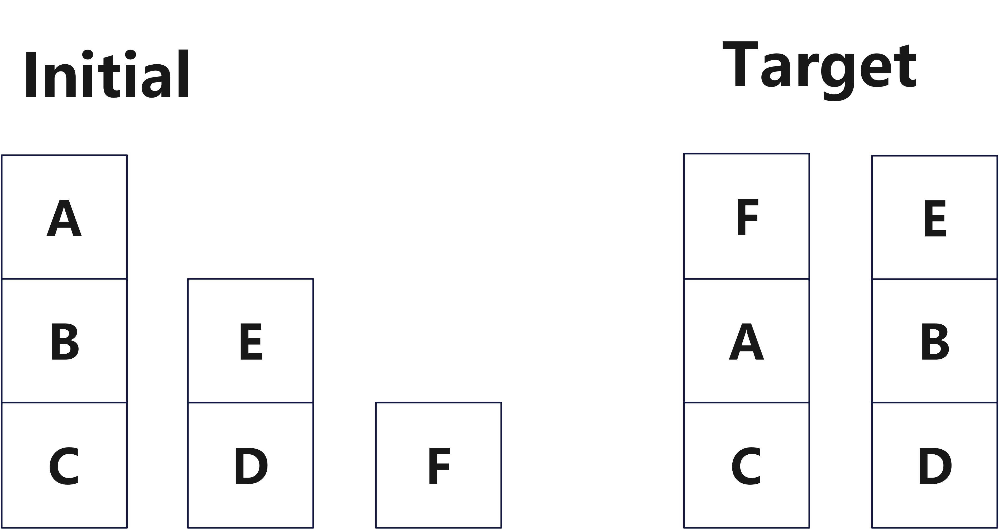

<header>                <p>人工智能实验</p>    </header>

# 中山大学计算机学院

# 人工智能

# 本科生实验报告

###### （2023学年春季学期）


**课程名称**：Artificial Intelligence


## 一、实验题目

实验任务一：积木世界 blocks，补充动作(`blocks.pddl`)

实验任务二：补充完整 puzzle 中的 domain 文件(`puzzle.pddl`) 和 一个 `PPTx.pddl` 文件，只允许有 slide 这一个动作。其他自行定义。

## 二、实验内容

### 1.算法原理

**Planning Domain Definition Language**(PDDL) 是一种知识表示语言，旨在表达计划模型。

* **论域描述** Domain Description：明确论域内每个问题中存在的元素。
* **问题描述** Problem Description：明确具体的规划问题，包括初始状态和目标。
* PDDL 指定的规划任务分为两个文件：`domain` 文件和 `problem` 文件

* **输出**：规划器根据PDDL的问题描述生成有序的计划（动作序列）。

* 规划任务 planning task 由五部分组成：

  objects 对象、predicates 谓词、initial state 初始状态、goal specification 目标规范、actions/operators 操作/运算符。

运用 PDDL 可以求解很多规划问题，但是求解的结果不能保证最优性。

### 2. 流程图

### 2.1 积木世界


### 2.2 15puzzle 问题


### 3.关键代码展示

#### 3.1 Blocks world

问题：通过 `move` 和 `moveToTable` 的操作，改变积木状态为最终的目标状态。

分析两个行动：

* `move a b`：把 a 移动到 b 的上方

  * 前提：a 的上方为空，b的上方为空，且 a 不是 b

  * 行动：

    * a 在 b 的上方
    * b 的上方不为空
    * a 原来的下方方块的上方为空

  * 代码：

    ```pddl
    (:action move
             :parameters (?x ?y - physob)
             :precondition (and (clear ?x) (clear ?y)(not (= ?x ?y)))
             :effect (
              and (not (clear ?y)) (on ?x ?y) 
              (forall(?z)(when(on ?x ?z)(and (clear ?z)(not (on ?x ?z)))))
             )
    )
    ```

* `moveToTable a`：把 a 移动到 桌面上

  * 前提：a 上方为空，且 a 不在桌面上

  * 行动：

    * 设置 a 原来的下方方块的上方为空
    * 设置 a 在桌面上

  * 代码：

    ```pddl
    (:action moveToTable
             :parameters (?x - physob)
             :precondition (and (clear ?x) (not (ontable ?x)))
             :effect (
              and (ontable ?x)
              (forall(?z)(when(on ?x ?z)(and (clear ?z)(not (on ?x ?z)))))
             )
    )
    ```

#### 3.2 15puzzle

定义谓词 `at` 和 `adjacent` ：

```
  (:predicates  (adjacent ?p1 ?p2 - loc)
                (at ?t - num ?p - loc))
```

定义 常量 B，代表空位置：

```
  (:constants
    B - num
  )
```

单个动作：`slide` ，定义：

`slide t, x, y` ：把 t 从位置 x 移动到位置 y

* 前提：t 在位置 x 上，位置 y 上为空，位置 x, y 相邻

* 行动：

  * t 在位置 y 上
  * t 不在位置 x 上
  * B(空白) 在位置 x 上
  * B(空白) 不在位置 y 上

* 代码：

  ```
    (:action slide
               :parameters (?t - num ?x ?y - loc)
               :precondition (and (at B ?y) (at ?t ?x) (adjacent ?x ?y))
               :effect (and (at B ?x) (at ?t ?y) (not (at ?t ?x) ) (not (at B ?y))) 
    )
  ```

在 `PP1.pddl` 中：

定义 objects：

```
 (:objects T1 T2 T3 T4 T5 T6 T7 T8 T9 T10 T11 T12 T13 T14 T15 - num
    P1 P2 P3 P4 P5 P6 P7 P8 P9 P10 P11 P12 P13 P14 P15 P16 - loc)
```

PPT1的初始状态：

```
 (:init (at T14 P1) (at T10 P2) (at T6 P3) (at B P4)
 (at T4 P5) (at T9 P6) (at T1 P7) (at T8 P8)
 (at T2 P9) (at T3 P10) (at T5 P11) (at T11 P12)
 (at T12 P13) (at T13 P14) (at T7 P15) (at T15 P16)
 ; location
 (adjacent P1 P5) (adjacent P1 P2) 
 (adjacent P2 P6) (adjacent P2 P3) (adjacent P2 P1) 
 (adjacent P3 P7) (adjacent P3 P4) (adjacent P3 P2) 
 (adjacent P4 P8) (adjacent P4 P3) 
 (adjacent P5 P9) (adjacent P5 P1) (adjacent P5 P6) 
 (adjacent P6 P10) (adjacent P6 P2) (adjacent P6 P7) (adjacent P6 P5) 
 (adjacent P7 P11) (adjacent P7 P3) (adjacent P7 P8) (adjacent P7 P6) 
 (adjacent P8 P12) (adjacent P8 P4) (adjacent P8 P7) 
 (adjacent P9 P13) (adjacent P9 P5) (adjacent P9 P10) 
 (adjacent P10 P14) (adjacent P10 P6) (adjacent P10 P11) (adjacent P10 P9) 
 (adjacent P11 P15) (adjacent P11 P7) (adjacent P11 P12) (adjacent P11 P10) 
 (adjacent P12 P16) (adjacent P12 P8) (adjacent P12 P11) 
 (adjacent P13 P9) (adjacent P13 P14) 
 (adjacent P14 P10) (adjacent P14 P15) (adjacent P14 P13) 
 (adjacent P15 P11) (adjacent P15 P16) (adjacent P15 P14) 
 (adjacent P16 P12) (adjacent P16 P15)
 )
```

目标状态：

```
 (:goal (and (at T1 P1) (at T2 P2) (at T3 P3) (at T4 P4)
            (at T5 P5) (at T6 P6) (at T7 P7) (at T8 P8)
            (at T9 P9) (at T10 P10) (at T11 P11) (at T12 P12)
            (at T13 P13) (at T14 P14) (at T15 P15))
 )
```

## 三、实验结果及分析

### 积木世界结果展示

初始状态 和 目标状态：



运行结果分析：


```
0.00000: (MOVETOTABLE A)
0.00100: (MOVE F A)
0.00200: (MOVETOTABLE E)
0.00300: (MOVE B D)
0.00400: (MOVE F B)
0.00500: (MOVE A C)
0.00600: (MOVE F A)
0.00700: (MOVE E B)
```

结果示意图：


### 15puzzle 结果展示

测试 15puzzle 的 PPT1：

初始状态：


开始的部分输出：

```
Plan found:
0.00000: (SLIDE T6 P3 P4)
0.00100: (SLIDE T10 P2 P3)
0.00200: (SLIDE T14 P1 P2)
0.00300: (SLIDE T4 P5 P1)
0.00400: (SLIDE T9 P6 P5)
0.00500: (SLIDE T1 P7 P6)
0.00600: (SLIDE T5 P11 P7)
0.00700: (SLIDE T11 P12 P11)
0.00800: (SLIDE T15 P16 P12)
0.00900: (SLIDE T7 P15 P16)
0.01000: (SLIDE T13 P14 P15)
0.01100: (SLIDE T3 P10 P14)
0.01200: (SLIDE T2 P9 P10)
0.01300: (SLIDE T9 P5 P9)
0.01400: (SLIDE T1 P6 P5)
```

.jpg)

可知，能正确地滑动方块。

分析每个 num 变量的最后一步的移动结果：

```
T1: slide T1 P5 P1
T2: slide T2 P6 P2
T3: slide T3 P4 P3
T4: slide T4 P8 P4
T5: slide T5 P6 P5
T6: slide T6 P7 P6
T7: slide T7 P8 P7
T8: slide T8 P12 P8
T9: slide T9 P13 P9
T10: slide T10 P9 P10
T11: slide T11 P10 P11
T12: slide T12 P11 P12
T13: slide T13 P14 P13
T14: slide T14 P15 P14
T15: slide T15 P16 P15
```

均移动到正确的位置，规划器能够正确求解。

在设置目标状态的时候，似乎不能加入 `at B P16` ，加入会导致程序无法找到正确结果。


## 四、参考资料

* Planning24.pdf
* week 9 PDDL实验.pdf
* pddl.pdf

