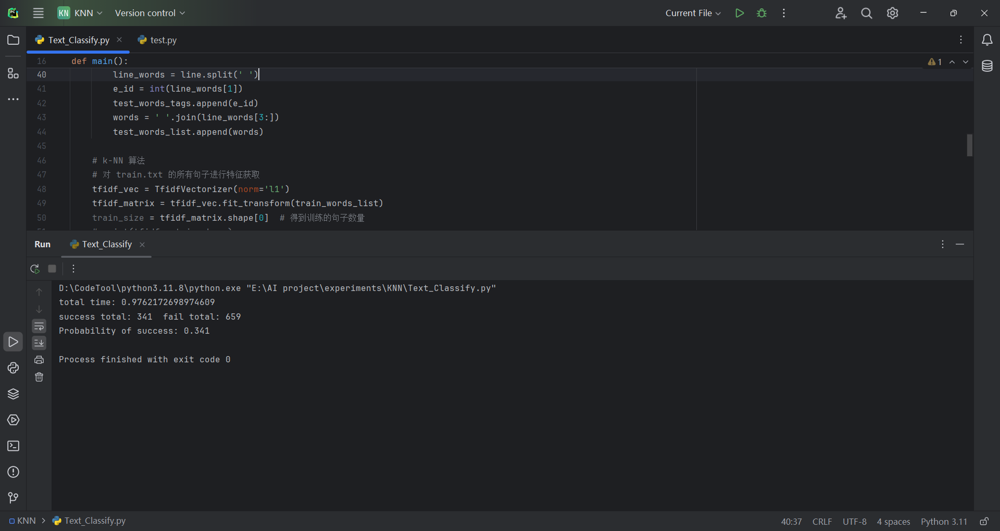
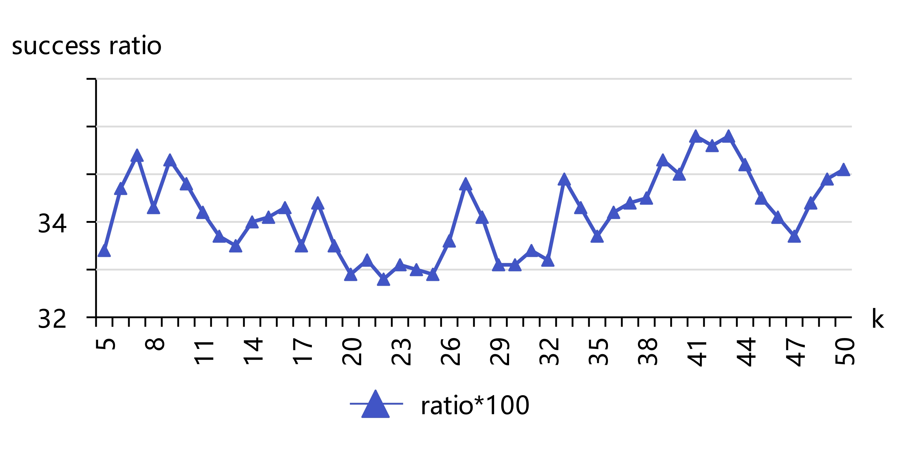

<header>                <p>人工智能实验</p>    </header>

# 中山大学计算机学院

# 人工智能

# 本科生实验报告

###### （2023学年春季学期）


**课程名称**：Artificial Intelligence


## 一、实验题目

* 实验内容：
  * k-NN分类器的实现
  * 在给定文本数据集完成文本情感分类训练，在测试集完成测试，计算准确率
* 实验要求：
  * 不可直接调用机器学习库中的分类器算法
  * 可使用各种提取文本特征的辅助工具


## 二、实验内容

### 1.算法原理

#### k-NN算法

k-NN（k-最近邻）算法是一种基本的机器学习算法，用于实现文本分类。其原理相对简单直观，主要包括以下几个步骤：

1. **特征提取**：首先，需要将文本数据转换为数值型特征向量，常用的方法有词袋模型（Bag of Words）和TF-IDF（Term Frequency-Inverse Document Frequency）。我选取的特征提取的模型是 TF-IDF 模型。
2. **距离计算**：当有一个未分类的文本时，算法会计算这个文本与训练集中每个文本的距离。距离的计算方式可以是欧氏距离、曼哈顿距离或余弦相似度等。
3. **找到最近的k个邻居**：根据计算出的距离，找出与未分类文本距离最近的k个已分类文本。
4. **投票决策**：这k个最近邻居会根据它们的分类进行投票，出现次数最多的分类将被赋予未分类文本。
5. **分类结果**：最终，未分类文本被分配到票数最多的类别。

k-NN算法的优点是实现简单，易于理解。但它也有缺点，比如对大数据集的处理效率较低，因为需要计算每个未分类文本与训练集中所有文本的距离。此外，选择合适的k值也是实现有效分类的关键。


#### TF-IDF

TF-IDF 是一种在信息检索和文本挖掘中广泛使用的技术，用于评估文本中的单词或术语的重要性。TF-IDF 是 "Term Frequency-Inverse Document Frequency" 的缩写，它结合了词频和逆文档频率来衡量一个术语在文本集合中的相对重要性。

以下是 TF-IDF 的基本原理和计算步骤：

1. **词频 (Term Frequency, TF)**
   - 词频表示一个术语在单个文档中出现的频率。它可以用多种方式计算，最简单的方法是计算词语在文档中出现的次数。由于文档的长度可能不同，通常使用归一化方法计算词频，常见的公式是：
     $TF(t, d) = \frac{f(t, d)}{L(d)},$
     其中，\(f(t, d)\) 是术语 \(t\) 在文档 \(d\) 中出现的次数，\(L(d)\) 是文档 \(d\) 的总词数。
   
2. **逆文档频率 (Inverse Document Frequency, IDF)**
   - 逆文档频率用于衡量一个术语在整个文档集合中的稀有程度。其计算方式是看术语出现在多少个文档中，然后取对数进行惩罚，通常的公式是：
     $IDF(t, D) = \log\left( \frac{|D|}{1 + |d \in D: t \in d|} \right),$
     其中，\(|D|\) 是文档集合的总文档数，\($|d \in D: t \in d|$\) 是包含术语 \(t\) 的文档数量。加 1 是为了防止分母为零。
   
3. **TF-IDF**
   - TF-IDF 将词频和逆文档频率相结合，以评估术语的重要性。其计算公式为：
     $TF-IDF(t, d, D) = TF(t, d) \times IDF(t, D).$
     这个结果可以理解为一个术语在单个文档中出现的频率和在整个文档集合中稀有程度的结合。TF-IDF 得分越高，表示该术语在文档中越重要，或者在整个文档集合中越独特。


### 2.流程图


### 3.关键代码展示

数据预处理：

```python
# 数据预处理
# 处理训练数据
train_file = open('train.txt', 'r')
train_txt = train_file.readlines()
for line in train_txt[1:]:
    line_words = line.split(' ')
    e_id = int(line_words[1])  # 情感标签的编号
    e_str = line_words[2]      # 情感标签
    emotion_dict[e_id] = e_str  # 情感标签字典
    train_words_tags.append(e_id)
    # 重组成一个完整的句子, 以使得 TfidfVectorizer 能够处理
    words = ' '.join(line_words[3:])
    train_words_list.append(words)

# 处理测试数据, 处理方式和上面的差不多
test_file = open('test.txt', 'r')
test_txt = test_file.readlines()
for line in test_txt[1:]:
    line_words = line.split(' ')
    e_id = int(line_words[1])
    test_words_tags.append(e_id)
    words = ' '.join(line_words[3:])
    test_words_list.append(words)
```


K-NN 算法

```python
# k-NN 算法
# 对 train.txt 的所有句子进行特征获取
tfidf_vec = TfidfVectorizer(norm='l1')
tfidf_matrix = tfidf_vec.fit_transform(train_words_list)
train_size = tfidf_matrix.shape[0]  # 得到训练的句子数量
print(tfidf_matrix.shape)
# 得到 numpy 的 array 格式的 tfidf矩阵
train_tfidf = tfidf_matrix.toarray()

k = 14  # 参数
# 得到 所有测试句子的 tfidf向量 的值
test_tfidf = tfidf_vec.transform(test_words_list).toarray()
test_size = test_tfidf.shape[0]  # 测试的句子数量
success_cnt, fail_cnt = 0, 0  # 成功分类的数量和失败的数量

# 遍历所有的 测试案例
for i in range(test_size):
    # 计算 测试句子 和 所有训练的句子 的 tf-idf 的向量的 “距离”
    # 余弦距离  # 在处理 i=20 的数据的时候会出现除法异常
    # distances = np.array([compute_cosine_distance(train_tfidf[j], test_tfidf[i]) for j in range(train_size)])
    # 欧氏距离
    distances = np.array([compute_euclidean_distance(train_tfidf[j], test_tfidf[i]) for j in range(train_size)])
    # 曼哈顿距离，利用矩阵运算进行优化
    # distances = np.sum(np.abs(train_tfidf-test_tfidf[i]), axis=1)
    # 获得前k短距离的训练样例的下标
    nearest_neighbors = np.argsort(distances)[:k]
    # 得到前k短距离的训练样例对应的 情感标签
    neighbor_tags = [train_words_tags[j] for j in nearest_neighbors]
    # 得到 情感标签最多的对应的 情感标签
    common_tag = Counter(neighbor_tags).most_common(1)[0][0]
    if common_tag == test_words_tags[i]:  # 如果情感标签相同
        print(i, emotion_dict[common_tag], "success")
        success_cnt += 1
    else:
        print(i, emotion_dict[common_tag], "fail", emotion_dict[test_words_tags[i]])
        fail_cnt += 1
```

在计算距离的时候，利用矩阵运算极大地加快了距离计算的速度。


### 4.优化

在计算距离的时候，利用矩阵运算加快计算速度。我原本在计算距离的时候，使用了两层 for 循环，第一层 for 遍历 训练数据中的所有的句子，第二层 for 循环遍历所有单词，在第二层遍历的过程中一个一个地增加 dist 变量的值。这样会导致计算距离的速度特别慢，差不多 1~2s 的时间得到单个测试句子的分类结果。

原来的部分代码片段：

```python
words_dist_list = []  # 针对单个测试句子的 和所有训练句子的距离的 列表
for j in range(train_size):  # 第一层遍历 => 遍历所有的 训练句子
    dist = 0
    for k in range(word_num):  # 第二层遍历 => 遍历所有的单词
        dist += abs(test_tfidf_matrix[i, k]-tfidf_matrix[j, k])
    words_dist_list.append((dist, j))

words_dist_list.sort()

e_idx_cnt = [0 for _ in range(20)]
for dis, idx in words_dist_list[:k]:
    e_idx_cnt[train_words_tags[idx]] += 1
max_idx = max(enumerate(e_idx_cnt), key=lambda x: x[1])[0]
```

优化的程序使用四行代码完成上面的代码实现的内容：

```python
distances = np.sum(np.abs(train_tfidf-test_tfidf[i]), axis=1)  # 矩阵运算优化
nearest_neighbors = np.argsort(distances)[:k]
neighbor_tags = [train_words_tags[j] for j in nearest_neighbors]
common_tag = Counter(neighbor_tags).most_common(1)[0][0]
```

运行速度提升了很多，1000个测试案例，不到 1s 就全部运行完成


## 三、实验结果及分析

1. 实验结果展示示例

以曼哈顿距离作为两个句子的 TF-IDF向量距离，设置 k = 15：



输出：

```
total time: 0.9762172698974609
success total: 341  fail total: 659
Probability of success: 0.341
```


2. 评测指标展示及分析

测试了三个距离的函数：（测试的 k 设置为 15）

| 距离函数   | 距离函数公式                                    | 程序运行时间        | 分类的成功率 |
| ---------- | ----------------------------------------------- | ------------------- | ------------ |
| 曼哈顿距离 | $d(x, y) = \sum_{i=1}^{n} |x_i - y_i|$          | 0.9357075691223145s | 34.1%        |
| 欧氏距离   | $d(x, y) = \sqrt{\sum_{i=1}^{n} (x_i - y_i)^2}$ | 0.8337030410766602s | 33.3%        |
| 余弦距离   | $\cos(x, y) = \frac{x \cdot y}{\|x\|\|y\|}$     | 1.6877796649932861s | 35.3%        |

三个距离函数余弦距离表现最好，其次是曼哈顿距离。但是余弦距离的计算时间比其他两个距离的计算时间更长，主要是因为有更多的乘法和除法，耗时更多。


比较不同的 k 值对结果的影响，下面的测试结果是在曼哈顿距离下的测试结果：

| k 值 |       |
| ---- | ----- |
| 5    | 33.4% |
| 10   | 34.8% |
| 15   | 34.1% |
| 20   | 32.9% |
| 30   | 33.1% |

同时，我测试了 k 从 5~40的数据，得到下面的折线图：



在这个训练样本和测试样本下，k值在5~50之间得到的主要在33%~36% 之间波动，平均值为 34.1%。


3. 和机器学习库中的分类器算法进行比较

调用库函数，设置 k = 15 且 距离函数设置为曼哈顿距离：

```python
# k-NN 算法
# 对 train.txt 的所有句子进行特征获取
tfidf_vec = TfidfVectorizer(norm='l1')
train_tfidf_matrix = tfidf_vec.fit_transform(train_words_list)

k = 15  # 参数
test_tfidf_matrix = tfidf_vec.transform(test_words_list)
# KNN 库函数
knn = KNeighborsClassifier(n_neighbors=k, metric='manhattan')
knn.fit(train_tfidf_matrix, train_words_tags)
test_predictions = knn.predict(test_tfidf_matrix)
accuracy = accuracy_score(test_predictions, test_words_tags)

print("Accuracy:", accuracy)
```

运行得到的分类正确率为 30.8%，低于我的程序的正确率。


## 五、参考资料

* week10 k-NN&Bayes.pdf
* https://zhuanlan.zhihu.com/p/97273457

