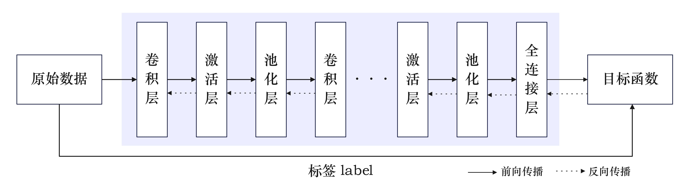
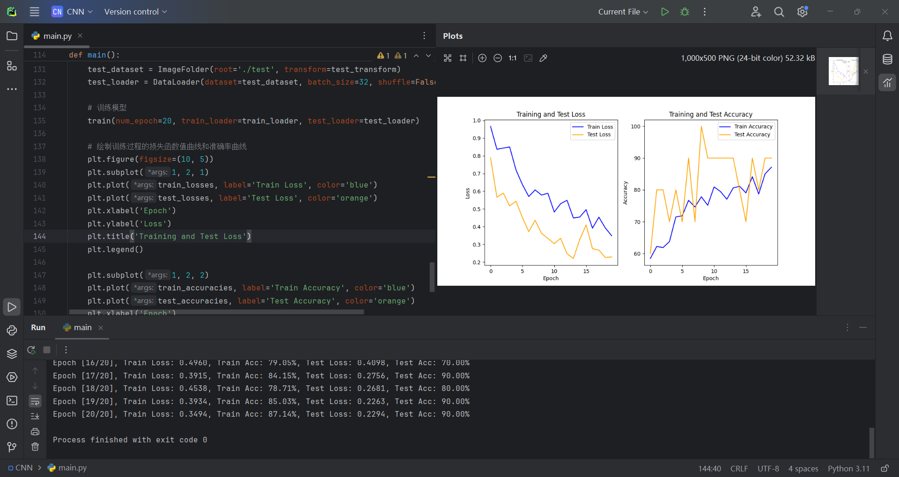
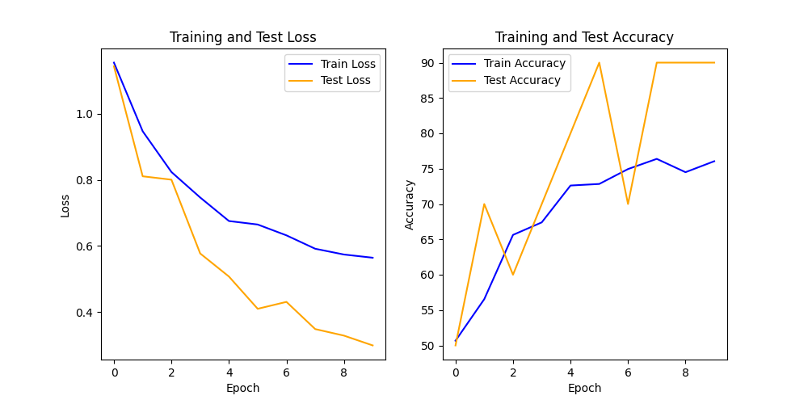
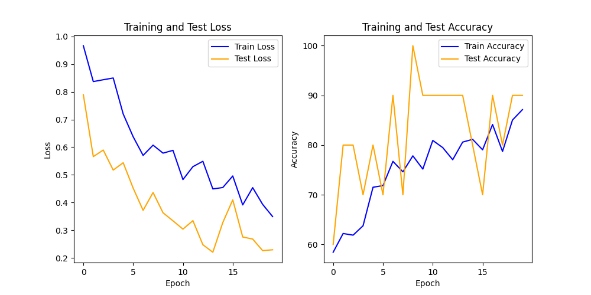
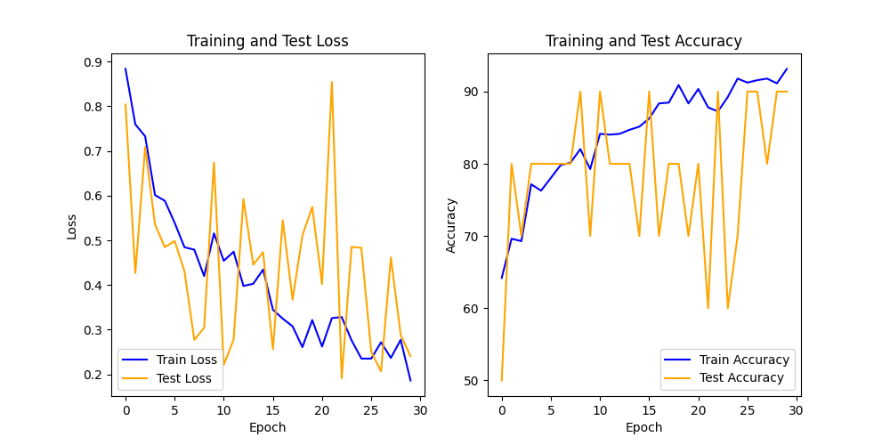
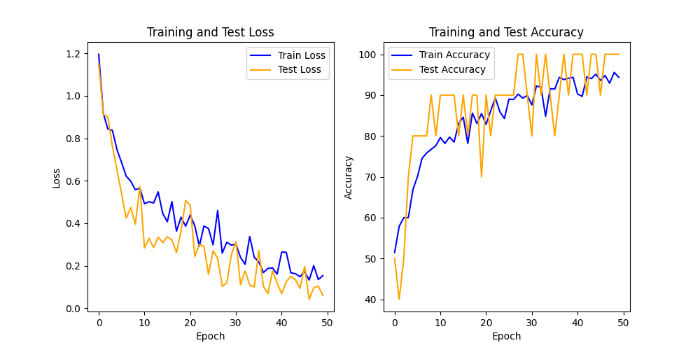

<header>                <p>人工智能实验</p>    </header>

# 中山大学计算机学院

# 人工智能

# 本科生实验报告

###### （2023学年春季学期）


**课程名称**：Artificial Intelligence


## 一、实验题目

中药图片分类人物

* 利用pytorch框架搭建神经网络实现中药图片分类，具体见给出的数据集和测试集。
* 要求： 搭建合适的网络框架，利用训练集完成网络训练，统计网络模型的训练准确率和测试准确率，画出模型的训练过程的loss曲线、准确率曲线。


## 二、实验内容

### 1.算法原理

卷积神经网络（Convolutional Neural Network, CNN）是一种前馈神经网络，其算法原理基于仿生学中对动物视觉系统的理解。CNN的核心思想是通过模仿生物神经网络中视觉皮层的结构和功能，来实现对图像等二维数据的高效处理和特征提取。

CNN的算法原理主要包括以下几个关键概念：

1. **卷积层（Convolutional Layer）**：卷积层是CNN的核心组成部分，其中使用一组可学习的滤波器（或称为卷积核）来对输入图像进行卷积操作。每个滤波器对输入图像进行滑动卷积操作，提取出不同的特征。这些特征包括边缘、纹理等低级特征。

2. **激活函数（Activation Function）**：卷积层中的卷积操作结果通常会被输入到一个激活函数中，以引入非线性特性。常用的激活函数包括ReLU（Rectified Linear Unit）、Sigmoid和tanh等。

3. **池化层（Pooling Layer）**：池化层用于降低卷积层输出的空间维度，减少模型参数数量，提高模型的鲁棒性。常用的池化操作包括最大池化和平均池化。

4. **全连接层（Fully Connected Layer）**：全连接层将卷积层和池化层提取的特征进行整合，并通过全连接的方式进行分类或回归等任务。

5. **反向传播算法（Backpropagation Algorithm）**：CNN通过反向传播算法来训练模型，即通过计算损失函数对模型参数的梯度，并使用梯度下降等优化算法来更新参数，使得模型的预测结果逼近真实标签。

通过这些组成部分的层层堆叠和训练，CNN能够自动学习并提取出输入数据中的高级特征，从而实现对图像、文本等复杂数据的有效分析和处理。

卷积神经网络常用于图像处理，CNN具有参数共享、局部连接、平移不变性、分层特征学习和自动特征学习等特点，这使得它成为处理图像数据的一种高效且强大的深度学习模型。

在我们这个实验中，需要实现图像分类，很自然地想到要用CNN构建图像分类的模型。

实验流程：

1. 读入训练集和测试集中的图片信息以及对图片预处理 

2. 用`pytorch`搭建神经网络（包括卷积和全连接神经网络） 

3. 将一个batch的训练集中的图片输入至神经网络，得到所有类别的预测分类概率

4. 根据真实标签和预测标签，利用交叉熵损失函数计算loss值，并进行梯度下降 

5. 根据测试集计算准确率，如果准确率没收敛，跳转回步骤3 

6. 画出loss、测试集准确率的曲线图


### 2.伪代码

训练函数伪代码：

```
Procedure train(num_epoch, train_loader, test_loader):
    For each epoch in range(num_epoch):
        running_loss = 0.0
        For each data in train_loader:
            Get inputs, labels from data
            Move inputs, labels to device
            Zero gradients
            Forward pass: outputs = model(inputs)
            Compute loss: loss = loss_fn(outputs, labels)
            Backward pass: loss.backward()
            Update parameters: optimizer.step()
            Accumulate loss: running_loss += loss.item()

        Evaluate model on training data: train_loss, train_accuracy = evaluate_model(model, train_loader)
        Store train_loss, train_accuracy
        Evaluate model on test data: test_loss, test_accuracy = evaluate_model(model, test_loader)
        Store test_loss, test_accuracy

        Print training and testing results
```

测试模型函数伪代码：
```
Procedure evaluate_model(cnn_model, data_loader):
    correct = 0
    total = 0
    loss = 0
    With no gradients:
        For each inputs, labels in data_loader:
            Move inputs, labels to device
            outputs = cnn_model(inputs)
            loss = loss + loss_fn(outputs, labels).item()
            _, predicted = max(outputs, 1)
            total = total + size(labels, 0)
            correct = correct + sum(predicted == labels).item()

    Return loss / size(data_loader), 100 * correct / total
```




<center>图 卷积神经网络基本流程图</center>

本实验中定义的卷积神经网络的结构图：

.jpg)

<center>图 本实验定义的神经网络结构</center>

### 3.关键代码展示

**导入所需要的库**

```python
import torch
import torch.nn as nn
import torch.nn.functional as F
from torch.optim import Adam
import torchvision.transforms as transforms
from torch.utils.data import DataLoader
from torchvision.datasets import ImageFolder
from matplotlib import pyplot as plt
```


**定义卷积神经网络**

使用 `Pytorch` 中 `torch.nn` 包构建神经网络模型。我定义的网络由以下 16层构成：`Conv -> BatchNorm -> ReLU -> Conv -> BatchNorm -> ReLU -> MaxPool -> Conv -> BatchNorm -> ReLU -> Conv -> BatchNorm -> ReLU -> MaxPool -> Linear -> Linear`。

* `Conv` 卷积层是CNN的主要层，可以帮助检测图像中的特征。每个层都有多个通道来检测图像中的特定特征，还有多个内核定义检测到的特征的大小。 定义卷积层时，需要提供输入通道数、输出通道数和内核大小。 该层中的输出通道数为下一层的输入通道数。
* `ReLU` 层是一个激活函数。
* `BatchNorm2d` 层对输入进行标准化，使得输入具有零均值和单位方差，从而提高网络精度。
* `MaxPool` 层，能确保图像中的对象的位置不会影响神经网络检测其特定特征的能力。
* `Linear` 层是网络的最后两层层，它计算每个类的分数。

CNN 是一种前馈网络。 在训练过程中，网络将处理所有层的输入，计算损失以了解图像的预测标签与正确标签相差多远，并将梯度传播回网络以更新层的权重。 通过迭代庞大的输入数据集，网络将“学习”设置其权重以获得最佳结果。前向函数计算损失函数的值，后向函数计算可学习参数的梯度。 使用` PyTorch` 创建神经网络时，只需定义前向函数。 后向函数会自动定义。

**定义 CNN**：

```python
# 定义卷积神经网络模型
class CNN(nn.Module):
    def __init__(self):
        super(CNN, self).__init__()
        # 第一个卷积层：输入通道数为3（RGB图像），输出通道数为16，卷积核大小为3x3
        self.conv1 = nn.Conv2d(in_channels=3, out_channels=16, kernel_size=3, padding=1)
        self.bn1 = nn.BatchNorm2d(16)  # 批归一化
        # 第二个卷积层
        self.conv2 = nn.Conv2d(in_channels=16, out_channels=32, kernel_size=3, padding=1)
        self.bn2 = nn.BatchNorm2d(32)
        # 最大池化层，池化核大小为2x2
        self.pool = nn.MaxPool2d(2, 2)
        # 第三个卷积层
        self.conv4 = nn.Conv2d(in_channels=32, out_channels=32, kernel_size=3, padding=1)
        self.bn4 = nn.BatchNorm2d(32)
        self.conv5 = nn.Conv2d(in_channels=32, out_channels=64, kernel_size=3, padding=1)
        self.bn5 = nn.BatchNorm2d(64)
        self.pool = nn.MaxPool2d(2, 2)

        # 全连接层，输入大小为64 * 16 * 16，输出大小为5 (因为有 5 个分类类别)
        self.fc1 = nn.Linear(64 * 16 * 16, 256)
        self.fc2 = nn.Linear(256, 5)

    def forward(self, x):
        x = F.relu(self.bn1(self.conv1(x)))  # 第一层卷积、批归一化、ReLU激活函数
        x = F.relu(self.bn2(self.conv2(x)))  # 第二层卷积、批归一化、ReLU激活函数
        x = self.pool(x)                     # 最大池化层
        x = F.relu(self.bn4(self.conv4(x)))  # 第三层卷积、批归一化、ReLU激活函数
        x = F.relu(self.bn5(self.conv5(x)))  # 第四层卷积、批归一化、ReLU激活函数
        x = self.pool(x)                     # 第二个最大池化层
        x = x.view(x.size(0), -1)            # 展平操作

        x = F.relu(self.fc1(x))              # 第一个全连接层、ReLU激活函数
        x = self.fc2(x)                      # 第二个全连接层
        return x
```


**接着定义损失函数**，使用分类交叉熵损失定义损失函数和 Adam 优化器，然后再使用分类损失函数。

```python
loss_fn = nn.CrossEntropyLoss()
optimizer = Adam(model.parameters(), lr=0.001, weight_decay=0.0001)
```


**使用训练数据训练模型**

训练模型，需要循环访问数据迭代器。由于需要进行绘图操作，每次迭代都需要记录损失值和训练准确率、测试准确率。

```python
def train(num_epoch, train_loader, test_loader):
    model.to(device)

    for epoch in range(num_epoch):
        running_loss = 0.0   # 记录累计损失值
        # 遍历训练数据集
        for i, data in enumerate(train_loader, 0):
            inputs, labels = data
            inputs, labels = inputs.to(device), labels.to(device)
            optimizer.zero_grad()            # 梯度清零
            outputs = model(inputs)          # 前向传播
            loss = loss_fn(outputs, labels)  # 计算损失值
            loss.backward()                  # 反向传播计算梯度
            optimizer.step()                 # 更新模型参数
            running_loss += loss.item()      # 累加损失值

        # 在训练集上测试模型
        train_loss, train_accuracy = evaluate_model(model, train_loader)
        train_losses.append(train_loss)
        train_accuracies.append(train_accuracy)
        # 在测试集上测试模型
        test_loss, test_accuracy = evaluate_model(model, test_loader)
        test_losses.append(test_loss)
        test_accuracies.append(test_accuracy)

        # 打印训练和测试结果
        print(f'Epoch [{epoch + 1}/{num_epoch}], '
              f'Train Loss: {train_loss:.4f}, Train Acc: {train_accuracy:.2f}%, '
              f'Test Loss: {test_loss:.4f}, Test Acc: {test_accuracy:.2f}%')
```


测试模型的函数：

```python
def evaluate_model(cnn_model, data_loader):
    correct = 0  # 初始化正确预测数量
    total = 0    # 初始化样本总数
    loss = 0     # 初始化损失值
    with torch.no_grad():  # 关闭梯度计算
        for inputs, labels in data_loader:                 # 遍历数据集
            inputs, labels = inputs.to(device), labels.to(device)
            outputs = cnn_model(inputs)                    # 前向传播
            loss += loss_fn(outputs, labels).item()        # 累加损失值
            _, predicted = torch.max(outputs, 1)           # 获取预测结果中的最大值及其索引
            total += labels.size(0)                        # 更新样本总数
            correct += (predicted == labels).sum().item()  # 统计正确预测数量

    return loss / len(data_loader), 100 * correct / total  # 返回平均测试损失值和测试准确率
```


处理测试数据和测试数据：

```python
# 处理训练数据和测试数据
    train_transform = transforms.Compose([  # 组合多个图像变换操作
        transforms.Resize((64, 64)),        # 调整图像大小为64x64
        transforms.RandomHorizontalFlip(),  # 随机水平翻转
        transforms.RandomRotation(15),      # 随机旋转角度在[-15, 15]之间
        transforms.ToTensor(),              # 将图像转换为张量
    ])

    test_transform = transforms.Compose([
        transforms.Resize((64, 64)),
        transforms.ToTensor(),
    ])
    
    # 创建训练数据集、训练数据加载器、测试数据集、测试数据加载器
    train_dataset = ImageFolder(root='./train', transform=train_transform)
    train_loader = DataLoader(dataset=train_dataset, batch_size=32, shuffle=True)
    test_dataset = ImageFolder(root='./test', transform=test_transform)
    test_loader = DataLoader(dataset=test_dataset, batch_size=32, shuffle=False)
```


训练模型：

```python
train(num_epoch=20, train_loader=train_loader, test_loader=test_loader)
```


### 4.优化

* 根据提供数据文件的特点，选择使用 `torch` 库自带的 `DataLoader` 和 `torchvision` 库的 `ImageFolder` 对图像文件进行处理，能够更高效地获得所需的数据格式。
* 使用了`torchvision.transforms`模块来进行数据处理和增强操作，包括图像大小调整、随机水平翻转、随机旋转等。这有助于提高模型的泛化能力。
* 在每个卷积层之后加入了批量归一化层，有助于加速训练过程并增加模型的稳定性。


## 三、实验结果及分析

1. 实验结果展示示例



```python
Epoch [1/20], Train Loss: 0.9665, Train Acc: 58.43%, Test Loss: 0.7897, Test Acc: 60.00%
Epoch [2/20], Train Loss: 0.8370, Train Acc: 62.20%, Test Loss: 0.5660, Test Acc: 80.00%
Epoch [3/20], Train Loss: 0.8436, Train Acc: 61.86%, Test Loss: 0.5897, Test Acc: 80.00%
Epoch [4/20], Train Loss: 0.8500, Train Acc: 63.75%, Test Loss: 0.5173, Test Acc: 70.00%
Epoch [5/20], Train Loss: 0.7200, Train Acc: 71.51%, Test Loss: 0.5438, Test Acc: 80.00%
Epoch [6/20], Train Loss: 0.6378, Train Acc: 71.84%, Test Loss: 0.4523, Test Acc: 70.00%
Epoch [7/20], Train Loss: 0.5703, Train Acc: 76.72%, Test Loss: 0.3718, Test Acc: 90.00%
Epoch [8/20], Train Loss: 0.6074, Train Acc: 74.61%, Test Loss: 0.4362, Test Acc: 70.00%
Epoch [9/20], Train Loss: 0.5786, Train Acc: 77.83%, Test Loss: 0.3631, Test Acc: 100.00%
Epoch [10/20], Train Loss: 0.5885, Train Acc: 75.17%, Test Loss: 0.3340, Test Acc: 90.00%
Epoch [11/20], Train Loss: 0.4830, Train Acc: 80.93%, Test Loss: 0.3040, Test Acc: 90.00%
Epoch [12/20], Train Loss: 0.5297, Train Acc: 79.49%, Test Loss: 0.3346, Test Acc: 90.00%
Epoch [13/20], Train Loss: 0.5491, Train Acc: 77.05%, Test Loss: 0.2476, Test Acc: 90.00%
Epoch [14/20], Train Loss: 0.4492, Train Acc: 80.60%, Test Loss: 0.2205, Test Acc: 90.00%
Epoch [15/20], Train Loss: 0.4543, Train Acc: 81.15%, Test Loss: 0.3278, Test Acc: 80.00%
Epoch [16/20], Train Loss: 0.4960, Train Acc: 79.05%, Test Loss: 0.4098, Test Acc: 70.00%
Epoch [17/20], Train Loss: 0.3915, Train Acc: 84.15%, Test Loss: 0.2756, Test Acc: 90.00%
Epoch [18/20], Train Loss: 0.4538, Train Acc: 78.71%, Test Loss: 0.2681, Test Acc: 80.00%
Epoch [19/20], Train Loss: 0.3934, Train Acc: 85.03%, Test Loss: 0.2263, Test Acc: 90.00%
Epoch [20/20], Train Loss: 0.3494, Train Acc: 87.14%, Test Loss: 0.2294, Test Acc: 90.00%
```

可以看出，随着迭代次数增加，训练样本的损失函数值整体呈下降趋势，准确率整体呈上升趋势。


2. 评测指标展示及分析

把迭代次数分别设置为10：



迭代次数设置为20：



迭代次数设设置为30：



迭代次数设置为50：



可以看出，随着迭代次数的增加，训练数据的准确率整体上逐步上升，测试数据的准确率也整体上升。

当迭代次数较少的情况下，加上测试数据的数量较少，所以测试数据的预测准确率波动较大。对于迭代次数50的情况下，在后期，测试数据的预测准确率在90%和100%之间波动，分类能力还是不错的。


## 四、参考资料

* https://learn.microsoft.com/zh-cn/windows/ai/windows-ml/tutorials/pytorch-train-model
* https://pytorch.org/tutorials/beginner/blitz/neural_networks_tutorial.html#sphx-glr-beginner-blitz-neural-networks-tutorial-py
