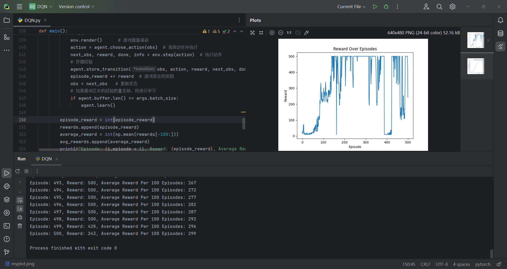
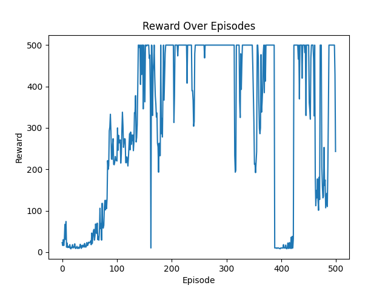
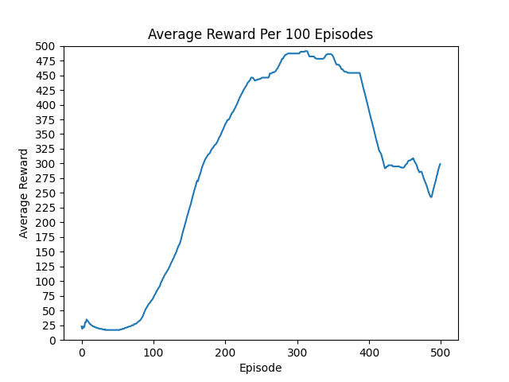
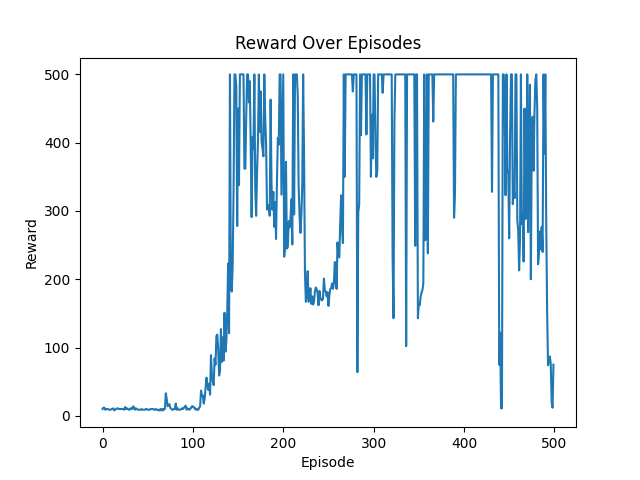
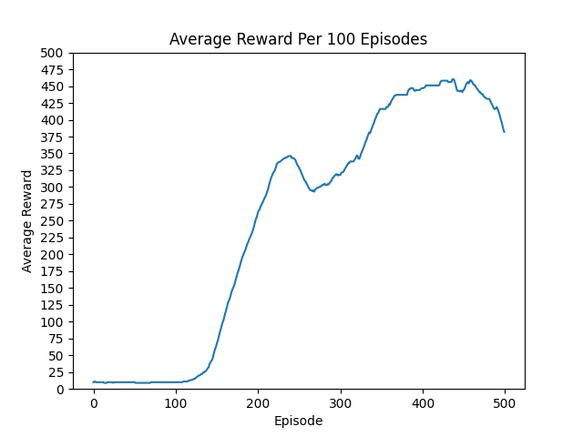
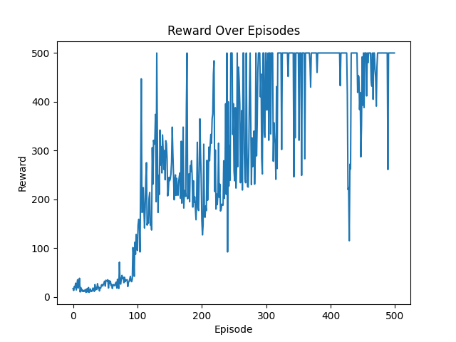
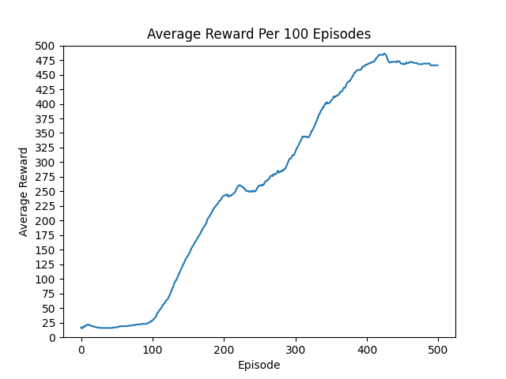
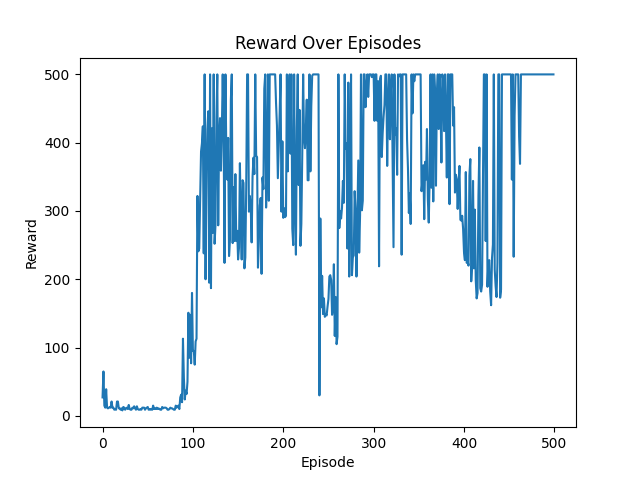
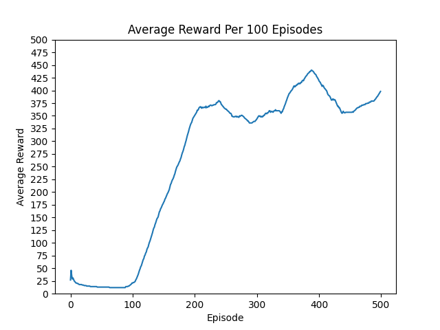

<header>                <p>人工智能实验</p>    </header>

# 中山大学计算机学院

# 人工智能

# 本科生实验报告

###### （2023学年春季学期）


**课程名称**：Artificial Intelligence


## 一、实验题目

**标题：** 使用 Deep Q-learning Network(DQN) 算法玩解决 CartPole-v1 游戏

**内容描述：** 本实验旨在使用深度 Q 学习网络（DQN）算法来解决 OpenAI Gym 中的 CartPole-v1 游戏。我们提供了框架代码的基础部分，但仍需要补充部分代码以完成整个实验。

**基础要求完成如下任务：**

- 在 500 局游戏内，至少达成一次：连续 10 局 Reward 值为 500 的情况。
- 展示单局 Reward 值曲线以及最近 100 局的平均 Reward 值曲线。

**进阶目标包括但不限于：**

- 达成一次：“最近百局的平均 Reward 值”≥ 475。
- 更快地达到这个目标。
- 实现更高的百局平均 Reward 值。

**需要补充的代码包括以下部分：**

1. **Q 网络（Qnet）：**
   - 补充一个线性层以完善 Q 网络的结构。
2. **经验回放缓冲区（ReplayBuffer）：**
   - 实现经验回放缓冲区的所有成员函数，包括添加经验、采样等。
3. **DQN 算法的具体实现（DQN）：**
   - `choose_action` 函数：实现 𝜖-greedy 策略的代码，用于选择动作。
   - `learn` 函数：
     - 实现 Q 值的计算。
     - 实现目标值的计算。
     - 实现损失值的计算。
     - 实现梯度下降过程。

以上是基本要求，根据实验需求，可以进一步调整和改进算法，以获得更好的结果。

**结果要求与展示：**

1. 单局 Reward 值曲线：展示每局游戏的 Reward 值随时间的变化情况。
2. 最近 100 局的平均 Reward 值曲线：展示最近 100 局游戏的平均 Reward 值随时间的变化情况。

## 二、实验内容

### 1.算法原理

* Deep Q-learning Nextword(DQN)

  深度 Q 学习网络（DQN）是将深度学习技术与 Q-learning 相结合的一种算法，旨在处理状态空间较大或连续的问题。其基本原理如下：

  - **状态表示：** 状态被表示为输入神经网络的特征。
  - **动作选择策略：** 使用 𝜖-greedy 策略，以一定的概率随机选择动作，以探索环境，而以较大的概率选择当前 Q 值最大的动作，以利用已有知识。
  - **Q 网络结构：** 使用神经网络来近似 Q 值函数。该网络的输入为状态，输出为每个可能动作的 Q 值。
  - **经验回放：** 将智能体的经验存储在回放缓冲区中，然后从中随机抽样，用于训练神经网络。这样可以打破数据之间的相关性，提高训练效率。
  - **目标 Q 值计算：** 使用 Bellman 方程来计算目标 Q 值，即当前奖励加上下一状态的最大 Q 值的折扣值。这个目标 Q 值用于训练网络。
  - **损失函数：** 使用目标 Q 值和网络输出的 Q 值之间的均方误差作为损失函数，用于更新网络参数。
  - **梯度下降：** 使用梯度下降算法来最小化损失函数，更新网络参数，使网络逼近最优的 Q 值函数。

  算法的关键点：

  * 用网络预测 Q 值，即网络输入状态 state，输出该状态下每个动作的 Q 值

  * Q 值的更新变为网络参数的更新，因此网络的损失值可定义为均方误差
    $$
    L = \cfrac12\big(Q(s, a) - (r + \gamma \max_{a'} Q(s', a'))\big)
    $$

  * 探索与利用

    $\epsilon-greedy$ 以概率 $\epsilon$ 随机选择一个动作，以概率 $1-\epsilon$ 选择最佳动作

  * 经验回放

    * 用 回放缓冲存区 可以减少与环境做互动的 次数，提高训练效率
    * 减少同批次训练数据的依赖关系
    * 做法：将每一步转移的 状态、动作、奖励、下一状态 等信息 存到一个缓冲区，训练网络时 从缓冲区随机抽取一批数据作为训练数据

  * 目标网络

    * $(r + \gamma \max_{a'}Q(s', a'))$ 可以看作目标值，目标值跟随 $Q$ 一直变化会给训练带来困难
    * 将评估网络与目标网络分开，目标网络不训练，评估网络更新若干轮后，用评估网络参数替换目标网络参数
    * $L = \cfrac12(Q_{eval}(s, a) - (r + \gamma \max_{a'} Q_{target} (s', a')))$ 

* 除了实现基本的 DQN 之外，我还在自己实现的基本的DQN基础之上尝试实现了基于 Dueling Network 的 DQN、基于 Soft Update 的 DQN。

  * Dueling Network：

    Dueling Network 是一种改进的深度 Q 网络（DQN），用于强化学习中的价值函数近似。Dueling Network 的主要思想是通过将状态值（state value）和优势函数（advantage function）分开估计，从而提高训练效率和性能。

    1. 背景

       在传统的 DQN 中，使用一个神经网络来近似 Q 函数，即给定一个状态$s$ 和一个动作$a$，预测其 Q 值$Q(s, a)$。然而，这种方法在某些情况下并不高效，特别是在一些状态下，动作的选择对 Q 值影响不大，即动作之间的差异不明显。

    2. Dueling Network 的结构

       Dueling Network 通过引入两个分支网络来解决上述问题，一个用于估计状态值$V(s)$，另一个用于估计优势函数$A(s, a)$。

       具体来说，一个神经网络在最后的几层之前是共享的，然后分成两个分支：
       1. 状态值分支：估计状态值$V(s)$，即状态本身的价值。
       2. 优势函数分支：估计优势函数$A(s, a)$，即在特定状态下，选择特定动作相比其他动作的优势。

       最后，这两个分支的输出组合成 Q 值

    3. 特点：

       与传统 DQN 相比，Dueling Network DQN 的主要区别在于 Q 网络的架构设计。其他部分，包括经验回放、目标网络更新、损失函数等，都与 DQN 类似。

  * 软更新（Soft Update）：

    在深度 Q 网络（DQN）中，目标网络（target network）的引入是为了提高训练的稳定性。然而，目标网络参数的更新频率也会对训练过程产生显著影响。为了在稳定性和效率之间找到平衡，基于 Soft Update 的 DQN 提供了一种渐进更新目标网络参数的方法。

    1. 背景

       在传统的 DQN 中，目标网络的参数每隔一定的步数（例如，每1000步）才从当前 Q 网络复制一次。虽然这种硬性更新（hard update）策略能稳定训练过程，但它在参数更新的间隔之间可能会导致目标 Q 值变化过大，影响收敛速度。

    2. Soft Update 的概念

       Soft Update 是一种对目标网络参数进行渐进更新的方法，而不是每隔固定步数进行一次大规模的参数复制。具体来说，Soft Update 通过指数加权平均的方法，将目标网络参数逐步向当前 Q 网络参数靠拢。

    3. Soft Update 的公式

       在 Soft Update 中，目标网络参数 $\theta^-$ 更新为：
       $\theta' \leftarrow \tau \theta + (1 - \tau) \theta'$
       其中：

       - $\theta$ 是当前 Q 网络的参数。

       - $\theta'$ 是目标网络的参数。

       - $\tau$ 是一个很小的常数，称为软更新系数（soft update coefficient）。
    
    4. 特点：更平滑的更新：由于目标网络参数的更新是逐步进行的，Soft Update 能够提供更平滑的 Q 值变化，减少训练过程中不稳定的震荡。
    


### 2.伪代码

（中文版伪代码）

**算法**：具有经验回放的深度 Q 学习
$$
\begin{aligned}
&\text{初始化 replay memory }D\text{ 为 capacity }N \\
&\text{初始化 动作价值函数 }Q\text{ 为 随机权重 }\theta\\
&\text{初始化 目标动作价值函数 }\hat{Q}\text{ 为权重 }\theta^- = \theta\\
&\bold{For} \text{ episode} = 1, M\ \bold{do} \\
&\ \ \ \ \text{初始化 序列 } s_1 = {x_1} \text{ 和预处理序列 } \phi_1 = \phi_1(s_1) \\
&\ \ \ \ \bold{For}\ t=1,\text{T}\ \bold{do}\\
&\ \ \ \ \ \ \ \ \text{以概率 }\varepsilon\text{ 选择一个随机动作 }a_t\\
&\ \ \ \ \ \ \ \ \text{否则选择 } a_t = \mathrm{argmax}_aQ(\phi(s_t), a; \theta)\\
&\ \ \ \ \ \ \ \ \text{在模拟器中执行动作} a_t \text{观察 reward } r_t \text{ 和图像 } x_{t+1} \\
&\ \ \ \ \ \ \ \ \text{令 } s_{t+1} = s_t, a_t, x_{t+1} \text{ 以及预处理} \phi_{t+1} = \phi(s_{t+1}) \\
&\ \ \ \ \ \ \ \ \text{在 }D\text{ 中保存 transitions }(\phi_j, a_j, r_j, \phi_{j+1})\\
&\ \ \ \ \ \ \ \ \text{在 }D\text{ 中随机采样一小批 transitions }(\phi_t, a_t, r_t, \phi_{t+1})\\
&\ \ \ \ \ \ \ \ 设置 y_j = \begin{cases}r_j&  \text{如果 episode 终止在j+1步}\\
r_j + \gamma \max_{a'} \hat{Q}(\phi_{j+1}, a'; \theta^-) & \text{其他情况}
\end{cases}\\
&\ \ \ \ \ \ \ \ \text{对网络参数}\theta\text{ 进行梯度下降操作，以优化}(y_j - Q(\phi_j, a_j; \theta))^2\text{ 的值}\\
&\ \ \ \ \ \ \ \ \text{每 }C \text{ 步重置 } \hat{Q} = Q\\
&\ \ \ \ \bold{End\ For}\\
& \bold{End\ For}
\end{aligned}
$$


### 3.关键代码展示

#### DQN

设计 QNet：

```python
class QNet(nn.Module):
    """
    一个用于表示深度 Q 网络 (DQN) 中的 Q 值函数的神经网络架构。

    该网络接收环境的输入状态，通过隐藏层进行处理，并输出每个可用动作的估计 Q 值。

    属性:
        input_size (int): 输入状态的维度。
        hidden_size (int): 隐藏层的神经元数量。
        output_size (int): 输出神经元的数量，代表动作的个数。
        fc1 (nn.Linear): 处理输入状态的第一个全连接线性层。
        fc2 (nn.Linear): 生成 Q 值估计的第二个全连接线性层。
    """

    def __init__(self, input_size, hidden_size, output_size):
        super(QNet, self).__init__()
        self.fc1 = nn.Linear(input_size, hidden_size)  # 创建第一个线性层
        self.fc2 = nn.Linear(hidden_size, output_size)  # 创建第二个线性层

    def forward(self, x):
        x = torch.Tensor(x)  # 将输入转换为 PyTorch 张量
        x = F.relu(self.fc1(x))  # 对第一个线性层的输出应用 ReLU 激活函数
        x = self.fc2(x)  # 将处理后的数据传递到第二个线性层
        return x
```


经验回放缓冲区：

```python
# 经验回放缓冲区
class ReplayBuffer:
    def __init__(self, capacity):
        self.buffer = deque(maxlen=capacity)

    def len(self):
        return len(self.buffer)

    def push(self, *transition):
        self.buffer.append(transition)

    def sample(self, batch_size):
        transitions = random.sample(self.buffer, batch_size)
        obs, actions, rewards, next_obs, dones = zip(*transitions)  # 解压缩元组
        return np.array(obs), actions, rewards, np.array(next_obs), dones

    def clean(self):
        self.buffer.clear()
```


固定 epsilon 的 DQN 的实现：

```python
class DQN:
    def __init__(self, env, input_size, hidden_size, output_size):
        self.env = env
        self.device = torch.device('cuda' if torch.cuda.is_available() else 'cpu')
        # 评估网络
        self.eval_net = QNet(input_size, hidden_size, output_size).to(self.device)
        # 目标网络
        self.target_net = QNet(input_size, hidden_size, output_size).to(self.device)
        # Adam优化器
        self.optim = optim.Adam(self.eval_net.parameters(), lr=args.lr)
        # ε-贪心策略的参数 ε 随着游戏回合的增加，逐渐减少
        # 在训练开始时，智能体更多地进行探索（即有较高的概率选择随机动作）
        # 在训练快要结束时，智能体更多地进行利用（即有较低的概率选择随机动作）
        self.eps = args.eps
        # 创建经验回放缓冲区
        self.buffer = ReplayBuffer(args.capacity)
        self.loss_fn = nn.MSELoss()
        self.learn_step = 0
        self.steps_done = 0

    # 选择动作 - 使用ε-贪心策略
    def choose_action(self, obs):
        # ε 的概率进行探索（随机选择一个动作）
        # 1-ε 的概率选择最佳动作
        self.steps_done += 1
        if np.random.rand() < self.eps:
            # 生成0到1之间的随机数，如果小于ε，则进行探索，选择随机动作
            return self.env.action_space.sample()
        # 1-ε 的概率： 根据当前策略选择最优动作
        obs = torch.Tensor(obs).unsqueeze(0).to(self.device)
        with torch.no_grad():  # 关闭梯度计算
            actions = self.eval_net(obs)
        return torch.argmax(actions).item()  # 返回 Q 值最大的动作

    def store_transition(self, *transition):
        self.buffer.push(*transition)

    def learn(self):
        if self.learn_step % args.update_target == 0:  # 定期更新目标网络
            self.target_net.load_state_dict(self.eval_net.state_dict())
        self.learn_step += 1

        # 从缓冲区采样一个批次的经验
        obs, actions, rewards, next_obs, dones = self.buffer.sample(args.batch_size)
        # 转换为 pytorch 张量
        obs = torch.Tensor(obs).to(self.device)
        actions = torch.LongTensor(actions).unsqueeze(1).to(self.device)
        rewards = torch.FloatTensor(rewards).unsqueeze(1).to(self.device)
        next_obs = torch.Tensor(next_obs).to(self.device)
        dones = torch.FloatTensor(dones).unsqueeze(1).to(self.device)

        # 计算评估网络的Q值
        q_eval = self.eval_net(obs).gather(1, actions)
        # 计算目标网络的Q值
        q_next = self.target_net(next_obs).max(1)[0].detach().unsqueeze(1)
        q_target = rewards + args.gamma * q_next * (1 - dones)

        # 计算损失
        loss = self.loss_fn(q_eval, q_target)

        # 反向传播和优化
        self.optim.zero_grad()
        loss.backward()
        self.optim.step()
```


逐步下降epsilon 的 DQN 实现：

将固定的 $\varepsilon$ 替换成随着迭代次数逐步降低的 $\varepsilon$ 。在进行较少回合数的时候， $\varepsilon$ 较大，更有可能做出随机动作，进行探索，到了较多回合数的时候， $\varepsilon$​ 较小，做出行动决定的时候更可能会选择根据策略得出的最优动作。这样实现的 DQN，可能可以更快地得到最优效果。

主要在上面程序的基础上修改了 `__init__` 函数和`choose_action` 函数：

```python
# Deep Q-Learning Network
class DQN:
    def __init__(self, env, input_size, hidden_size, output_size):
        self.env = env
        self.device = torch.device('cuda' if torch.cuda.is_available() else 'cpu')

        # 评估网络
        self.eval_net = QNet(input_size, hidden_size, output_size).to(self.device)
        # 目标网络
        self.target_net = QNet(input_size, hidden_size, output_size).to(self.device)

        # Adam优化器
        self.optim = optim.Adam(self.eval_net.parameters(), lr=args.lr)

        # ε-贪心策略的参数 ε 随着游戏回合的增加，逐渐减少
        # 在训练开始时，智能体更多地进行探索（即有较高的概率选择随机动作）
        # 在训练快要结束时，智能体更多地进行利用（即有较低的概率选择随机动作）
        self.eps_start = args.eps_start
        self.eps_end = args.eps_end
        # ε 会在约 eps_decay 个步骤内从 eps_start 线性衰减到接近 eps_end
        self.eps_decay = args.eps_decay

        # 创建经验回放缓冲区
        self.buffer = ReplayBuffer(args.capacity)

        self.loss_fn = nn.MSELoss()
        self.learn_step = 0
        self.steps_done = 0

    # 选择动作 - 使用ε-贪心策略
    def choose_action(self, obs):
        # ε 的概率进行探索（随机选择一个动作）
        # 1-ε 的概率选择最佳动作
        epsilon = self.eps_end + (self.eps_start - self.eps_end) * np.exp(-self.steps_done / self.eps_decay)
        self.steps_done += 1
        if np.random.rand() < epsilon:
            # 生成0到1之间的随机数，如果小于ε，则进行探索，选择随机动作
            return self.env.action_space.sample()
        # 1-ε 的概率： 根据当前策略选择最优动作
        obs = torch.Tensor(obs).unsqueeze(0).to(self.device)
        with torch.no_grad():  # 关闭梯度计算
            actions = self.eval_net(obs)
        return torch.argmax(actions).item()  # 返回 Q 值最大的动作
```


修改 `main()` 函数：

```python
def main():
    # 创建环境
    env = gym.make(args.env)
    # 获取环境的状态和动作空间维度
    o_dim = env.observation_space.shape[0]
    a_dim = env.action_space.n
    # 创建DQN智能体
    agent = DQN(env, o_dim, args.hidden, a_dim)
    rewards = []      # 存储每个游戏回合的奖励
    avg_rewards = []  # 存储每 100 个回合的平均奖励

    # 进行训练
    for i_episode in range(args.n_episodes):
        obs = env.reset()     # 游戏重置
        episode_reward = 0    # 奖励
        done = False          # 游戏是否结束
        step_cnt = 0          # 执行步骤的次数
        while not done and step_cnt < 500:
            step_cnt += 1
            env.render()      # 游戏画面渲染
            action = agent.choose_action(obs)  # 选择动作并执行
            next_obs, reward, done, info = env.step(action)  # 执行动作
            # 存储经验
            agent.store_transition(obs, action, reward, next_obs, done)
            episode_reward += reward  # 游戏回合的奖励
            obs = next_obs   # 更新状态
            # 如果缓冲区中的经验数量足够，则进行学习
            if agent.buffer.len() >= args.batch_size:
                agent.learn()

        print(f"Episode: {i_episode}, Reward: {episode_reward}")
        rewards.append(episode_reward)
        avg_rewards.append(np.mean(rewards[-100:]))

    # 绘制奖励曲线
    plt.figure()
    plt.plot(rewards)
    plt.xlabel('Episode')
    plt.ylabel('Reward')
    plt.title('Reward Over Episodes')

    plt.figure()
    plt.plot(avg_rewards)
    plt.ylim(0, 500)
    plt.yticks(range(0, 501, 25))
    plt.xlabel('Episode')
    plt.ylabel('Average Reward')
    plt.title('Average Reward Per 100 Episodes')
    plt.show()
```


修改输入参数：

```python
if __name__ == "__main__":
    parser = argparse.ArgumentParser()
    parser.add_argument("--env", default="CartPole-v1", type=str, help="environment name")
    parser.add_argument("--lr", default=1e-3, type=float, help="learning rate")
    parser.add_argument("--hidden", default=64, type=int, help="dimension of hidden layer")
    parser.add_argument("--n_episodes", default=500, type=int, help="number of episodes")
    parser.add_argument("--gamma", default=0.99, type=float, help="discount factor")
    parser.add_argument("--capacity", default=10000, type=int, help="capacity of replay buffer")
    parser.add_argument("--batch_size", default=128, type=int)
    parser.add_argument("--update_target", default=100, type=int, help="frequency to update target network")
    parser.add_argument("--eps_start", default=0.9, type=float)
    parser.add_argument("--eps_end", default=0.01, type=float)
    parser.add_argument("--eps_decay", default=500, type=int)
    args = parser.parse_args()
    main()
```

上面是基础的 DQN 的实现，除了上面的实验外，我还在上面的DQN基础之上实现了基于 Dueling Network 的 DQN、基于 Soft Update 的 DQN。


#### 基于 Dueling Network 的 DQN

这个也是修改 QNet 的结构，主要修改在于评估动作的方式发生改变。该架构将 DQN 的最后一层拆分为两个分支。一个分支估计当前状态的价值 (V(s))，独立于任何特定动作。另一个分支估计每个动作相对于该状态的平均优势 (A(s,a))。传统 DQN 输出 Q 值，表示在给定状态下采取特定动作的预期奖励。而在 Dueling DQN 中，每个动作的最终 Q 值是通过将估计值 (V(s)) 与该动作的优势 (A(s,a)) 进行组合得到。

修改后的 QNet 结构：

```python
class DuelingQNet(nn.Module):
    """Dueling Q网络架构

    该类定义了Dueling Q网络的结构。

    Attributes:
        fc1 (nn.Linear): 第一个全连接层，将输入映射到隐藏层。
        fc_value (nn.Linear): 价值网络的输出层，用于预测状态的整体价值。
        fc_advantage (nn.Linear): 优势网络的输出层，用于预测每个动作相对于平均动作的优势。
    """

    def __init__(self, input_size, hidden_size, output_size):
        super(DuelingQNet, self).__init__()
        self.fc1 = nn.Linear(input_size, hidden_size)
        self.fc_value = nn.Linear(hidden_size, 1)
        self.fc_advantage = nn.Linear(hidden_size, output_size)

    def forward(self, x):
        x = torch.Tensor(x)
        x = F.relu(self.fc1(x))   # 激活函数 ReLU
        value = self.fc_value(x)  # 价值网络的输出
        advantage = self.fc_advantage(x)  # 优势网络的输出
        q_values = value + (advantage - advantage.mean(dim=1, keepdim=True))  # 计算 Q 值
        return q_values
```


#### 基于软更新的 DQN

主要是加入一个参数 $\tau$ ，作为每次更新网络的权重。带有软更新的目标网络的更新公式为：
$$
\theta' = \tau \theta + (1-\tau)\theta'
$$
$\theta$ 表示主网络的权重，$\theta'$ 表示目标网络的权重。

加入软更新的 DQN的迭代更新的曲线会更加平稳。

主要修改的地方在  `learn` 函数上，修改了更新网络的代码：

```python
    def soft_update_target_network(self):
        for target_param, eval_param in zip(self.target_net.parameters(), self.eval_net.parameters()):
            target_param.data.copy_(self.tau * eval_param.data + (1.0 - self.tau) * target_param.data)

    def learn(self):
        self.soft_update_target_network()  # 每次都进行软更新

        # 从缓冲区采样一个批次的经验
        obs, actions, rewards, next_obs, dones = self.buffer.sample(args.batch_size)
        # ...  # 其他代码和之前的一样
```

修改输入的参数，加入一个 $\tau$ 参数：

```python
if __name__ == "__main__":
    # 其他参数和 逐步下降epsilon的DQN一样
    # 加入 参数 tau
    parser.add_argument("--tau", default=0.01, type=float, help="soft update parameter")
    args = parser.parse_args()
    main()
```


### 4.创新点&优化

* 利用根据时间步的 $\varepsilon$ ，使得模型在前期进行大量探索，能够一定程度上加快模型训练的速度。同时在后期，更倾向于选择根据决策模型得到的行动。
* 尝试使用基于 Dueling Network 的 DQN 对图像进行处理。
* 根据自己设计原模型的不稳定，所以尝试使用 Soft Update 修改模型更新部分的代码。


## 三、实验结果及分析

逐步下降 $\epsilon$ 的 DQN 的测试结果：





固定 $\epsilon$ 的 DQN 的测试结果：（$\epsilon = 0.1$）




基于 Dueling Network 的 DQN:




基于软更新的DQN：



从最后实现的结果来看，我的代码实现中，基于 Dueling Network的 DQN可能由于普通的 DQN 和 基于软更新的 DQN。我实现的普通的DQN，在后期结果不是很稳定，我试了很多种办法，尝试使用三层全连接层的神经网络模型，但是测试后期的100局的平均reward不是很高。


## 四、参考资料

* https://pytorch.org/tutorials/intermediate/reinforcement_q_learning.html
* https://blog.gofynd.com/building-a-deep-q-network-in-pytorch-fa1086aa5435

