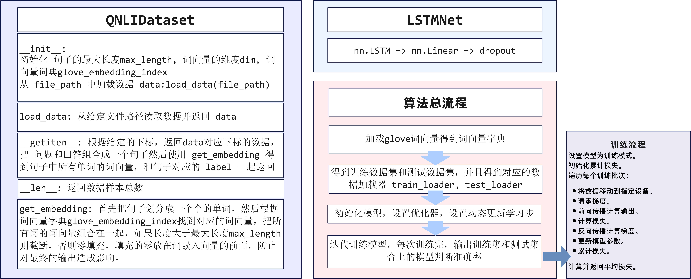
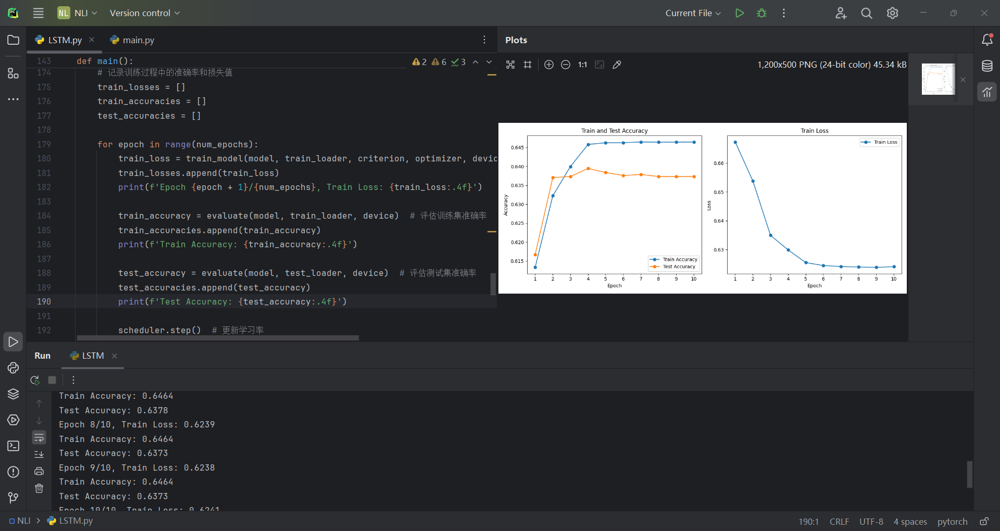
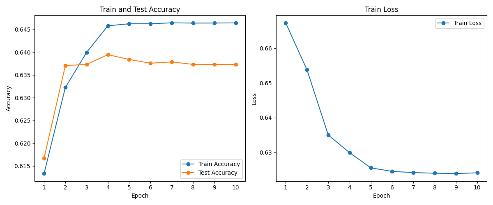
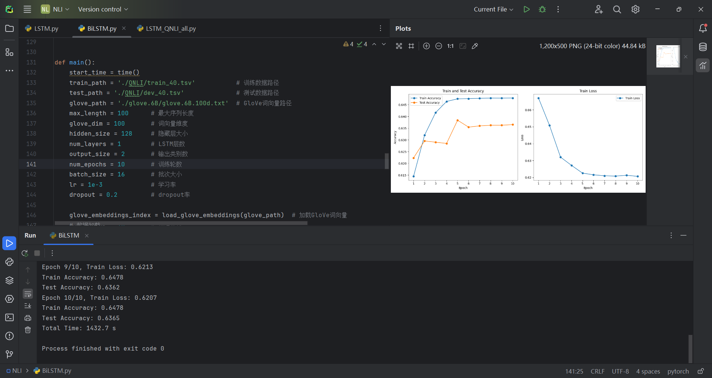
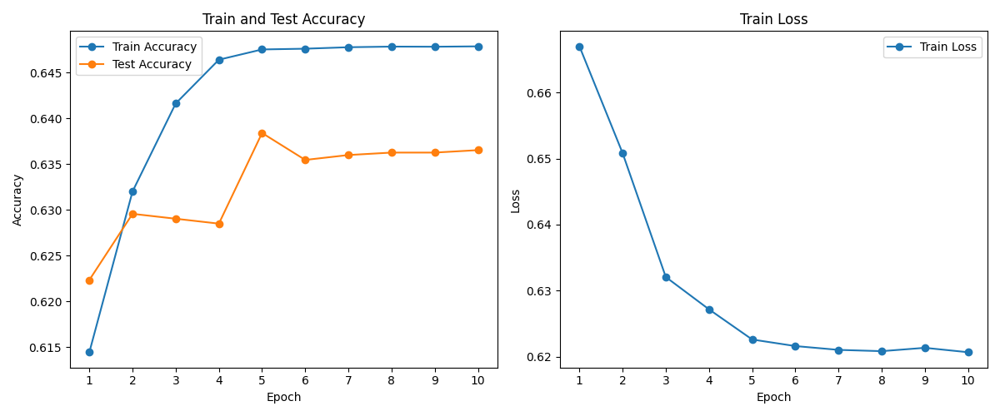
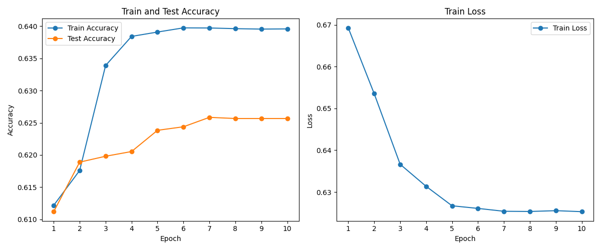
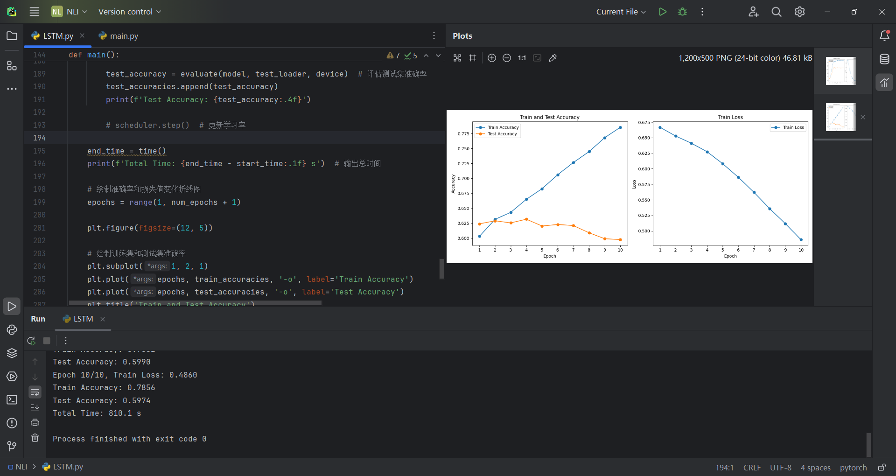

# 中山大学计算机学院

# 人工智能

# 本科生实验报告

###### （2023学年春季学期）


**课程名称**：Artificial Intelligence


## 一、实验题目

实验内容涉及使用QNLI数据集完成识别文本蕴含任务。实验任务是判断问题和句子是否蕴含，分为二分类问题。评价准则为准确率。实验要求在训练过程中某次测试准确率达到55%以上，并分析运行时间和其他指标。实验步骤包括数据读取、数据预处理、词嵌入、数据对齐、使用分类模型进行训练和输出分析。

任务：判断问题（question）和句子（sentence，维基百科段落中的一句）是否蕴含，蕴含和不蕴含，二分类。

评价准则：准确率（accuracy）。

实验任务

* 实验内容
  * 使用给定数据集（QNLI限制长度所得的子集）完成识别文本蕴含任务
* 实验要求
  * 训练过程中某次测试准确率达到55%以上（不要求loss收敛）
  * 分析运行时间和其他指标

## 二、实验内容

### 1.算法原理

LSTM通过引入门控机制（输入门、遗忘门和输出门）来克服传统RNN在处理长序列时的梯度消失问题。这使得LSTM能够捕捉长时间依赖关系，并在自然语言处理任务中表现出色。

**数据预处理**

- **分词（Tokenization）**：将问题和句子分解为单词或词块。
- **词嵌入（Word Embedding）**：使用GloVe预训练词向量将每个单词转换为固定长度的向量表示，这些向量捕捉了词语之间的语义相似性。

**数据对齐（Padding）**

- **序列长度对齐**：由于输入序列（问题和句子）长度不一，需要对齐序列长度。通常通过在较短序列的末尾添加零值进行补全。

**LSTM 网络结构**

- **输入层**：接受嵌入后的问题和句子的向量表示。
- **LSTM 层**：通过递归神经网络处理输入序列，输出隐藏状态（hidden state）。LSTM层能够捕捉输入序列中的时间依赖关系。
- **全连接层（Fully Connected Layer）**：将LSTM层的输出连接到一个或多个全连接层，进一步提取特征。

**训练过程**

- **损失函数**：使用交叉熵损失函数来评估模型的输出与真实标签之间的差距。
- **优化器**：如Adam优化器，通过反向传播算法调整模型参数以最小化损失函数。


### 2.流程图




### 3.关键代码展示

主要的参数列表：

```python
train_path = './QNLI/train_40.tsv'           # 训练数据路径
test_path = './QNLI/dev_40.tsv'              # 测试数据路径
glove_path = './glove.6B/glove.6B.100d.txt'  # GloVe词向量路径
max_length = 100      # 最大序列长度
glove_dim = 100       # 词向量维度
hidden_size = 128     # 隐藏层大小
num_layers = 1        # LSTM层数
output_size = 2       # 输出类别数
num_epochs = 10       # 训练轮数
batch_size = 16       # 批次大小
lr = 1e-3             # 学习率
dropout = 0.2         # dropout率
```


`QNLIDataset` 的定义：

```python
class QNLIDataset(Dataset):
    def __init__(self, file_path, glove_embeddings_index, dim=100, max_length=128):
        self.max_length = max_length  # 最大序列长度
        self.dim = dim  # 词向量维度
        self.glove_embeddings_index = glove_embeddings_index  # 词向量字典
        self.data = self.load_data(file_path)  # 加载数据

    # 加载数据
    def load_data(self, file_path):
        data = []
        with open(file_path, 'r', encoding='utf-8') as f:
            f.readline()  # 跳过首行
            for line in f:
                parts = line.strip().split('\t')
                if len(parts) == 4:
                    question = parts[1].lower()
                    sentence = parts[2].lower()
                    label = 1 if parts[3] == 'entailment' else 0
                    data.append([question, sentence, label])
        return data

    # 获取数据条目
    def __getitem__(self, idx):
        question, sentence, label = self.data[idx]

        # 分词并创建词向量
        text = question + " " + sentence
        text_embedding = self.get_embedding(text)

        return {
            'text': torch.tensor(text_embedding, dtype=torch.float32),
            'label': torch.tensor(label, dtype=torch.long)
        }

    # 获取数据集长度
    def __len__(self):
        return len(self.data)

    # 获取词嵌入向量
    def get_embedding(self, text):
        tokens = text.split()  # 将文本按空格分割成单词列表
        embedding = [self.glove_embeddings_index.get(token, np.zeros(self.dim, dtype=np.float32))
                     for token in tokens]  # 获取每个单词的词向量，如果单词不在词向量字典中，则用全零向量代替

        if len(embedding) < self.max_length:
            # 如果词向量列表长度小于最大长度，则在前面填充全零向量
            embedding = [np.zeros(self.dim, dtype=np.float32)] * (self.max_length - len(embedding)) + embedding
        else:
            # 如果词向量列表长度大于最大长度，则截断
            embedding = embedding[:self.max_length]
        return np.array(embedding)  # 将词向量列表转换为NumPy数组并返回
```


`LSTMNet` 的定义：

```python
class LSTMNet(nn.Module):
    def __init__(self, input_size, hidden_size, num_layers, output_size, dropout):
        super(LSTMNet, self).__init__()
        self.hidden_size = hidden_size  # 隐藏层大小
        self.num_layers = num_layers  # LSTM层数

        self.lstm = nn.LSTM(input_size, hidden_size, num_layers, batch_first=True)
        self.fc = nn.Linear(hidden_size, output_size)
        self.dropout = nn.Dropout(dropout)

        self.init_weights()  # 初始化权重

    # 初始化权重
    def init_weights(self):
        for name, param in self.named_parameters():
            if 'weight' in name:
                nn.init.xavier_uniform_(param)  # 用Xavier均匀分布初始化权重
            elif 'bias' in name:
                nn.init.zeros_(param)  # 初始化偏置为0

    # 前向传播
    def forward(self, x):
        h0 = torch.zeros(self.num_layers, x.size(0), self.hidden_size).to(x.device)
        c0 = torch.zeros(self.num_layers, x.size(0), self.hidden_size).to(x.device)

        out, _ = self.lstm(x, (h0, c0))  # LSTM计算
        out = self.dropout(out[:, -1, :])  # 应用dropout
        out = self.fc(out)  # 全连接层
        return out
```

加入权重初始化的函数，可能可以使得训练过程更加稳定。


模型训练函数 `train_model` ：

```python
def train_model(model, train_loader, criterion, optimizer, device):
    model.train()  # 设置模型为训练模式
    total_loss = 0.0
    for batch in train_loader:
        text = batch['text'].to(device)
        labels = batch['label'].to(device)
        optimizer.zero_grad()  # 梯度清零
        outputs = model(text)
        loss = criterion(outputs, labels)  # 计算损失
        loss.backward()  # 反向传播
        optimizer.step()  # 更新参数
        total_loss += loss.item()
    return total_loss / len(train_loader)
```


模型评估函数 `evaluate` ：

```python
def evaluate(model, eval_loader, device):
    model.eval()  # 设置模型为评估模式
    all_labels = []
    all_preds = []

    with torch.no_grad():  # 评估过程中不计算梯度
        for batch in eval_loader:
            text = batch['text'].to(device)
            labels = batch['label'].to(device)
            outputs = model(text)
            preds = torch.argmax(outputs, dim=1)
            all_labels.extend(labels.cpu().numpy())
            all_preds.extend(preds.cpu().numpy())

    accuracy = accuracy_score(all_labels, all_preds)  # 计算准确率
    return accuracy
```


模型初始化、迭代过程（在 `main()` 函数中实现）：

```python
model = BiLSTMNet(glove_dim, hidden_size, num_layers, output_size, dropout)
device = torch.device('cuda' if torch.cuda.is_available() else 'cpu')
model = model.to(device)

criterion = nn.CrossEntropyLoss()
optimizer = torch.optim.Adam(model.parameters(), lr=lr)
scheduler = torch.optim.lr_scheduler.StepLR(optimizer, step_size=2, gamma=0.1)

# 记录训练过程中的准确率和损失值
train_losses = []
train_accuracies = []
test_accuracies = []

for epoch in range(num_epochs):
    train_loss = train_model(model, train_loader, criterion, optimizer, device)  # 训练模型
    train_losses.append(train_loss)
    print(f'Epoch {epoch + 1}/{num_epochs}, Train Loss: {train_loss:.4f}')

    train_accuracy = evaluate(model, train_loader, device)  # 评估训练集准确率
    train_accuracies.append(train_accuracy)
    print(f'Train Accuracy: {train_accuracy:.4f}')

    test_accuracy = evaluate(model, test_loader, device)  # 评估测试集准确率
    test_accuracies.append(test_accuracy)
    print(f'Test Accuracy: {test_accuracy:.4f}')

    scheduler.step()  # 更新学习率
```


使用 双向LSTM，只需要修改 `LSTMNet` ：

```python
class BiLSTMNet(nn.Module):
    def __init__(self, input_size, hidden_size, num_layers, output_size, dropout):
        super(BiLSTMNet, self).__init__()
        self.hidden_size = hidden_size
        self.num_layers = num_layers

        self.lstm = nn.LSTM(input_size, hidden_size, num_layers, batch_first=True, bidirectional=True)
        self.fc = nn.Linear(hidden_size * 2, output_size)
        self.dropout = nn.Dropout(dropout)

        self.init_weights()

    def init_weights(self):
        ... # 不改变

    def forward(self, x):
        h0 = torch.zeros(self.num_layers * 2, x.size(0), self.hidden_size).to(x.device)
        c0 = torch.zeros(self.num_layers * 2, x.size(0), self.hidden_size).to(x.device)

        out, _ = self.lstm(x, (h0, c0))
        out = self.dropout(out[:, -1, :])
        out = self.fc(out)
        return out
```


### 4.优化

* 优化的模型初始化：使用Xavier均匀分布初始化权重，可以使得模型训练过程更加稳定。
* 使用动态调整的学习率

## 三、实验结果及分析

1. 实验结果展示示例

LSTM 模型：





```
Epoch 1/10, Train Loss: 0.6673
Train Accuracy: 0.6133
Test Accuracy: 0.6167
Epoch 2/10, Train Loss: 0.6538
Train Accuracy: 0.6322
Test Accuracy: 0.6370
Epoch 3/10, Train Loss: 0.6350
Train Accuracy: 0.6400
Test Accuracy: 0.6373
Epoch 4/10, Train Loss: 0.6299
Train Accuracy: 0.6458
Test Accuracy: 0.6395
Epoch 5/10, Train Loss: 0.6255
Train Accuracy: 0.6462
Test Accuracy: 0.6384
Epoch 6/10, Train Loss: 0.6245
Train Accuracy: 0.6463
Test Accuracy: 0.6376
Epoch 7/10, Train Loss: 0.6241
Train Accuracy: 0.6464
Test Accuracy: 0.6378
Epoch 8/10, Train Loss: 0.6239
Train Accuracy: 0.6464
Test Accuracy: 0.6373
Epoch 9/10, Train Loss: 0.6238
Train Accuracy: 0.6464
Test Accuracy: 0.6373
Epoch 10/10, Train Loss: 0.6241
Train Accuracy: 0.6464
Test Accuracy: 0.6373
Total Time: 809.6 s
```


BiLSTM：






```python
Epoch 1/10, Train Loss: 0.6670
Train Accuracy: 0.6144
Test Accuracy: 0.6223
Epoch 2/10, Train Loss: 0.6508
Train Accuracy: 0.6320
Test Accuracy: 0.6296
Epoch 3/10, Train Loss: 0.6321
Train Accuracy: 0.6416
Test Accuracy: 0.6290
Epoch 4/10, Train Loss: 0.6272
Train Accuracy: 0.6464
Test Accuracy: 0.6285
Epoch 5/10, Train Loss: 0.6226
Train Accuracy: 0.6475
Test Accuracy: 0.6384
Epoch 6/10, Train Loss: 0.6216
Train Accuracy: 0.6476
Test Accuracy: 0.6354
Epoch 7/10, Train Loss: 0.6210
Train Accuracy: 0.6478
Test Accuracy: 0.6360
Epoch 8/10, Train Loss: 0.6208
Train Accuracy: 0.6478
Test Accuracy: 0.6362
Epoch 9/10, Train Loss: 0.6213
Train Accuracy: 0.6478
Test Accuracy: 0.6362
Epoch 10/10, Train Loss: 0.6207
Train Accuracy: 0.6478
Test Accuracy: 0.6365
Total Time: 1432.7 s
```


LSTM 模型在 QNLI 完整数据集合上进行测试：



```python
Epoch 1/10, Train Loss: 0.6693
Train Accuracy: 0.6122
Test Accuracy: 0.6112
Epoch 2/10, Train Loss: 0.6535
Train Accuracy: 0.6176
Test Accuracy: 0.6189
Epoch 3/10, Train Loss: 0.6366
Train Accuracy: 0.6339
Test Accuracy: 0.6198
Epoch 4/10, Train Loss: 0.6314
Train Accuracy: 0.6384
Test Accuracy: 0.6205
Epoch 5/10, Train Loss: 0.6267
Train Accuracy: 0.6391
Test Accuracy: 0.6238
Epoch 6/10, Train Loss: 0.6261
Train Accuracy: 0.6397
Test Accuracy: 0.6244
Epoch 7/10, Train Loss: 0.6254
Train Accuracy: 0.6397
Test Accuracy: 0.6258
Epoch 8/10, Train Loss: 0.6254
Train Accuracy: 0.6396
Test Accuracy: 0.6257
Epoch 9/10, Train Loss: 0.6255
Train Accuracy: 0.6395
Test Accuracy: 0.6257
Epoch 10/10, Train Loss: 0.6253
Train Accuracy: 0.6396
Test Accuracy: 0.6257
Total Time: 2054.0 s
```


2. 评测指标展示及分析

在我的模型中，Loss 一开始下降比较快，在之后保持一个稳定的状态，与之相对应的，在训练集上的测试准确率一开始上升较快，之后趋于稳定。QNLI 完整数据的测试数据集合上的测试稳定性要好于部分测试集的测试。在完整的测试数据集合上，测试集合上的测试准确率可以达到62+%。


在未动态调整学习率的情况下使用 LSTM 进行预测得到的结果：



可以看出虽然在训练集上训练的准确率不断上升，但是，在测试集上的评估准确率不升反降。说明模型非常不稳定。

动态更新学习率优化后的结果就是上面第一个测试的结果：


动态更新学习率可以使模型更加稳定，在测试集上的评估效果更好。


## 四、参考资料

* [基于pytorch构建双向LSTM（Bi-LSTM）文本情感分类实例（使用glove词向量）](https://blog.csdn.net/qq_52785473/article/details/122800625) 
* https://www.heywhale.com/mw/project/5b6956ea9889570010c33d54
* https://blog.csdn.net/ycq1041265011/article/details/110139729


 
